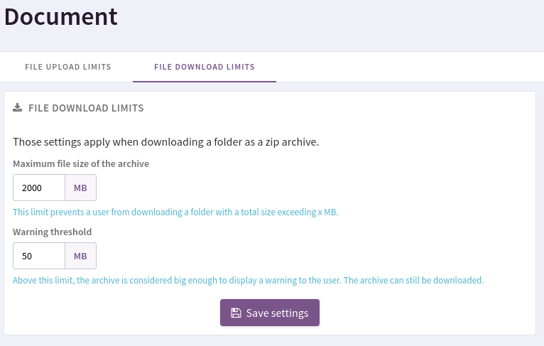
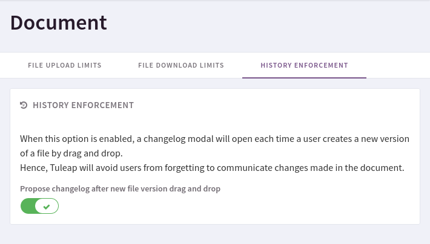

.. _site-admin-document:

Document Manager modern interface (2019)
========================================

File download/upload limits
```````````````````````````



  You can set limits on the maximum total size of the Zip archive that users may
  download. All limits are set in Megabytes (MB).

Both limits apply in the Document manager for :ref:`downloading a folder as a zip<document-download-folder-zip>`.
The first limit **forbids** users from downloading folders above this size. The
second limit shows a warning to users but still allows downloading folders
above this size.

History enforcement
```````````````````



By default, when a user drops a new version on a file to update it, they are not asked to fill up anything.
In order to encourage people to fill up the version changelog of files, site-administrators can enable the option "Propose changelog after drag and drop".
Each time a new version will be uploaded using drag'n drop, a changelog modal will be displayed beforehand.
Keep in mind that filling up the version title and the changelog is not mandatory and can be ignored.
