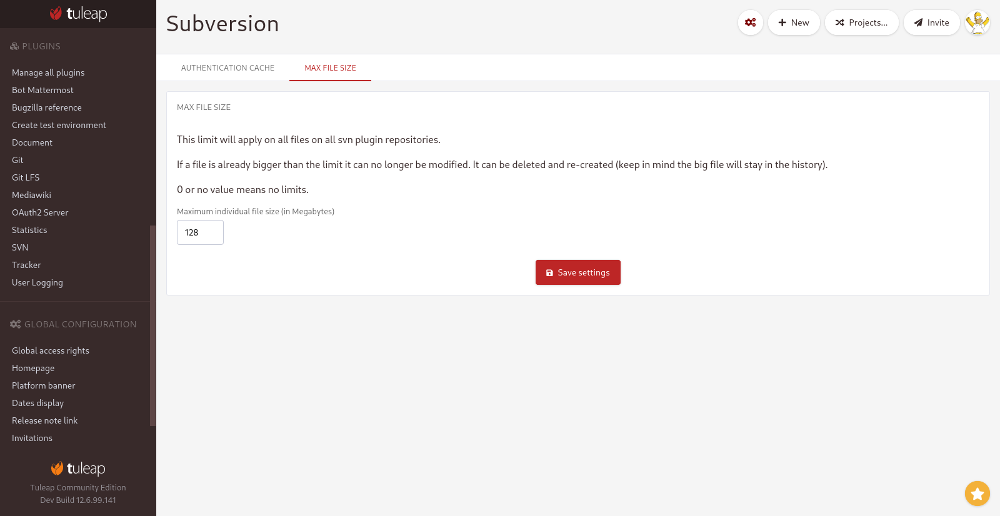

.. _svn-plugin:

SVN plugin
==========

.. _subversion-migration:

Subversion core repositories migration
--------------------------------------

Starting Tuleap 10, a CLI tool is available to migrate a SVN core repository into SVN multi-repository plugin within the
same project. To do this migration, you have to run the following command as ``root`` on your Tuleap server:

.. code-block:: bash

    /usr/share/tuleap/src/utils/php-launcher.sh \
    /usr/share/tuleap/plugins/svn/bin/migrate_to_plugin.php PROJECT_ID REPOSITORY_NAME USER_NAME

In this command:

1. ``PROJECT_ID`` is the project where we want to migrate a SVN core repository to the SVN multi-repository plugin.
2. ``REPOSITORY_NAME`` is the name the SVN repository will have in the SVN multi-repository plugin.
3. ``USER_NAME`` is the user used to do the migration.

A repository migrated will keep:

* SVN content history
* SVN accessfile history
* Commit rules
* Immutable tags
* Notifications

Use Subversion 1.9 from WANdisco repository
-------------------------------------------

.. warning::

    Starting Subversion 1.8, the way paths are handled in the access file has changed.
    Sections of the access file that might have been previously ignored will now deny
    accesses to the repository. For more information, consult the Subversion 1.8
    changelog: `FS paths syntax in authz access rules <https://subversion.apache.org/docs/release-notes/1.8#authz-fspath-syntax>`_.

You can use the following instructions to install Subversion 1.9:

 1. Install WANdisco repository on your server
 2. Upgrade Subversion with ``yum upgrade subversion``

.. _subversion-max-file-size:

Define max file size
--------------------

Site administrators can enforce a max file size for the whole platform. This applies on all repositories of svn plugin
in all projects. This limit will be enforced only with new commits (commits done after the limit is set) so you might
well have 50GB files with a 128MB limit if the file was already there.

This limit is not applied if you import a subversion repository or if you migrate from core to plugin.

Whenever someone tries to modify a file bigger than the limit, the modification will be forbidden. However the file can
be removed (``svn rm``) and re-added at a lower size. Please keep in mind that this won't save space on your disk as the
large version of the file is still present in subversion history.

The default limit for new platforms (starting Tuleap 12.7) is 50MB. Before 12.7 there was no limit set but administrators
can add one afterward.

This configuration can be done either in command line on the server with

.. code-block:: bash

    tuleap config-set plugin_svn_file_size_limit 134217728

In CLI, the filesize should be expressed in bytes (128MB in the previous example).

There is also a GUI for site administrator in "SVN" section, "Max file size".

