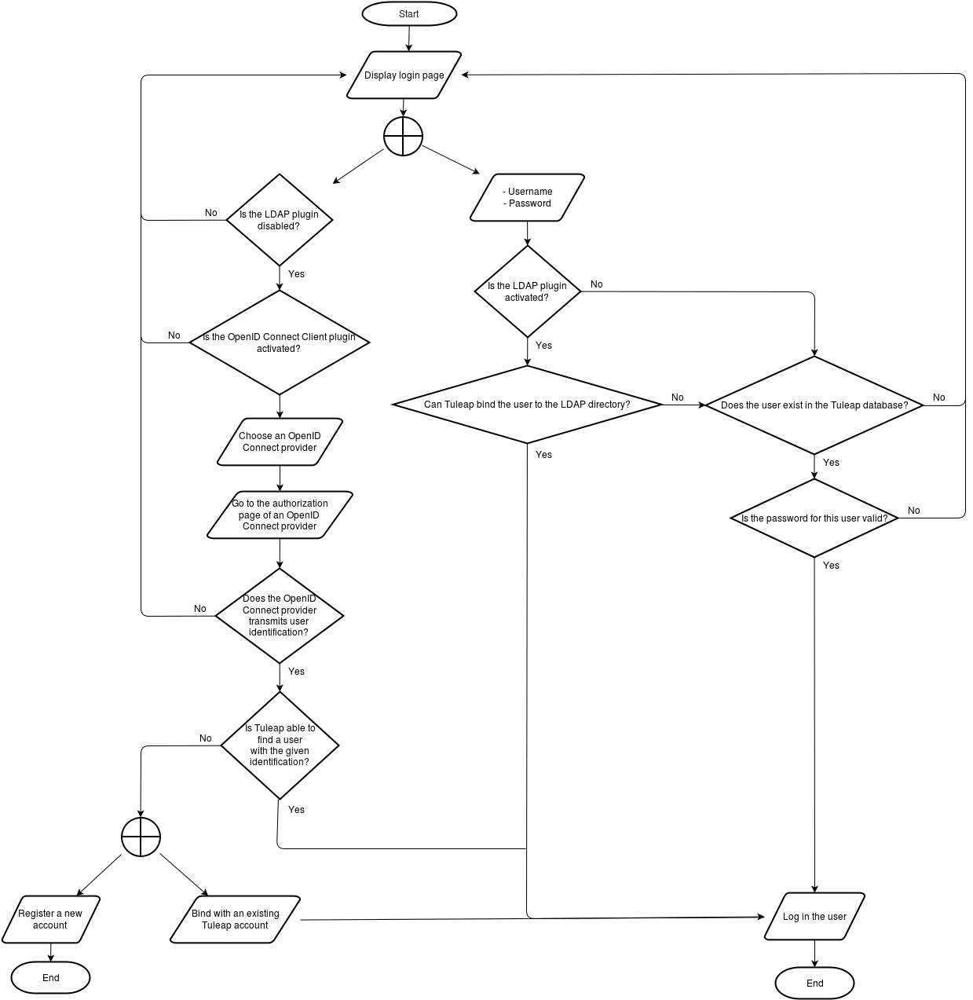

User authentication
===================

Tuleap authenticates users using his own database. However, Tuleap authentication
management through plugins:

* LDAP with ``tuleap-plugin-ldap``
* OpenID Connect with ``tuleap-plugin-openidconnectclient``. As of today, this plugin can not be used when the LDAP plugin is enabled.
* Generation of credentials on demand with ``tuleap-plugin-dynamic-credentials``, see :ref:`dynamic-credentials`.

The following flowchart explains how Tuleap deals with user authentication:

