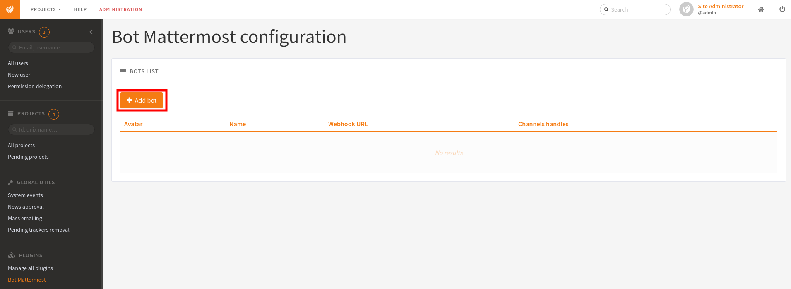
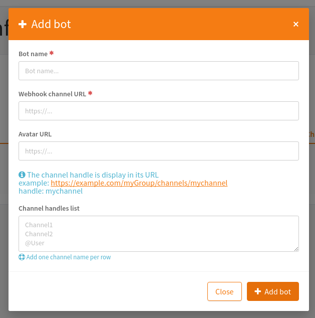

.. _botmattermost-plugins-admin:

Bot Mattermost plugins
======================

Installation users
------------------

In your Tuleap, you can find the package name using:

.. code-block:: bash

    yum search tuleap-plugin-botmattermost

and to install the plugin you want.

They are three plugins available in Tuleap RPM: ``tuleap-plugin-botmattermost`` ``tuleap-plugin-botmattermost-agiledashboard`` ``tuleap-plugin-botmattermost-git``.
The **botmattermost** plugin is mandatory to use the others.

You can install **botmattermost-git** for tuleap `Git`_ notification plugin and stand-up summary in :ref:`agile-dashboard` plugin.

.. _Git: ../user-guide/git.html

Configuration
-------------

BotMattermost
`````````````

After enabling it, this plugin can be reached in ``Admin > PLUGINS > Bot Mattermost``.
Click on **Add Bot** to create a new bot which can be used later by others :ref:`botmattermost-plugins` like :ref:`botmattermost-git` or :ref:`botmattermost-agiledashboard`.





Now you can pass to the configuration of others :ref:`botmattermost-plugins` to make your first **Mattermost** integration.
