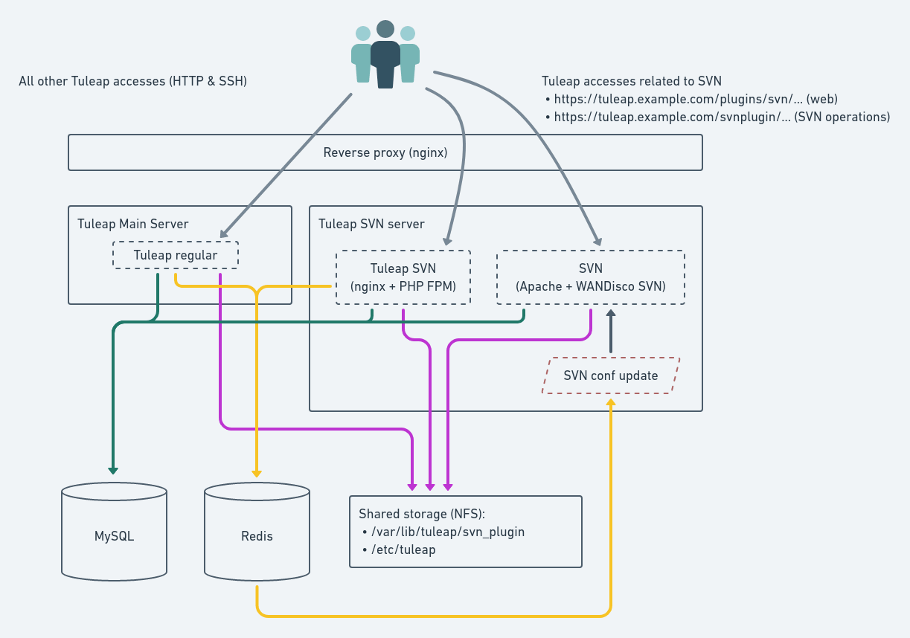

Distributed Tuleap Configuration
================================

**This require Tuleap >= 9.6.99.77**

Distributed Tuleap is a configuration of Tuleap to allow distribution of the workload across several servers
without any change for end users. As of today its possible to have offload SVN plugin traffic on a dedicated server.

Here is the architecture schema of the main components

The architecture is quite flexible in term of "what is installed where" and is pluggable easily with an existing
regular Tuleap server ("all in one"). However there 2 strong requirements:

* The subversion data path ``/var/lib/tuleap/svn_plugin`` must be shared between the 2 servers (el6 and el7).
* The tuleap configuration path ``/etc/tuleap`` must be share between the servers as well.

Most of the time it means that those 2 directories must be on an NFS share mounted on both servers. The setup of NFS
and mounting is outside the scope of this documentation.

The subversion part that is installed on a new server is designed to run on el7 compatible server (either Centos or RHEL).
We recommend to run the latest version (7.3 at time of writing). We will refer to it with el7. The regular Tuleap server
running on centos6 or rhel6 will referenced as el6.

Pack everything on el7 setup
----------------------------

While the architecture is designed to be used with several separted servers (one for regular Tuleap, one for Tuleap SVN,
one for redis, etc). It's quite common to only have one server for all "new components" (svn, redis, rabbitmq, reverse proxy).

This section will describe how to install this setup. It can be summarized by this diagram:

.. figure:: ../images/diagrams/DistributedTuleapAllOnEl7.png
    :align: center
    :alt: Distributed Tuleap "all on el7" Architecture
    :name: Distributed Tuleap "all on el7" Architecture

.. attention::

   With this setup for existing platforms there are three main consequences:

   * the DNS entry for your tuleap will change as the IP address for "tuleap" service will now be the IP address of the
     el7 server. This must be taken into account for the switch (for instance lower TTL a few weeks before the change to
     avoid lost users).
   * if you platform enabled "git over ssh" (or any other ssh based access) you will have to setup an ssh reverse proxy
     as well (explained bellow) and that means that your administration access (ssh) to the server must be updated to
     run on another port (eg. 2222) otherwise you won't be able to ssh the server (you will be redirected to el6 server).

On the el6 server
'''''''''''''''''

Gather data for el7 setup
~~~~~~~~~~~~~~~~~~~~~~~~~

First, you must have the same tuleap packages installed on your RHEL6 and RHEL7
servers. You must retrieve the packages list from your Tuleap RHEL6 server

.. code-block:: bash

   $ sudo rpm -aq --qf "%{NAME}\n" tuleap-plugin-\* > rhel6_tuleap_packages.lst

You will also need the ids of ``codendiadm`` user

.. code-block:: bash

    # GID
    $ sudo id -g codendiadm
    # UID
    $ sudo id -u codendiadm

That's very important because of the shared NFS mount between the 2 servers

Configure for reverse-proxy
~~~~~~~~~~~~~~~~~~~~~~~~~~~

**Remember**: the "old" el6 will no longer be the entry point for all requests:

* Edit your firewall configuration so only el7 server can access :80
* Edit ``/etc/tuleap/conf/local.inc`` and add ``$sys_trusted_proxies = '${TULEAP_RHEL7_IP}';``

On the el7 server
'''''''''''''''''

Prepare the server
~~~~~~~~~~~~~~~~~~

Disable SELinux

.. code-block:: bash

   $ sudo echo 0 > /sys/fs/selinux/enforce
   $ sudo sed -i 's/^SELINUX=.*/SELINUX=disabled/g' /etc/sysconfig/selinux

Add the EPEL and the SCL repository

.. code-block:: bash

   $ sudo yum install -y epel-release
   # For Centos
   $ sudo yum install -y centos-release-scl

For RHEL checkout `documentation about RHSCL <https://access.redhat.com/documentation/en-US/Red_Hat_Software_Collections/2/html-single/2.3_Release_Notes/index.html#sect-Installation-Subscribe>`_.

Create ``codendiadm`` user with the same ids than on el6 (UID & GID corresponds to the value you got on el6):

.. code-block:: bash

   $ sudo groupadd groupadd -g GID codendiadm
   $ sudo useradd -g codendiadm -M -d /var/lib/tuleap -u UID codendiadm

Mount ``/etc/tuleap`` and ``/var/lib/tuleap/svn_plugin`` directories on el7.

If you configured properly, when you run ``ls -l /etc/tuleap/`` on el7 and el6 server you should see

.. code-block:: bash

    ...
    drwxr-xr-x  2 codendiadm codendiadm 4096 Apr 14 09:08 conf
    drwxr-xr-x  3 codendiadm codendiadm 4096 Apr 17  2016 documentation
    drwxr-xr-x  2 codendiadm codendiadm 4096 Nov 18 14:41 forgeupgrade
    ...

If it's wrongly configured you will have sth like:

.. code-block:: bash

    ...
    drwxr-xr-x  2 496 497 4096 Apr 14 09:08 conf
    ...

That would mean that the codendiadm user doesn't have the correct IDs.

.. attention::

    If you provide ssh access to your end users (for git over ssh, project web pages or ftp over ssh, ...) you
    need to update the ssh port you will you to connect to el7 server:

    **WARNING**: it's a dangerous operation, be careful to not close you shell until you are 100% sure everything works
    or you might lock yourself out of the server

    * Edit ``/etc/ssh/sshd_config`` and set ``Port 2222`` (or any other port that you want to use).
    * Update your firewall rules to open ``2222`` for tcp connexions
    * Restart sshd server
    * With another terminal try to ssh the el7 server on port ``2222``
    * If it works, keep the configuration, otherwise revert the ``sshd_config``

When everything is OK (esp. the ssh part), update the DNS entry for your tuleap server to point to RHEL7 server IP address.

Install Rabbitmq
~~~~~~~~~~~~~~~~

Install RabbitMQ from `official rabbitmq builds <https://www.rabbitmq.com/install-rpm.html>`_

Start the RabbitMQ server & enable it at boot time

.. code-block:: bash

   $ sudo systemctl start rabbitmq-server
   $ sudo systemctl enable rabbitmq-server

Create a tuleap user with a strong password ``${RABBIT_PASSWORD}``

.. code-block:: bash

   $ sudo rabbitmqctl add_user tuleap ${RABBIT_PASSWORD}
   $ sudo rabbitmqctl set_permissions tuleap "^tuleap_svnroot_update.*" ".*" ".*"

And finally set rabbitmq parameters for Tuleap in your config file ``/etc/tuleap/conf/rabbitmq.inc``

.. code-block:: bash

   <?php

   $rabbitmq_server   = '${TULEAP_RHEL7_IP}';
   $rabbitmq_port     = 5672;
   $rabbitmq_user     = 'tuleap';
   $rabbitmq_password = '${RABBIT_PASSWORD}';

Firewall configuration:

* Ensure EL6 server can access port 5672/tcp

Install Redis
~~~~~~~~~~~~~

.. attention::

  RHEL users need to enable the **centos-sclo-sclo** repository.

Install Redis server from epel repository

.. code-block:: bash

   $ sudo yum install -y redis sclo-php56-php-pecl-redis

Generate a strong password ``${REDIS_PASSWORD}`` and set in the configuration:

.. code-block:: bash

   ...
   bind 0.0.0.0
   ...
   requirepass ${REDIS_PASSWORD}
   ...

Start the redis server & enable automatically

.. code-block:: bash

   $ sudo systemctl start redis
   $ sudo systemctl enable redis

Firewall configuration:

* Ensure EL6 server can access port 6379/tcp

Install Tuleap packages
~~~~~~~~~~~~~~~~~~~~~~~

Add the Tuleap el7 repository

.. code-block:: bash

   $ sudo cat << EOF > /etc/yum.repos.d/tuleap.rhel7.repo
   [Tuleap-rhel7]
   name=Tuleap
   baseurl=https://ci.tuleap.org/yum/tuleap/rhel/7/dev/\$basearch
   enabled=1
   gpgcheck=0
   EOF

Install the packages list

.. code-block:: bash

   $ sudo yum install $(cat rhel6_tuleap_packages.lst) \
                      nginx \
                      rh-php56-php-fpm \
                      rh-php56-php-bcmath \
                      tuleap-plugin-svn \
                      php-amqplib-amqplib

.. note::

  If you are using subversion from `Wandisco <https://www.wandisco.com/subversion/download>`_ to run newer versions,
  make sure to install the same version on both el6 and el7 servers.

Configure Nginx
~~~~~~~~~~~~~~~

In this setup Nginx will serve as front reverse-proxy and bridge for php-fpm.

Install the base configuration for backend-svn:

.. code-block:: bash

   $ sudo /usr/share/tuleap/tools/distlp/setup.php --module=backend-svn
   info [FPM] Backup original FPM file
   info [FPM] Deploy new tuleap.conf
   info [FPM] Done

And create missing directories:

.. code-block:: bash

    mkdir -p /etc/nginx/conf.d/http/ /etc/nginx/conf.d/tcp/

Deploy ``/etc/nginx/nginx.conf``:

.. sourcecode:: nginx

    user nginx;
    worker_processes auto;
    error_log /var/log/nginx/error.log;
    pid /run/nginx.pid;

    # Load dynamic modules. See /usr/share/nginx/README.dynamic.
    include /usr/share/nginx/modules/*.conf;

    events {
        worker_connections 1024;
    }

    http {
        log_format  main  '$remote_addr - $remote_user [$time_local] "$request" '
                          '$status $body_bytes_sent "$http_referer" '
                          '"$http_user_agent" "$http_x_forwarded_for"';

        access_log  /var/log/nginx/access.log  main;

        sendfile            on;
        tcp_nopush          on;
        tcp_nodelay         on;
        keepalive_timeout   65;
        types_hash_max_size 2048;

        include             /etc/nginx/mime.types;
        default_type        application/octet-stream;

        # Load modular configuration files from the /etc/nginx/conf.d directory.
        # See http://nginx.org/en/docs/ngx_core_module.html#include
        # for more information.
        include /etc/nginx/conf.d/http/*.conf;
    }

    stream {
        include /etc/nginx/conf.d/tcp/*.conf;
    }

Deploy ``/etc/nginx/proxy-vars.conf``:

.. sourcecode:: nginx

    proxy_set_header X-Real-IP         $remote_addr;
    proxy_set_header X-Forwarded-For   $proxy_add_x_forwarded_for;
    proxy_set_header X-Forwarded-Proto $scheme;
    proxy_set_header Host              $host;

Deploy ``/etc/nginx/conf.d/http/tuleap.conf``:

.. sourcecode:: nginx

    # ++ Disable emitting nginx version in response header
    server_tokens off;
    # -- Disable emitting nginx version in response header

    # ++ Cache and compress
    proxy_cache_path    /tmp/nginx_cache levels=1:2 keys_zone=cache_zone:200m
                        max_size=1g inactive=30m;
    proxy_cache_key     "$scheme$request_method$host$request_uri";
    gzip            on;
    gzip_vary       on;
    gzip_proxied    expired no-cache no-store private auth;
    gzip_types      text/plain text/css text/xml text/javascript
                    application/x-javascript application/xml;
    gzip_disable    "MSIE [1-6]\.";
    # -- Cache and compress

    upstream backend-web {
        server ${TULEAP_RHEL6_IP}:80;
    }

    upstream backend-httpd {
        server 127.0.0.1:8080;
    }

    server {
        listen 443 ssl;
        server_name ${SET_HERE_YOUR_SERVER_NAME};
        ssl_certificate ${PATH_TO_YOUR_SSL_CERTIFICATE};
        ssl_certificate_key ${PATH_TO_YOUR_SSL_CERTIFICATE};
        ssl_session_timeout 1d;
        ssl_session_cache shared:SSL:50m;
        ssl_session_tickets off;

        ssl_protocols TLSv1 TLSv1.1 TLSv1.2;
        ssl_ciphers 'ECDHE-ECDSA-CHACHA20-POLY1305:ECDHE-RSA-CHACHA20-POLY1305:ECDHE-ECDSA-AES128-GCM-SHA256:ECDHE-RSA-AES128-GCM-SHA256:ECDHE-ECDSA-AES256-GCM-SHA384:ECDHE-RSA-AES256-GCM-SHA384:DHE-RSA-AES128-GCM-SHA256:DHE-RSA-AES256-GCM-SHA384:ECDHE-ECDSA-AES128-SHA256:ECDHE-RSA-AES128-SHA256:ECDHE-ECDSA-AES128-SHA:ECDHE-RSA-AES256-SHA384:ECDHE-RSA-AES128-SHA:ECDHE-ECDSA-AES256-SHA384:ECDHE-ECDSA-AES256-SHA:ECDHE-RSA-AES256-SHA:DHE-RSA-AES128-SHA256:DHE-RSA-AES128-SHA:DHE-RSA-AES256-SHA256:DHE-RSA-AES256-SHA:ECDHE-ECDSA-DES-CBC3-SHA:ECDHE-RSA-DES-CBC3-SHA:EDH-RSA-DES-CBC3-SHA:AES128-GCM-SHA256:AES256-GCM-SHA384:AES128-SHA256:AES256-SHA256:AES128-SHA:AES256-SHA:DES-CBC3-SHA:!DSS';
        ssl_prefer_server_ciphers on;

        client_max_body_size 50M;

        # ++ Cache media (not mandatory for reverse proxy)
        location ~* \.(?:js|css|png|gif|eot|woff)$ {
            access_log              off;
            add_header              X-Cache-Status $upstream_cache_status;
            proxy_cache             cache_zone;
            proxy_cache_valid       200 302 1h;
            proxy_ignore_headers    "Set-Cookie";
            proxy_hide_header       "Set-Cookie";
            #expires                 1h;

            proxy_pass http://backend-web;
            include proxy-vars.conf;
        }
        # -- Cache media

        # The 4 proxy_set_header are mandatory
        location / {
            proxy_pass http://backend-web;
            include proxy-vars.conf;
        }

        # -- SVN
        location ^~ /plugins/svn {
            alias /usr/share/tuleap/plugins/svn/www;

            if (!-f $request_filename) {
                rewrite ^ /plugins/svn/index.php last;
            }

            location ~ \.php(/|$) {
                if (!-f $request_filename) {
                    rewrite ^ /plugins/svn/index.php last;
                }
                fastcgi_pass 127.0.0.1:9000;
                include fastcgi_params;
                fastcgi_param SCRIPT_FILENAME $request_filename;
            }
        }

        location ^~ /svnplugin {
            proxy_pass http://backend-httpd;
            proxy_set_header X-Real-IP         $remote_addr;
            proxy_set_header X-Forwarded-For   $proxy_add_x_forwarded_for;
            proxy_set_header X-Forwarded-Proto $scheme;
            proxy_set_header Host              $host;
            # Write Destination header for Subversion COPY and MOVE operations
            set $fixed_destination $http_destination;
            if ( $http_destination ~* ^https(.*)$ ) {
                set $fixed_destination http$1;
            }
            proxy_set_header Destination $fixed_destination;
        }

        location /viewvc-theme-tuleap {
            alias /usr/share/viewvc-theme-tuleap/assets;
        }
        # -- SVN
    }

    # Let Nginx manage "force HTTPS itself"
    server {
        listen       80;
        server_name  ${SET_HERE_YOUR_SERVER_NAME};
        return       301 https://$server_name:443;
    }

Deploy ``/etc/nginx/conf.d/tcp/ssh.conf``:

.. sourcecode:: nginx

    upstream tuleap-ssh {
        server ${TULEAP_RHEL6_IP}:22 max_fails=2 fail_timeout=5s;
    }

    server {
        listen 22;
        proxy_connect_timeout 1s;
        proxy_timeout 3s;
        proxy_pass tuleap-ssh;
    }

You can start Nginx service

.. code-block:: bash

   $ sudo systemctl start nginx
   $ sudo systemctl enable nginx

Finalize php configuration
~~~~~~~~~~~~~~~~~~~~~~~~~~

Define the name of the handler and the path session in ``/etc/opt/rh/rh-php56/php-fpm.d/tuleap.conf``

.. code-block:: php

   ...
   php_value[session.save_handler] = redis
   ...
   php_value[session.save_path] = "tcp://${TULEAP_RHEL7_IP}:6379?auth=${REDIS_PASSWORD}"
   ...

Restart php-fpm and apache and make them persistent:

.. code-block:: bash

   $ sudo systemctl restart rh-php56-php-fpm
   $ sudo systemctl restart httpd
   $ sudo systemctl enable rh-php56-php-fpm
   $ sudo systemctl enable httpd

And start Tuleap service

.. code-block:: bash

   $ sudo systemctl start tuleap

Finalize configuration on el6 server
''''''''''''''''''''''''''''''''''''

Install php redis connector:

.. code-block:: bash

   $ sudo yum install -y php-pecl-redis

Then edit ``/etc/httpd/conf.d/php.conf`` and update:

.. code-block:: conf

    php_value session.save_handler = redis
    php_value session.save_path "tcp://${TULEAP_RHEL7_IP}:6379?auth=${REDIS_PASSWORD}"

and restart apache

.. code-block:: bash

   $ service httpd restart

Test your new server
--------------------

You should be able to browse seamlessly your new server. All pages will be served by el6 server except browsing of svn
plugin and subversion operations made on svn plugin.

The various logs on el7 server:

* svn operations (svn ls, etc): ``/var/log/httpd/``
* svn browsing (viewvc + settings): ``/var/opt/rh/rh-php56/log/php-fpm``
* tuleap svn backend: ``/var/log/tuleap/svnroot_updater.log``
* reverse proxy logs: ``/var/log/nginx``
