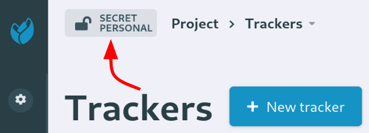

Projects management
===================

Projects settings
*****************

Categories
----------

Categorizing projects allows users to better find a particular project (see :ref:`software-map-(or Project Tree)`).

In ``site admin » project settings » categories`` you can define which categories the administrators can use
for their projects. For each category you can define its description, decide if it is mandatory, choose the maximum
number of allowed values or choose if it is used as project flag.


   Screenshot of category edition


Project flags
`````````````

In a context of `classified information <https://en.wikipedia.org/wiki/Classified_information>`_, in order to allow
people to know about the level a project is, this information is displayed in every pages of the project.

Let's consider that project confidentiality is picked-up in one list

* Secret
* Confidential
* Restricted
* Official
* Unclassified

And another category is used to provide another level of classification

* Personal
* Special
* Industry

You can get any combination of the 2 lists:

* Secret - Personal
* Secret - Industry
* ...

The information is then displayed on the right hand side of the project name in the navbar with a tooltip with
full information on hover.



   Example of project flags

.. IMPORTANT::
   Please note the following constraints for project flags:

   * Up to two categories can be used as project flag
   * Chosen categories cannot have a maximum number of allowed values bigger than 1.
