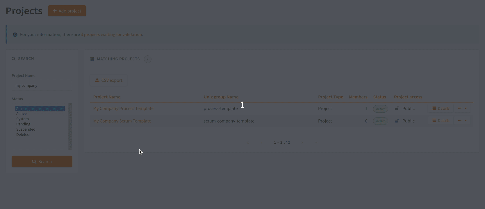

Project templates
=================

When users create a project (see :ref:`project-registration`), they have the possibility to use a "your company"
template. That means you can propose predefined templates in order to provide templates in compliance with the processes
defined in your company.

Create your company's template
``````````````````````````````
Steps to create a template dedicated to your company:
    1. Create a new project
    2. Configure it
    3. Go in the Tuleap Administration
    4. Select the project you want to set as a template and click on details
    5. Select "Template" in the "Project Type" selectbox
    6. Your new company templates is available to anybody in your company!


