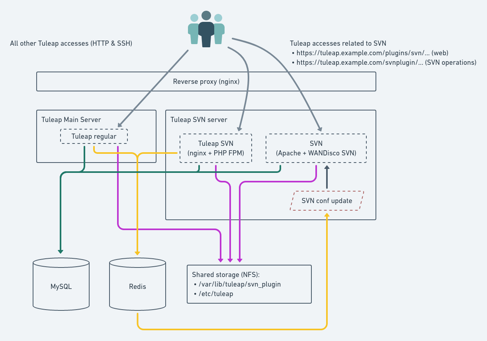
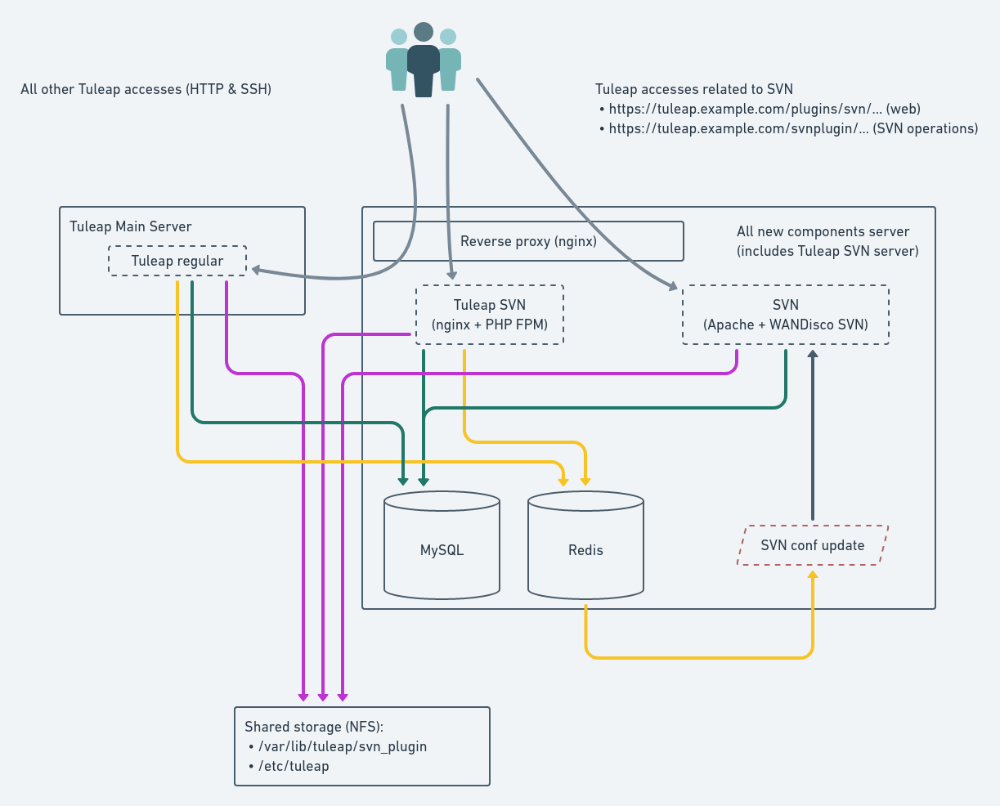

Advanced deployments
####################

.. _admin_howto_reverseproxy:

Deploy Tuleap behind a reverse proxy
====================================

We strongly recommend to setup the reverse proxy so that it terminates SSL.

Install Nginx
-------------

Install nginx from EPEL.

Configure Nginx
---------------

.. sourcecode:: nginx

    # ++ Disable emitting nginx version in response header
    server_tokens off;
    # -- Disable emitting nginx version in response header

    # ++ Cache and compress (not mandatory for reverse proxy)
    proxy_cache_path    /tmp/nginx_cache levels=1:2 keys_zone=cache_zone:200m
                        max_size=1g inactive=30m;
    proxy_cache_key     "$scheme$request_method$host$request_uri";
    gzip            on;
    gzip_vary       on;
    gzip_proxied    expired no-cache no-store private auth;
    gzip_types      text/plain text/css text/xml text/javascript
                    application/x-javascript application/xml;
    gzip_disable    "MSIE [1-6]\.";
    # -- Cache and compress

    upstream tuleap {
        server 127.0.0.1:4430;
    }

    server {
        listen 443 ssl;
        server_name tuleap.example.com;
        ssl_certificate /etc/nginx/ssl/server.crt;
        ssl_certificate_key /etc/nginx/ssl/server.key;
        ssl_session_timeout 1d;
        ssl_session_cache shared:MozSSL:10m;
        ssl_session_tickets off;

        # Path to Diffie-Hellman parameter
        # You can generated the file with openssl dhparam -out /path/to/dhparam.pem 2048
        ssl_dhparam /path/to/dhparam.pem;

        ssl_protocols TLSv1.2;
        ssl_ciphers ECDHE-ECDSA-AES128-GCM-SHA256:ECDHE-RSA-AES128-GCM-SHA256:ECDHE-ECDSA-AES256-GCM-SHA384:ECDHE-RSA-AES256-GCM-SHA384:ECDHE-ECDSA-CHACHA20-POLY1305:ECDHE-RSA-CHACHA20-POLY1305:DHE-RSA-AES128-GCM-SHA256:DHE-RSA-AES256-GCM-SHA384;
        ssl_prefer_server_ciphers off;

        # ++ Cache media (not mandatory for reverse proxy)
        location ~* \.(?:js|css|png|gif|eot|woff)$ {
            access_log              off;
            add_header              X-Cache-Status $upstream_cache_status;
            proxy_cache             cache_zone;
            proxy_cache_valid       200 302 1h;
            proxy_ignore_headers    "Set-Cookie";
            proxy_hide_header       "Set-Cookie";
            expires                 1h;

            proxy_pass https://tuleap;
            proxy_ssl_verify off;
            proxy_set_header X-Real-IP         $remote_addr;
            proxy_set_header X-Forwarded-For   $proxy_add_x_forwarded_for;
            proxy_set_header X-Forwarded-Proto $scheme;
            proxy_set_header Host              $host;
        }
        # -- Cache media

        # The 4 proxy_set_header are mandatory
        location / {
            proxy_pass https://tuleap;
            proxy_ssl_verify off;
            proxy_set_header X-Real-IP         $remote_addr;
            # Allow to know what is the original IP address (esp. for logging purpose as well as session management)
            proxy_set_header X-Forwarded-For   $proxy_add_x_forwarded_for;
            # Allow to know what is the original protocol (so Tuleap knows if things were in HTTPS)
            proxy_set_header X-Forwarded-Proto $scheme;
            # What is the name of the platform to the end users
            proxy_set_header Host              $host;
            # Write Destination header for Subversion COPY and MOVE operations
            set $fixed_destination $http_destination;
            if ( $http_destination ~* ^https(.*)$ ) {
                set $fixed_destination http$1;
            }
            proxy_set_header Destination $fixed_destination;
        }
    }

    # Let Nginx manage "force HTTPS itself"
    server {
        listen       80;
        server_name  tuleap.example.com;
        return       301 https://$server_name:443$request_uri;
    }

Configure Tuleap
----------------

You will need to tell Tuleap that the IP of the reverse proxy is trusted, in local.inc:

.. sourcecode:: php

    $sys_trusted_proxies = '127.0.0.1';

Be careful with this value, once you set it, Tuleap will automatically trust some request
headers when the request come from this IP address (``X_FORWARDED_FOR``, ``X_FORWARDED_PROTO``, ``REMOTE_ADDR``).
So if your proxy is not properly configured to value those headers, it could be used by an
attacker to spoof requests.

Please note that you can also use CIDR notation like ``192.168.0.0/24`` as well.

.. _admin_howto_distributed_tuleap:

Distributed Tuleap Configuration
================================

Distributed Tuleap is a configuration of Tuleap to allow distribution of the workload across several servers
without any change for end users. As of today its possible to have offload SVN plugin traffic on a dedicated server.

Here is the architecture schema of the main components

The architecture is quite flexible in term of "what is installed where" and is pluggable easily with an existing
regular Tuleap server ("all in one"). However there 2 strong requirements:

* The subversion data path ``/var/lib/tuleap/svn_plugin`` must be shared between the 2 servers (*Main* and *SVN* servers).
* The tuleap configuration path ``/etc/tuleap`` must be share between the servers as well.

Most of the time it means that those 2 directories must be on an NFS share mounted on both servers. The setup of NFS
and mounting is outside the scope of this documentation.

The subversion part that is installed on a new server is designed to run on el7 compatible server (either CentOS or RHEL).
We recommend to run the latest version (7.9 at time of writing). We will refer to it with *Tuleap SVN Server*. The regular Tuleap server
running will be referenced as *Main Tuleap Server*.

Pack all new components on one server
-------------------------------------

While the architecture is designed to be used with several separated servers (one for regular Tuleap, one for Tuleap SVN,
one for Redis, etc). It's quite common to only have one server for all "new components" (svn, Redis, reverse proxy).

This section will describe how to install this setup. It can be summarized by this diagram:

.. attention::

   With this setup for existing platforms there are three main consequences:

   * the DNS entry for your tuleap will change as the IP address for "tuleap" service will now be the IP address of the
     *Tuleap SVN Server*. This must be taken into account for the switch (for instance lower TTL a few weeks before the change to
     avoid lost users).
   * if you platform enabled "git over ssh" (or any other ssh based access) you will have to setup an ssh reverse proxy
     as well (explained bellow) and that means that your administration access (ssh) to the server must be updated to
     run on another port (eg. 2222) otherwise you won't be able to ssh the server (you will be redirected to the *Main Tuleap Server*).

Requirements
''''''''''''
Here are the requirements to install Distributed Tuleap.

Distributions
~~~~~~~~~~~~~
All servers are expected to run CentOS/RedHat 7.

Services
~~~~~~~~
  * The Reverse Proxy needs to be **Nginx 1.10** or newer
  * The database needs to be **MySQL 8.0**
  * The SVN repository needs to be **svn/wandisco 1.9** or newer
  * You need **Redis 3.2** or newer

On the MySQL server
'''''''''''''''''''

Add new privileges to **dbauthuser** so that the *Tuleap SVN Server* can access the database

.. code-block:: sql

   mysql> GRANT SELECT ON tuleap.user TO 'dbauthuser'@'${TULEAP_SVN_SERVER_IP}' identified by '${DBAUTHUSER_PASSWORD}';
   mysql> GRANT SELECT ON tuleap.user_group TO 'dbauthuser'@'${TULEAP_SVN_SERVER_IP}';
   mysql> GRANT SELECT ON tuleap.groups TO 'dbauthuser'@'${TULEAP_SVN_SERVER_IP}';
   mysql> GRANT SELECT ON tuleap.svn_token TO 'dbauthuser'@'${TULEAP_SVN_SERVER_IP}';
   mysql> GRANT SELECT ON tuleap.plugin_ldap_user TO 'dbauthuser'@'${TULEAP_SVN_SERVER_IP}';
   mysql> GRANT CREATE,SELECT ON plugin_openidconnectclient_user_mapping TO 'dbauthuser'@'${TULEAP_SVN_SERVER_IP}';
   mysql> REVOKE CREATE ON plugin_openidconnectclient_user_mapping FROM 'dbauthuser'@'${TULEAP_SVN_SERVER_IP}';
   mysql> FLUSH PRIVILEGES;

On the *Main Tuleap Server* server
''''''''''''''''''''''''''''''''''

Gather data for *SVN Server* setup
~~~~~~~~~~~~~~~~~~~~~~~~~~~~~~~~~~

First, you must have the same tuleap packages installed on your *Main* and *SVN*
servers. You must retrieve the packages list from your *Main Tuleap* server

.. code-block:: bash

   $ sudo rpm -aq --qf "%{NAME}\n" tuleap-plugin-\* > tuleap_packages.lst

You will also need the ids of ``codendiadm`` user

.. code-block:: bash

    # GID
    $ sudo id -g codendiadm
    # UID
    $ sudo id -u codendiadm

That's very important because of the shared NFS mount between the 2 servers

Configure for reverse-proxy
~~~~~~~~~~~~~~~~~~~~~~~~~~~

**Remember**: the "old" *Main Tuleap Server* will no longer be the entry point for all requests:

* Edit your firewall configuration so only the *Tuleap SVN Server* can access :80
* Edit ``/etc/tuleap/conf/local.inc`` and add ``$sys_trusted_proxies = '${TULEAP_SVN_SERVER_IP}';``

On the *Tuleap SVN Server*
''''''''''''''''''''''''''

Prepare the server
~~~~~~~~~~~~~~~~~~

Disable SELinux

.. code-block:: bash

   $ sudo echo 0 > /sys/fs/selinux/enforce
   $ sudo sed -i 's/^SELINUX=.*/SELINUX=disabled/g' /etc/sysconfig/selinux

Add the EPEL and the SCL repository

.. code-block:: bash

   $ sudo yum install -y epel-release
   # For Centos
   $ sudo yum install -y centos-release-scl

For RHEL checkout `documentation about RHSCL <https://access.redhat.com/documentation/en-us/red_hat_software_collections/2/html-single/2.3_release_notes/index#sect-Installation-Subscribe>`_.

Create ``codendiadm`` user with the same ids than on the *Main Tuleap Server* (UID & GID corresponds to the value you got on the *Main Tuleap Server*):

.. code-block:: bash

   $ sudo groupadd -g GID codendiadm
   $ sudo useradd -g codendiadm -M -d /var/lib/tuleap -u UID codendiadm

Mount ``/etc/tuleap`` and ``/var/lib/tuleap/svn_plugin`` directories on the *Tuleap SVN Server*.

If you configured properly, when you run ``ls -l /etc/tuleap/`` on the *Tuleap SVN Server* and *Main Tuleap Server* you should see

.. code-block:: bash

    ...
    drwxr-xr-x  2 codendiadm codendiadm 4096 Apr 14 09:08 conf
    drwxr-xr-x  3 codendiadm codendiadm 4096 Apr 17  2016 documentation
    drwxr-xr-x  2 codendiadm codendiadm 4096 Nov 18 14:41 forgeupgrade
    ...

If it's wrongly configured you will have something like:

.. code-block:: bash

    ...
    drwxr-xr-x  2 496 497 4096 Apr 14 09:08 conf
    ...

That would mean that the codendiadm user doesn't have the correct IDs.

.. attention::

    If you provide ssh access to your end users (for git over ssh, project web pages or ftp over ssh, ...) you
    need to update the ssh port you will you to connect to the *Tuleap SVN Server*:

    **WARNING**: it's a dangerous operation, be careful to not close your shell until you are 100% sure everything works
    or you might lock yourself out of the server

    * Edit ``/etc/ssh/sshd_config`` and set ``Port 2222`` (or any other port that you want to use).
    * Update your firewall rules to open ``2222`` for tcp connexions
    * Restart sshd server
    * With another terminal try to ssh the *Tuleap SVN Server* on port ``2222``
    * If it works, keep the configuration, otherwise revert the ``sshd_config``

When everything is OK (esp. the ssh part), update the DNS entry for your tuleap server to point to *Tuleap SVN Server* IP address.

Install Redis
~~~~~~~~~~~~~

Install Redis server from epel repository

.. code-block:: bash

   $ sudo yum install -y redis

Generate a strong password ``${REDIS_PASSWORD}`` and set in the configuration:

.. code-block:: bash

   ...
   bind 0.0.0.0
   ...
   requirepass ${REDIS_PASSWORD}
   ...

Start the redis server & enable automatically

.. code-block:: bash

   $ sudo systemctl start redis
   $ sudo systemctl enable redis

Firewall configuration:

* Ensure the *Main Tuleap Server* can access port 6379/tcp

Install Tuleap packages
~~~~~~~~~~~~~~~~~~~~~~~

Add the Tuleap el7 repository

.. code-block:: bash

   $ sudo cat << EOF > /etc/yum.repos.d/tuleap.rhel7.repo
   [Tuleap-rhel7]
   name=Tuleap
   baseurl=https://ci.tuleap.org/yum/tuleap/rhel/7/dev/\$basearch
   enabled=1
   gpgcheck=1
   gpgkey=https://ci.tuleap.net/yum/tuleap/gpg.key
   EOF

Install the packages list

.. code-block:: bash

   $ sudo yum install $(cat tuleap_packages.lst) \
                      nginx \
                      tuleap-plugin-svn

.. note::

  If you are using subversion from `WANdisco <https://www.wandisco.com/resource-library>`_ to run newer versions,
  make sure to install the same version on both the *Main Tuleap Server* and the *Tuleap SVN server*.

Configure Nginx
~~~~~~~~~~~~~~~

In this setup Nginx will serve as front reverse-proxy and bridge for php-fpm.

Install the base configuration for backend-svn:

.. code-block:: bash

   $ sudo /usr/share/tuleap/tools/distlp/setup.php --module=backend-svn
   info [FPM] Backup original FPM file
   info [FPM] Deploy new tuleap.conf
   info [FPM] Done

And create missing directories:

.. code-block:: bash

    mkdir -p /etc/nginx/conf.d/http/ /etc/nginx/conf.d/tcp/

Deploy ``/etc/nginx/nginx.conf``:

.. sourcecode:: nginx

    user nginx;
    worker_processes auto;
    error_log /var/log/nginx/error.log;
    pid /run/nginx.pid;

    # Load dynamic modules. See /usr/share/nginx/README.dynamic.
    include /usr/share/nginx/modules/*.conf;

    events {
        worker_connections 1024;
    }

    http {
        log_format  main  '$remote_addr - $remote_user [$time_local] "$request" '
                          '$status $body_bytes_sent "$http_referer" '
                          '"$http_user_agent" "$http_x_forwarded_for"';

        access_log  /var/log/nginx/access.log  main;

        sendfile            on;
        tcp_nopush          on;
        tcp_nodelay         on;
        keepalive_timeout   65;
        types_hash_max_size 2048;

        include             /etc/nginx/mime.types;
        default_type        application/octet-stream;

        # Load modular configuration files from the /etc/nginx/conf.d directory.
        # See http://nginx.org/en/docs/ngx_core_module.html#include
        # for more information.
        include /etc/nginx/conf.d/http/*.conf;
    }

    stream {
        include /etc/nginx/conf.d/tcp/*.conf;
    }

Deploy ``/etc/nginx/proxy-vars.conf``:

.. sourcecode:: nginx

    proxy_set_header X-Real-IP         $remote_addr;
    proxy_set_header X-Forwarded-For   $proxy_add_x_forwarded_for;
    proxy_set_header X-Forwarded-Proto $scheme;
    proxy_set_header Host              $host;

Deploy ``/etc/nginx/conf.d/http/tuleap.conf``:

.. sourcecode:: nginx

    # ++ Disable emitting nginx version in response header
    server_tokens off;
    # -- Disable emitting nginx version in response header

    # ++ Cache and compress
    proxy_cache_path    /tmp/nginx_cache levels=1:2 keys_zone=cache_zone:200m
                        max_size=1g inactive=30m;
    proxy_cache_key     "$scheme$request_method$host$request_uri";
    gzip            on;
    gzip_vary       on;
    gzip_proxied    expired no-cache no-store private auth;
    gzip_types      text/plain text/css text/xml text/javascript
                    application/x-javascript application/xml;
    gzip_disable    "MSIE [1-6]\.";
    # -- Cache and compress

    upstream backend-web {
        server ${TULEAP_MAIN_SERVER_IP}:80;
    }

    upstream backend-httpd {
        server 127.0.0.1:8080;
    }

    server {
        listen 443 ssl;
        server_name ${HERE_YOUR_DOMAIN_NAME};
        ssl_certificate ${PATH_TO_YOUR_SSL_CERTIFICATE};
        ssl_certificate_key ${PATH_TO_YOUR_SSL_CERTIFICATE};
        ssl_session_timeout 1d;
        ssl_session_cache shared:MozSSL:10m;
        ssl_session_tickets off;

        ssl_protocols TLSv1.2;
        ssl_ciphers ECDHE-ECDSA-AES128-GCM-SHA256:ECDHE-RSA-AES128-GCM-SHA256:ECDHE-ECDSA-AES256-GCM-SHA384:ECDHE-RSA-AES256-GCM-SHA384:ECDHE-ECDSA-CHACHA20-POLY1305:ECDHE-RSA-CHACHA20-POLY1305:DHE-RSA-AES128-GCM-SHA256:DHE-RSA-AES256-GCM-SHA384;
        ssl_prefer_server_ciphers off;

        client_max_body_size 50M;

        # ++ Cache media (not mandatory for reverse proxy)
        location ~* \.(?:js|css|png|gif|eot|woff)$ {
            access_log              off;
            add_header              X-Cache-Status $upstream_cache_status;
            proxy_cache             cache_zone;
            proxy_cache_valid       200 302 1h;
            proxy_ignore_headers    "Set-Cookie";
            proxy_hide_header       "Set-Cookie";
            #expires                 1h;

            proxy_pass http://backend-web;
            include proxy-vars.conf;
        }
        # -- Cache media

        # The 4 proxy_set_header are mandatory
        location / {
            proxy_pass http://backend-web;
            include proxy-vars.conf;
        }

        # -- SVN
        root /usr/share/tuleap/src/www;
        index index.php;

        location /index.php {
            include fastcgi_params;

            fastcgi_pass 127.0.0.1:9000;
            fastcgi_index                   index.php;

            fastcgi_param DOCUMENT_ROOT             $realpath_root;
            fastcgi_param SCRIPT_FILENAME   $realpath_root$fastcgi_script_name;
        }

        location / {
            try_files $uri $uri/ /index.php?$args;
        }

        location ^~ /plugins/svn/ {
            alias /usr/share/tuleap/plugins/svn/www/;

            if (!-f $request_filename) {
                rewrite ^ /index.php last;
            }
        }

        location ^~ /svnplugin {
            proxy_pass http://backend-httpd;
            proxy_set_header X-Real-IP         $remote_addr;
            proxy_set_header X-Forwarded-For   $proxy_add_x_forwarded_for;
            proxy_set_header X-Forwarded-Proto $scheme;
            proxy_set_header Host              $host;
            # Write Destination header for Subversion COPY and MOVE operations
            proxy_set_header Destination $http_destination;
        }

        location /viewvc-theme-tuleap {
            alias /usr/share/viewvc-theme-tuleap/assets;
        }
        # -- SVN
    }

    # Let Nginx manage "force HTTPS itself"
    server {
        listen       80;
        server_name  ${SET_HERE_YOUR_DOMAIN_NAME};
        return       301 https://$server_name$request_uri;
    }

Deploy ``/etc/nginx/conf.d/tcp/ssh.conf``:

.. sourcecode:: nginx

    upstream tuleap-ssh {
        server ${TULEAP_MAIN_SERVER_IP}:22 max_fails=2 fail_timeout=5s;
    }

    server {
        listen 22;
        proxy_connect_timeout 1s;
        proxy_timeout 3s;
        proxy_pass tuleap-ssh;
    }

You can start Nginx service

.. code-block:: bash

   $ sudo systemctl start nginx
   $ sudo systemctl enable nginx

Finalize PHP configuration
~~~~~~~~~~~~~~~~~~~~~~~~~~

Define the name of the handler and the path session in ``/etc/opt/remi/php74/php-fpm.d/tuleap.conf``

.. code-block:: php

   ...
   php_value[session.save_handler] = redis
   ...
   php_value[session.save_path] = "tcp://${TULEAP_SVN_SERVER_IP}:6379?auth=${REDIS_PASSWORD}"
   ...

Mask RHEL php-fpm unit to avoid confusion with the tuleap-php-fpm unit

.. code-block:: bash

   $ sudo systemctl mask php74-php-fpm

Restart apache and make it persistent:

.. code-block:: bash

   $ sudo systemctl restart httpd
   $ sudo systemctl enable httpd

And start Tuleap service

.. code-block:: bash

   $ sudo systemctl enable tuleap-svn-updater.service
   $ sudo systemctl start tuleap

Tuleap service is an umbrella unit and start the following services

.. code-block:: bash

   $ sudo systemctl list-unit-files tuleap-\*
   UNIT FILE                     STATE
   tuleap-php-fpm.service        enabled
   tuleap-svn-log-parser.service enabled
   tuleap-svn-updater.service    enabled

Test your new server
--------------------

You should be able to browse seamlessly your new server. All pages will be served by the *Main Tuleap Server* except browsing of svn
plugin and subversion operations made on svn plugin.

The various logs on the *Tuleap SVN Server*:

* svn operations (svn ls, etc): ``/var/log/httpd/``
* svn browsing (viewvc + settings): ``/var/opt/remi/php74/log/php-fpm``
* tuleap svn backend: ``/var/log/tuleap/svnroot_updater.log``
* reverse proxy logs: ``/var/log/nginx``

.. _install_realtime:

Tuleap Realtime
===============

What is Realtime
----------------

Tuleap Realtime brings interactivity when users are viewing the same screen at the same time.
For example in Kanban, when one user moves a card from one column to another, then the card is automatically moved for every users that are on the same Kanban.

Tuleap Realtime installation
----------------------------

Install the ``tuleap-realtime`` package:

  .. code-block:: bash

        $ yum install tuleap-realtime

You have a tuleap-realtime service and a config file created.

Generate a private key that will be shared between the Tuleap Realtime server machine and the Tuleap server machine.
To generate it, you can use the following command:

  .. code-block:: bash

        head -c 64 /dev/urandom | base64 --wrap=88

.. attention::
    Be careful, the confidentiality of the data rely on this key so it needs to be strong enough

The next step is to adapt your Tuleap Realtime config file.
To do this, you have to edit the ``/etc/tuleap-realtime/config.json`` file:

* Replace value of ``full_path_ssl_cert`` and ``full_path_ssl_key`` by a path where is the certificate and key.
* Replace value of ``port`` by the port that tuleap-realtime server will listen.
* Replace value of ``nodejs_server_jwt_private_key`` by the generated private key.

Then, you have to change configurations on Tuleap server machine, in the ``/etc/tuleap/conf/local.inc`` file.

The port and the private key have to be the same in your config file.
You also have to replace the value of ``nodejs_server_jwt_private_key`` in the ``local.inc`` config file by the new key.

  .. code-block:: bash

         $nodejs_server = '<domain_name>:<port>';
         $nodejs_server_jwt_private_key = '<your_private_key_generated>';

Run Tuleap Realtime server
--------------------------

A service tuleap-realtime is available. You can ``start|stop|condrestart|status`` the server.

* start: start the service starting Node.js server
* stop: stop the service stoping Node.js server
* condrestart: restart the service if already running
* status: display service's status

You can test the activation of the realtime server with curl:

.. code-block:: bash

    $ curl https://<tuleap_instance>:<port>

    # It works if the response looks like the following (the Cannot GET / part is expected):
    <!DOCTYPE html>
    <html lang="en">
    <head>
    <meta charset="utf-8">
    <title>Error</title>
    </head>
    <body>
    <pre>Cannot GET /</pre>
    </body>
    </html>
    # If curl cannot connect to tuleap-realtime or verify its certificate, it will output a different error.

Notes
-----

If your certificate used by tuleap-realtime isn't in the list of recognized CAs then the real time won't work.
To verify you can see this error "Unable to reach nodejs server ..." in the ``/var/log/tuleap/codendi_syslog`` file.

To resolve it, you have to add a new certification authority to the CA bundle.

If your server is behind a firewall, make sure that the port used by realtime is opened in the firewall.
