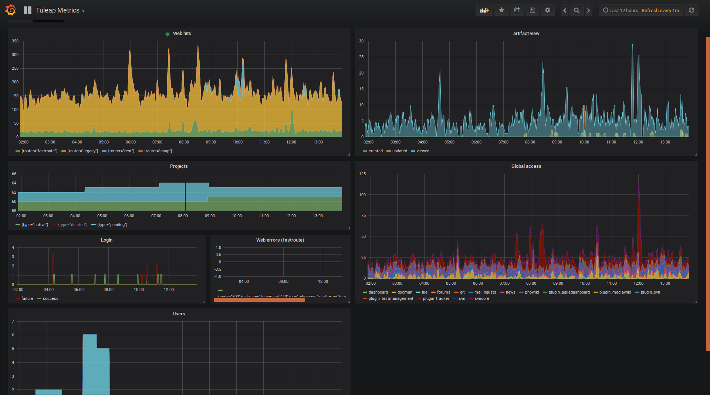

.. _admin_monitoring_with_prometheus:

Monitoring with Prometheus
==========================

.. attention::

  This module is part of :ref:`Tuleap Entreprise <tuleap-enterprise>`. It might
  not be available on your installation of Tuleap.

Tuleap gathers metrics about usage (number of artifact viewed, created, updated, services access) and exposes them using
`Prometheus <https://prometheus.io/>`_ format. To efficiently exploit them, you should install Prometheus as well as
`Grafana <https://grafana.com/>`_. Installation and configuration of those tools is not covered in this section but well
documented in their respective documentations.

Configuration of Tuleap
-----------------------

First step is to install a Valkey server and to configure Tuleap to use it,
checkout the :ref:`Valkey installation guide<installation_valkey>`.

After having installed and activated ``tuleap-plugin-prometheus-metrics`` rpm, you need to setup a password to access the
data (by default data are private and there is no ways to make them accessible anonymously). To do so, you need to write
a 16 chars password (minimum) in ``/etc/tuleap/plugins/prometheus_metrics/etc/metrics_secret.key``. Keep this file safe by
making it readable only by ``codendiadm`` user (``chown codendiadm:codendiadm`` && ``chmod 0400``).

You also have to give it to the platform, this name will used as a label in Prometheus so you can be able to filter the
result per platform if you are running multiple Tuleap instances. The name can be something like *staging*, *production*
or just the FQDN of the instance: ``tuleap config-set prometheus_platform <name>``.

Then your instance will output metrics under the ``/metrics`` end-point. For instance if your tuleap is setup under
https://tuleap.example.com, you will metrics them at https://tuleap.example.com/metrics. You will get a basic auth challenge
where username is ``metrics`` and the password is the one set previously.

Using node_exporter
~~~~~~~~~~~~~~~~~~~

Tuleap can also exposes server metrics (CPU, RAM, etc) on the same end point. It's useful because it avoids to make two
configurations in Prometheus and you don't have to make your own reverse proxy to let Prometheus access securely to your
server metrics.

The server metrics are gathered by `node_exporter <https://github.com/prometheus/node_exporter>`_.

The following example uses COPR repository

.. sourcecode:: bash

    # On RHEL/Rocky Linux/... 9
    $> dnf install golang-github-prometheus-node-exporter
    # Adjust the arguments used when starting the service to your liking
    # You might want to only expose it locally with `--web.listen-address="127.0.0.1:9100"`
    $> $EDITOR /etc/default/prometheus-node-exporter
    # Start the service and enable it at boot time
    $> systemctl enable --now prometheus-node-exporter

    $> tuleap config-set prometheus_node_exporter http://127.0.0.1:9100/metrics

Then you will see a bunch of data like ``node_cpu_seconds_total`` on ``/metrics`` end-point.

Configuration of Prometheus
---------------------------

The following snippet should be added in your ``prometheus.yml`` config. For more information about Prometheus configuration,
it is recommended to take a look at `Prometheus documentation <https://prometheus.io/docs/prometheus/latest/configuration/configuration/>`_.

.. sourcecode:: yaml

    scrape_configs:

      ...

      - job_name: tuleap
        metrics_path: /metrics
        scheme: https
        basic_auth:
          username: metrics
          password: Some very strong password set by admin
        static_configs:
          - targets:
            - tuleap.example.com

      ...

Grafana Dashboard
-----------------

The dashboard is published on `Grafana Dashboard Marketplace <https://grafana.com/grafana/dashboards/18764-tuleap-metrics/>`_ you can either find it directly
in your Grafana instance or download it directly from there.

The dashboard evolves when new metrics are being added to Tuleap so keep an eye on it.
