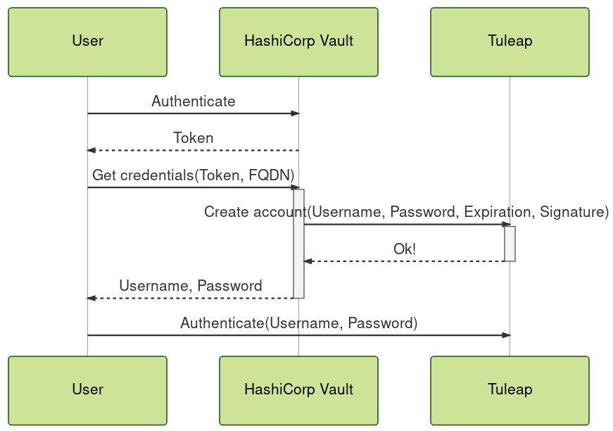
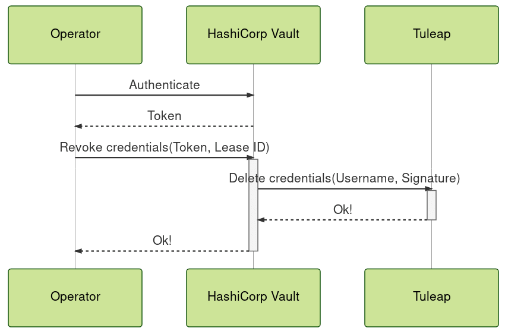

.. _dynamic-credentials:

Dynamic credentials
===================

.. attention::

  This module is part of :ref:`Tuleap Enterprise <tuleap-enterprise>`. It might
  not be available on your installation of Tuleap.

The dynamic credentials plugin aims to provide a way to generate short-lived
credentials on the fly to access to a Tuleap instance. While it could work with
other tools, the plugin is specifically designed to work with
`HashiCorp Vault <https://developer.hashicorp.com/vault>`_.

The goal is to solve the following challenges:

 * **Non-Repudiation**: Credentials are unique per user which makes auditing and finding
   the source of compromise possible. The need of sharing credentials is removed.
 * **Impact of a compromise**: Since credentials are only valid for a limited period
   of time, it reduces the risks because they will be revoked automatically.
 * **Revocation**: It is possible to associate each credentials to a specific client.
   This makes possible to revoke only the impacted credentials in case of a lease.

As of today, the dynamic credentials plugin only allows to create set of credentials
associated with a site adminitrator access.

Setup
*****

The plugin ``tuleap-plugin-dynamic-credentials`` must be installed and enabled
on your Tuleap instance, see :ref:`install-plugins` to learn how to do that.

On your Vault instance, you must install the ``vault-tuleap-plugin`` and mount
the secret engine, refer to the
`Vault documentation <https://developer.hashicorp.com/vault/docs/plugins/plugin-management>`_ to
learn how to do that. A compiled version of the ``vault-tuleap-plugin`` can be
found `here <https://ci.tuleap.org/jenkins/job/Tuleap%20Additional%20Tools/job/Build%20Additional%20Tuleap%20Tools/>`_.
This document assumes the Tuleap secrets engine is enabled at the ``tuleap``
path in Vault. If that is not the case, please your commands accordingly.

You then need to configure a connection to communicate with a Tuleap instance:

::

    $ vault write tuleap/config/my-tuleap allowed_roles="my-role"

Once the connection is configured, you need to retrieve the public key and set it
in the configuration file of the plugin
``/etc/tuleap/plugins/dynamic_credentials/etc/dynamic_credentials.inc`` on your
Tuleap server:

::

    $ vault read tuleap/config/my-tuleap

Configure a role to map a name in your Vault instance to the host running your
Tuleap instance:

::

    $ vault vault write database/roles/my-role \
        config_name="my-tuleap" \
        allowed_hosts="tuleap.example.com"

You can then request credentials and use them to log in the Tuleap instance:

::

    $ vault write tuleap/creds/my-role host='tuleap.example.com'

How does it work?
-----------------

The following diagram summarizes the communication the user requesting the
credentials, the HashiCorp Vault instance and the Tuleap instance:

..
    mermaidjs diagram
    sequenceDiagram
        participant User
        participant HashiCorp Vault
        participant Tuleap
        User->>HashiCorp Vault: Authenticate
        HashiCorp Vault-->>User: Token
        User->>+HashiCorp Vault: Get credentials(Token, FQDN)
        HashiCorp Vault->>+Tuleap: Create account(Username, Password, Expiration, Signature)
        Tuleap-->>-HashiCorp Vault: Ok!
        HashiCorp Vault-->>-User: Username, Password
        User->>Tuleap: Authenticate(Username, Password)

The following diagram summarizes the communication the user requesting the
credentials, the HashiCorp Vault instance and the Tuleap instance:

..
    mermaidjs diagram
    sequenceDiagram
        participant Operator
        participant HashiCorp Vault
        participant Tuleap
        Operator->>HashiCorp Vault: Authenticate
        HashiCorp Vault-->>Operator: Token
        Operator->>+HashiCorp Vault: Revoke credentials(Token, Lease ID)
        HashiCorp Vault->>+Tuleap: Delete credentials(Username, Signature)
        Tuleap-->>-HashiCorp Vault: Ok!
        HashiCorp Vault-->>-Operator: Ok!

Authentication of requests coming from HashiCorp Vault to the Tuleap instance
relies on Ed25519 base64 encoded signatures.
The signed messages are generated the following ways:

 * creation request: ``<sys_https_host>||username||password||expiration (ISO8601 formatted)``
 * revocation request: ``<sys_https_host>||username``

The security of the solution relies on the fact that the private key used to sign messages
is generated directly in the HashiCorp Vault instance and, under a normal usage,
is not known by other parties. The HashiCorp Vault instance is the only party
able to generate a valid request accepted by the Tuleap instance. The
`HashiCorp Vault security model <https://developer.hashicorp.com/vault/docs/internals/security>`_
might of interest. For the Tuleap plugin, the usual security model of Tuleap applies.
