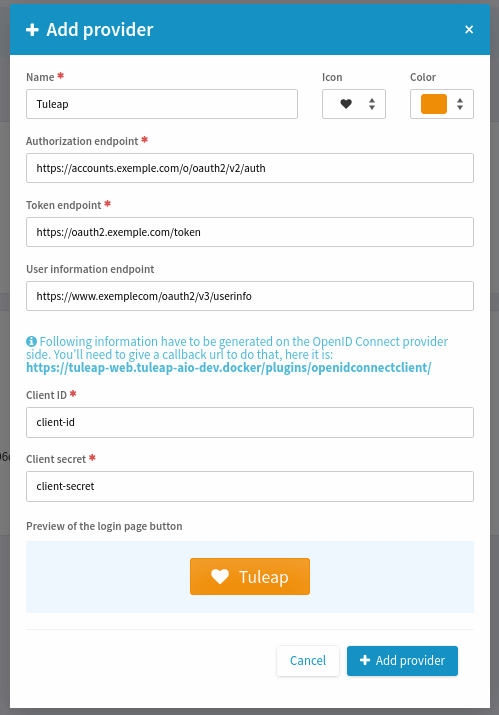
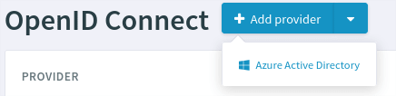
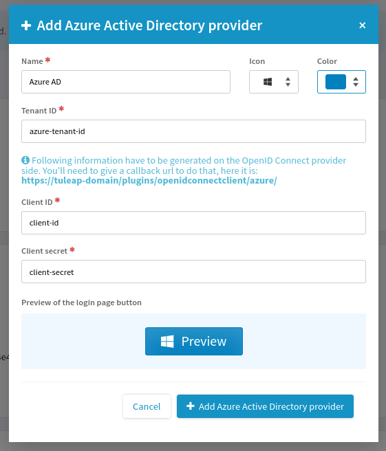

OpenID Connect
---------------

The Open Id Connect plugin allow to allows to authenticate with Open Id Connect.

.. attention::
    As of today, this plugin can not be used when the LDAP plugin is enabled.

Generic Provider
****************

This is the one who is used more the most of the Open Id provider.
To add a generic provider, you need to go on PLUGINS >> OpenID Connect Client >> Add provider as site administrator.
A modal opens and you can fill in the necessary fields

Azure Active Directory Provider
*******************************

Azure AD is a little bite different and doesn't need the same data.
If you want to add an Azure AD provider, click on the caret down and "Azure Active Directory".

A different modal opens and you can fill the necessary fields. Note authorization endpoint, token endpoint and user information endpoint are not more necessary.
They are replaced by Tenant Id.

