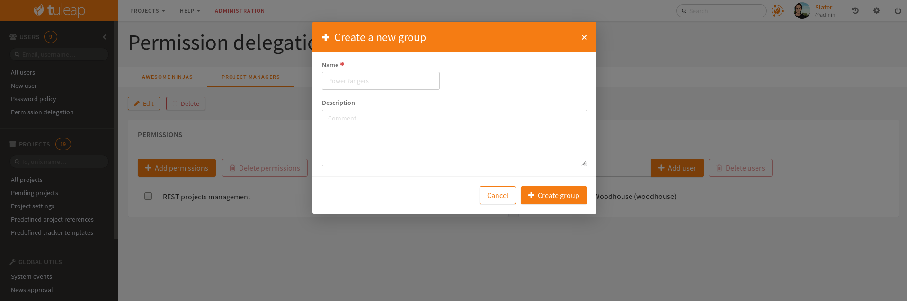

Permission delegation
---------------------

It is possible to grant some platform-wide permissions to certain users. To do so, you need to create some user groups, then grant permissions to these user groups.

There are various permissions to be granted. However, think wisely about the people to be granted these rights. With a great power come great responsibilities!

+-----------------------------------------------------------+----------------------------------------------------------------------------------------------------------------------+
| Permission                                                | What it grants                                                                                                       |
+===========================================================+======================================================================================================================+
| Global Mediawiki Administrator                            | Grants Mediawiki administration rights in every projects                                                             |
+-----------------------------------------------------------+----------------------------------------------------------------------------------------------------------------------+
| Global Tracker Administrator                              | Grants Tracker administration rights in every projects                                                               |
+-----------------------------------------------------------+----------------------------------------------------------------------------------------------------------------------+
| Platform administration                                   | Grants site administrator rights. Users of this delegation will have an "Administration" tab in the navigation bar.  |
+-----------------------------------------------------------+----------------------------------------------------------------------------------------------------------------------+
| REST projects management                                  | Grants the right to create / suspend / activate projects through the REST API                                        |
+-----------------------------------------------------------+----------------------------------------------------------------------------------------------------------------------+
| Retrieve User Membership Information                      | Grants the right to know which group any user belongs to.                                                            |
+-----------------------------------------------------------+----------------------------------------------------------------------------------------------------------------------+
| See information about system events through the REST API. | Grants the right to query GET /system_events on the REST API                                                         |
+-----------------------------------------------------------+----------------------------------------------------------------------------------------------------------------------+
| User Management                                           | Grants the right to manage users: change the status, the username, etc,.. through the REST API                       |
+-----------------------------------------------------------+----------------------------------------------------------------------------------------------------------------------+
| REST Read only administrator                              | Grants the right to browse the whole REST API as a read only platform administrator. Assigned user(s) should only be |
|                                                           | used with the REST API as it will induce inconsistent behaviour with the Web UI.                                     |
+-----------------------------------------------------------+----------------------------------------------------------------------------------------------------------------------+

.. NOTE::
    A security prevents you to remove the user group containing the last Platform administration permission or you might be unable to access the platform administration anymore.
