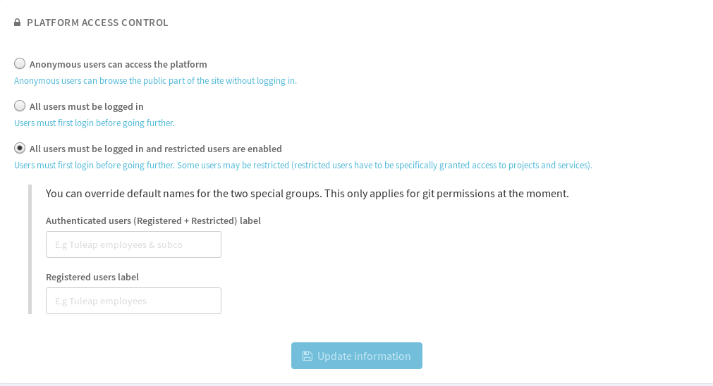

Permissions model
=================

.. _classes-of-citizens:

Type of users
-------------

Before we go further into the user registration process it is worth
reviewing the various types of Tuleap citizens. There are always 3 of them:

-  **Registered Users**: once you have created your own account (see
   below) you can use your login/password to authenticate with
   Tuleap. Registered users have access to all
   Tuleap projects including source code unless the project
   administrators decided otherwise. And since the system knows about
   you, it enables you to customize your view of the system through your
   Personal Page, monitor Forums, software release, receive support
   request follow-ups, site updates and many other useful things.

-  **Project Members**: users who are actively working on a
   Tuleap hosted project. To become a project member, you
   must first become a registered user and then ask a project
   administrator to include you in the project members. Most of the time
   project members are part of the project team but are not limited to
   software developers. They can be in charge of the support activity,
   the project documentation or the project management. Project members
   can be granted different rights by the Project Administrator
   according to their role in the team (see :ref:`project-administration` for more details).

-  **Project Administrators**: registered users who create a new
   Tuleap project are elected as the first Project
   Administrators. Project Administrators have full rights over their
   projects except project deletion - a very unusual operation - that
   can only be done by a Site Administrator. In the course
   of the project life, the initial project administrator can grant (or
   revoke) the status of project administrator to any project member.

In addition to those roles, depending of the platform configuration, there might be
two extra roles:

-  **Anonymous Users**: when you first visit the Tuleap site
   you are typically an anonymous user. Anonymous users can browse the
   site but many of the resources cannot be used or accessed by an
   anonymous user.

-  **Restricted Users**: users who are project members, or even project
   administrators, but with restricted access rights: they cannot access
   pages from projects they are not a member of. This special role is only
   enabled on servers in heterogeneous environments
   where corporate users and external consultants share the same server.

Site configuration
------------------

The permission model of Tuleap is first defined by the platform configuration.
This configuration is done by a site administrator in ``Admin > Configure anonymous and restricted access``
section.



   Admin of site access

As a site admin you decide whether:

* Anonymous users can access the platform (``Anonymous``)
* All users must be logged in (``Registered``)
* All users must be logged in and restricted users are enabled (``Registered + Restricted``)

Please note that, in ``Registered + Restricted`` mode, site admin can customize the name
of the two meta-groups ``Authenticated users`` (corresponding to all users, ``Registered``
and ``Restricted``) as well as ``Registered users``.

The default list of groups is:

+--------------------------+
| Registered + Restricted  |
+==========================+
| * Authenticated users    |
| * Registered users       |
| * Project members        |
| * Project admins         |
| * *project's groups*     |
+--------------------------+

In most configurations, ``Registered + Restricted`` is used to separate ``Registered`` *regular* users
that are employees of the company from ``Restricted`` users that are subcontractors. Hence an "Acme" company
might want to rename the groups:

* ``Authenticated users`` -> ``ACME employees & subco``
* ``Registered users``    -> ``ACME employees``

Then the list of available groups would be:

+--------------------------+
| Registered + Restricted  |
+==========================+
| * ACME employees & subco |
| * ACME employees         |
| * Project members        |
| * Project admins         |
| * *project's groups*     |
+--------------------------+

Project's permissions
---------------------

.. _project-visibility:

In addition to site configuration, project administrators can decide whether their projects are:

* **Public**
* **Private**
* **Public inc. Restricted** (only if platform is ``Registered + Restricted``)
* **Private without Restricted** (only if platform is ``Registered + Restricted``)

When the **Private without Restricted** mode is used, no restricted user can be added to the project.

Resources visibility
````````````````````

You can find bellow the complete matrix of *Who can access What* depending to the various configurations:

+-----------------------+---------------------------------------------+---------------------------------------------+----------------------------------------------------------------------------------------------------+
|   Site configuration  |                 Anonymous                   |                 Registered                  |                                    Registered + Restricted                                         |
+-----------------------+----------------------+----------------------+----------------------+----------------------+-------------------------+----------------------+----------------------+----------------------------+
| Project configuration |         Public       |       Private        |         Public       |       Private        | Public incl. Restricted |       Public         |         Private      | Private without Restricted |
+=======================+======================+======================+======================+======================+=========================+======================+======================+============================+
|   Anonymous           |        **YES**       |          NO          |         N/A          |         N/A          |           N/A           |         N/A          |          N/A         |              N/A           |
+-----------------------+----------------------+----------------------+----------------------+----------------------+-------------------------+----------------------+----------------------+----------------------------+
|  Authenticated users  |          N/A         |         N/A          |         N/A          |         N/A          |         **YES**         |         NO           |          NO          |              NO            |
+-----------------------+----------------------+----------------------+----------------------+----------------------+-------------------------+----------------------+----------------------+----------------------------+
|   Registered users    |        **YES**       |         NO           |       **YES**        |         NO           |         **YES**         |        **YES**       |          NO          |              NO            |
+-----------------------+----------------------+----------------------+----------------------+----------------------+-------------------------+----------------------+----------------------+----------------------------+
|   Project members     |         **YES**      |       **YES**        |       **YES**        |        **YES**       |         **YES**         |        **YES**       |        **YES**       |            **YES**         |
+-----------------------+----------------------+----------------------+----------------------+----------------------+-------------------------+----------------------+----------------------+----------------------------+
|   Project admins      |         **YES**      |       **YES**        |       **YES**        |        **YES**       |         **YES**         |        **YES**       |        **YES**       |            **YES**         |
+-----------------------+----------------------+----------------------+----------------------+----------------------+-------------------------+----------------------+----------------------+----------------------------+
| project's group       |         **YES**      | NO (need to be       |       **YES**        | NO (need to be       |         **YES**         |        **YES**       | NO (need to be       |     NO (need to be         |
|     member            |                      |   project member)    |                      |      project member) |                         |                      |      project member) |          project member)   |
+-----------------------+----------------------+----------------------+----------------------+----------------------+-------------------------+----------------------+----------------------+----------------------------+

Notes:

* N/A means that this option is not possible according to the configuration.
* Project admins
* At the time being, ``Authenticated users`` group is only available for "git repositories" resource

Resource configuration
``````````````````````

The following matrix describe the resource manager possibilities according to various configurations.

At the time being, this applies only to "git repositories"

+-----------------------+---------------------------------------------+---------------------------------------------+----------------------------------------------------------------------------------------------------+
|   Site configuration  |                 Anonymous                   |                 Registered                  |                                      Registered + Restricted                                       |
+-----------------------+----------------------+----------------------+----------------------+----------------------+-------------------------+----------------------+----------------------+----------------------------+
| Project configuration |         Public       |       Private        |         Public       |       Private        | Public incl. Restricted |       Public         |         Private      | Private without Restricted |
+=======================+======================+======================+======================+======================+=========================+======================+======================+============================+
|   Available groups    | * Anonymous          | * Project members    | * Registered user    | * Project members    | * Authenticated users   | * Registered user    | * Project members    | * Project members          |
|                       | * Registered user    | * Project admins     | * Project members    | * Project admins     | * Registered user       | * Project members    | * Project admins     | * Project admins           |
|                       | * Project members    | * *project's groups* | * Project admins     | * *project's groups* | * Project members       | * Project admins     | * *project's groups* | * *project's groups*       |
|                       | * Project admins     |                      | * *project's groups* |                      | * Project admins        | * *project's groups* |                      |                            |
|                       | * *project's groups* |                      |                      |                      | * *project's groups*    |                      |                      |                            |
+-----------------------+----------------------+----------------------+----------------------+----------------------+-------------------------+----------------------+----------------------+----------------------------+

Legacy resource configuration and visibility
````````````````````````````````````````````

For all other resources, the resource manager always sees all groups:

* Anonymous
* Registered user
* Project members
* Project admins
* *project's groups*

However, permissions apply the very same way:

+-----------------------+---------------------------------------------+---------------------------------------------+----------------------------------------------------------------------------------------------------+
|   Site configuration  |                 Anonymous                   |                 Registered                  |                                    Registered + Restricted                                         |
+-----------------------+----------------------+----------------------+----------------------+----------------------+-------------------------+----------------------+----------------------+----------------------------+
| Project configuration |         Public       |       Private        |         Public       |       Private        | Public incl. Restricted |       Public         |         Private      | Private without Restricted |
+=======================+======================+======================+======================+======================+=========================+======================+======================+============================+
|   Anonymous           |        **YES**       |          NO          |         NO           |         NO           |           NO            |         NO           |          NO          |              NO            |
+-----------------------+----------------------+----------------------+----------------------+----------------------+-------------------------+----------------------+----------------------+----------------------------+
|   Registered users    |        **YES**       |         NO           |       **YES**        |         NO           |         **YES**         |        **YES**       |          NO          |              NO            |
+-----------------------+----------------------+----------------------+----------------------+----------------------+-------------------------+----------------------+----------------------+----------------------------+
|   Project members     |         **YES**      |       **YES**        |       **YES**        |        **YES**       |         **YES**         |        **YES**       |        **YES**       |            **YES**         |
+-----------------------+----------------------+----------------------+----------------------+----------------------+-------------------------+----------------------+----------------------+----------------------------+
|   Project admins      |         **YES**      |       **YES**        |       **YES**        |        **YES**       |         **YES**         |        **YES**       |        **YES**       |            **YES**         |
+-----------------------+----------------------+----------------------+----------------------+----------------------+-------------------------+----------------------+----------------------+----------------------------+
| project's group       |         **YES**      | NO (need to be       |       **YES**        | NO (need to be       |         **YES**         |        **YES**       | NO (need to be       | NO (need to be             |
|     member            |                      |   project member)    |                      |      project member) |                         |                      |      project member) |      project member)       |
+-----------------------+----------------------+----------------------+----------------------+----------------------+-------------------------+----------------------+----------------------+----------------------------+
