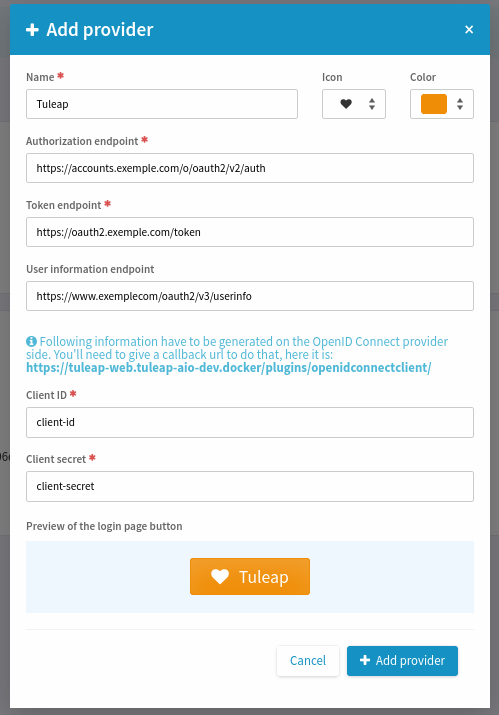
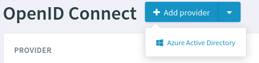
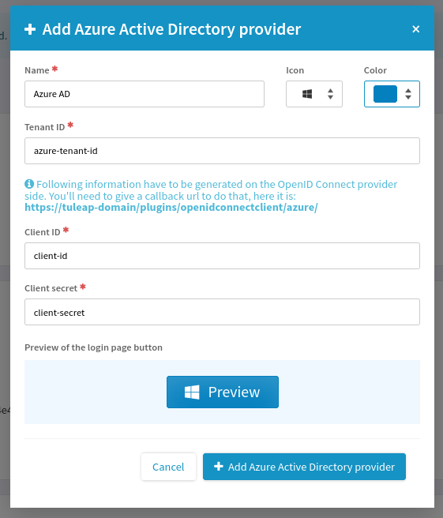

Setup OpenID Connect
====================

The OpenID Connect client plugin allows users to authenticate with an OpenID Connect provider.

.. attention::

    OpenID Connect is meant to delegate authentication to a 3rd party provider with a global goal to no longer have
    credentials management by Tuleap (either in Local DB or LDAP).

    As soon as users identify themselves with an OpenID Connect provider, they will no longer be able to use their existing
    credentials (if they had any) for:

    * Web login (they should use OpenID Connect instead)
    * REST API access (they should use :ref:`Access Keys <access-keys>`.)
    * Git over https access (they should use :ref:`Access Keys <access-keys>`.)
    * WebDAV access (they should use :ref:`Access Keys <access-keys>`.)
    * Subversion access (they should use :ref:`Access Keys <access-keys>`.)

    Access to **SOAP API is no longer possible** for users that switch to OpenID Connect.

Generic Provider
****************

This is the type of provider that should be used most of the time.
To add a generic provider, you need to go on PLUGINS >> OpenID Connect Client >> Add provider as site administrator.
A modal opens and you can fill in the necessary fields

Azure Active Directory / Entra ID Provider
******************************************

The Azure Active Directory provider takes into account the specificities of `Azure Active Directory / Entra ID <https://www.microsoft.com/en-us/security/business/identity-access/microsoft-entra-id>`_.
If you want to add an Azure AD provider, click on the caret down and "Azure Active Directory".

A different modal opens and you can fill the necessary fields.

.. _openid-connect-and-ldap:

OpenID Connect & LDAP
*********************

.. attention::

    Only activate LDAP and OpenID Connect if your OpenID Connect provider builds its user base on the same LDAP server.

.. warning::

    Enabling both LDAP and OpenID Connect is supposed to be temporary for the authentication part. As stated in introduction
    for security and mental health reasons, there should be a single source of truth of user management.

There are two configurations:

* **OpenID Connect in addition to existing LDAP authentication**. No extra configuration is needed but users that wants to use
  OpenID Connect provider will have to re-authenticate using their LDAP login (only the first time). This might be acceptable
  for existing users but for the new comers it will be weird: OIDC login + ask to re-authenticate with LDAP before getting started.
  This can be used for initial deployment but **should be considered as a temporary solution**.
* **OpenID Connect as "only authentication method"**. A configuration is required (see below). There is no re-authentication
  after OIDC provider has vetted the user, they will be automatically connected to Tuleap. You need to trust your OIDC
  provider and configuration to enable this mode.

In order to activate LDAP and OpenID Connect in parallel you must define a common field between the two authentication
sources. It means that your OpenID Connect provider should expose on its ``userinfo`` route a field that matches the one
configured as ``$sys_ldap_eduid`` in the LDAP configuration (will be user's ``ldap_id``).

For instance, if your LDAP provider is Microsoft Active Directory, the OpenID Connect provider must expose the ``sAMAccountName``
in ``userinfo``, for instance as ``preferred_name`` or any other field.

When you have this information, you must configure it with ``tuleap`` CLI as system administrator:

.. sourcecode:: shell

    tuleap config-set openidconnectclient_ldap_attribute preferred_name

After having run this command, you can configure your OpenID Connect provider as described in previous sections.

Please note that Tuleap trusts completely the OpenID Connect provider here, the value set for ``ldap_id`` is taken without any
form of verification.

Troubleshooting
---------------

You can monitor what's happening by looking at :ref:`LDAP and OpenID Connect logs <platform_logs>`:

OpenID Connect will complain if ``preferred_name`` is not found in the userinfo route:

.. sourcecode::

    2020-09-02T15:49:03+02:00 [132] [error] openidconnectclient_ldap_attribute config is defined to preferred_name however `userinfo` OIDC route only has: sub, name, given_name, family_name, picture, email, email_verified, locale

LDAP will log about LDAP id association for SVN related operations (**be aware, you should adjust log level to ``debug``**):

.. sourcecode::

    2020-09-01T16:47:33+02:00 [933] [debug] associateWithLDAPAccount start for vaceletm (id: 1280, ldap: vaceletm)
