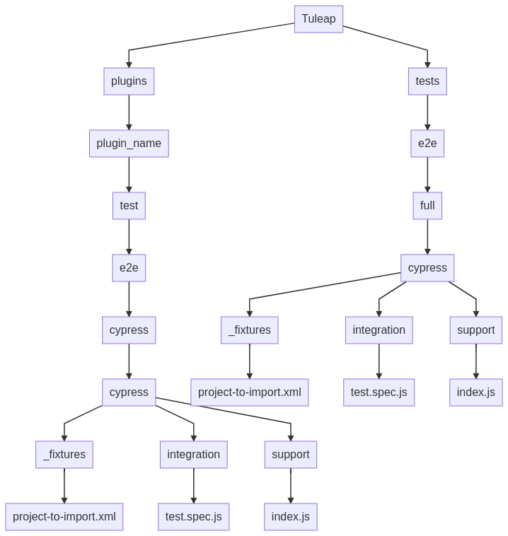

Tests
-----

We strongly encourage developers to apply TDD. Not only as a test tool but as a design tool.

Run tests
`````````

Tuleap comes with a handy test environment, based on SimpleTest and PHPUnit.
Core tests (for things in src directory) can be found in tests/simpletest directory with same subdirectory organization (eg. ``src/common/frs/FRSPackage.class.php`` tests are in ``tests/simpletest/common/frs/FRSPackageTest.php``).
Plugins tests are in each plugin tests directory:

* Old plugins have their tests written with SimpleTest (eg. ``plugins/tracker/include/Tracker.class.php`` tests are in ``plugins/tracker/tests/TrackerTest.php``).
* Recent plugins have their tests written with PHPUnit (eg. ``plugins/timetracking/include/Time/DateFormatter.php`` tests are in ``plugins/timetracking/phpunit/Time/DateFormatterTest.php``).

To run tests you can either use multiple CLI commands (at the root of Tuleap sources):

- make simpletest-73
- make phpunit-docker-73

Run tests with docker
`````````````````````

We have docker images to run unit tests on all environments:

* CentOS 6 + PHP 7.3 with simpletest: enalean/tuleap-simpletest:c6-php73
* CentOS 6 + PHP 7.2 with simpletest: enalean/tuleap-simpletest:c6-php72

Executing tests is as simple as, from root of Tuleap sources:

.. code-block:: bash

    $> docker run --rm=true -v $PWD:/tuleap:ro enalean/tuleap-simpletest:c6-php73 \
        /tuleap/tests/simpletest /tuleap/tests/integration /tuleap/plugins

If there is only one file or directory you are interested in:

.. code-block:: bash

    $> docker run --rm=true -v $PWD:/tuleap:ro enalean/tuleap-simpletest:c6-php73 --nodb \
        /tuleap/tests/simpletest/common/project/ProjectManagerTest.php

.. note::

  Please note the ``--nodb`` switch, it allows a faster start when there is no DB involved.


REST tests
""""""""""

There is also a docker image for REST tests, just run the following command:

.. code-block:: bash

   $> make tests_rest_73

It will execute all REST tests in a docker container. This container is stopped and removed once the tests are finished. If you need to run tests manually, do the following instead:

.. code-block:: bash

   $> make tests_rest_setup_73
   $root@d4601e92ca3f> ./tests/rest/bin/test_suite.sh <optional_path_to_tests_you_want_to_run>

In case of failure, you may need to attach to this running container in order to parse logs for example:

.. code-block:: bash

   $> docker exec -ti <name-of-the-container> bash
   $root@d4601e92ca3f> tail -f /var/opt/remi/php73/log/php-fpm/error.log


.. note::

  If you're using an old version of docker, you might encounter error `unknown flag: --mount`

  You can run your test container with:

  ``docker run -ti --rm -v "$(pwd)":/usr/share/tuleap --tmpfs /tmp -w /usr/share/tuleap enalean/tuleap-test-rest:c6-php73-mysql57 bash``

Cypress tests
"""""""""""""

All end-to-end tests are written with `Cypress <https://www.cypress.io>`_.

Writing good tests
``````````````````

Cypress tests come in addition to manual tests defined in our TestManagement tool.
The major advantage of cypress is that tests are run every night and warn us quickly if something bad happens.

One of the main difficulties in our end-to-end workflow is having a relevant test suite:
 - Tests covered by Cypress should not aim to eliminate TestManagement test definitions.
   That means that when we are working on a subject, before starting to write any code, we must think about what test we want to cover and who will execute the test (is the feature for everybody, for project admin ...). Once it's done, we can check if we have differences with our TestManagement test suite and adapt the TestManagement suite with what has been identified.
 - When we add new tests in Cypress that don't exist in TestManagement, we must add them as a new TestManagement definition.
 - When TestManagement test definitions can't fully be covered by Cypress, then we should split them:
    - one part covered by Cypress
    - one part which will be done manually during validation
    
Best practises for writing tests
````````````````````````````````

  - It's better to have tests split by user roles.
  - Test should be executed by the least-powered user (don't use project administrator for everything).
  - Multiple ``describe`` and small ``it`` will help us debug what's going on when tests fail.
  - Multiple TestManagement test definitions can not be covered by a simple testdefinition (``ttm`` tool won't do the report automatically). In that case you should split your Cypress test and link each TestManagement test definition to a smaller ``it``.
  - Always put your Cypress tests in the relevant plugin. End-to-end tests should still respect the plugin architecture.


Write tests
```````````

If you want to run all cypress tests locally just launch:

.. code-block:: bash

   $> make tests_cypress

You will be able to see the results of the test execution in ``tuleap/test_results_e2e_full``.

If you want to add new tests, you should use the cypress dev image:

.. code-block:: bash

   $> make tests_cypress_dev

It will launch a local container with a bunch of projects (defined in ``tests/e2e/_fixtures``).
Once the container has started, you must be able to launch the Cypress electron app.
The test structure respect the Tuleap dictinction between core and plugins.

To write tests in core, just go on core namespace and run `npx cypress open`

.. code-block:: bash

   $> cd tests/e2e/full/
   $> npx cypress open

To write tests in plugins, just go on plugin namespace and run `npx cypress open`

.. code-block:: bash

   $> cd plugins/<plugin_name/tests/e2e/cypress/
   $> npx cypress open

As reminder a namespace `architecture scheme <https://mermaid-js.github.io/mermaid-live-editor/#/edit/eyJjb2RlIjoiZ3JhcGggVERcbiAgQVtUdWxlYXBdIC0tPiBwbHVnaW5zXG4gIEFbVHVsZWFwXSAtLT4gQlt0ZXN0c11cbiAgcGx1Z2lucyAtLT4gcGx1Z2luX25hbWVcbiAgcGx1Z2luX25hbWUgLS0-IHRlc3RcbiAgdGVzdCAtLT4gZTJlXG4gIGUyZSAtLT4gY3lwcmVzc1xuICBjeXByZXNzIC0tPiBDW2N5cHJlc3NdXG4gIENbY3lwcmVzc10gLS0-IF9maXh0dXJlc1xuICBfZml4dHVyZXMgLS0-IHByb2plY3QtdG8taW1wb3J0LnhtbFxuICBDW2N5cHJlc3NdIC0tPiBpbnRlZ3JhdGlvblxuICBpbnRlZ3JhdGlvbiAtLT4gdGVzdC5zcGVjLmpzXG4gIENbY3lwcmVzc10gLS0-IHN1cHBvcnRcbiAgc3VwcG9ydCAtLT4gaW5kZXguanMgXG4gIEJbdGVzdHNdIC0tPiBEW2UyZV1cbiAgRFtlMmVdIC0tPiBmdWxsXG4gIGZ1bGwgLS0-IEVbY3lwcmVzc11cbiAgIEVbY3lwcmVzc10gLS0-IEZbX2ZpeHR1cmVzXVxuICBGW19maXh0dXJlc10gLS0-IEdbcHJvamVjdC10by1pbXBvcnQueG1sXVxuICAgRVtjeXByZXNzXSAtLT4gSFtpbnRlZ3JhdGlvbl1cbiAgSFtpbnRlZ3JhdGlvbl0gLS0-IElbdGVzdC5zcGVjLmpzXVxuICBFW2N5cHJlc3NdIC0tPiBKW3N1cHBvcnRdXG4gIEpbc3VwcG9ydF0gLS0-IEtbaW5kZXguanNdXG5cdFx0IiwibWVybWFpZCI6eyJ0aGVtZSI6ImRlZmF1bHQifX0>`_. is available:




The electron app will launch tests on ``https://tuleap/``.
You have to add a new entry in ``/etc/hosts`` file, the IP should correspond to the IP of your container ``tuleap_runtests_backend-web-e2e``.

.. code-block:: bash

   $> sudo vi /etc/hosts
   $> 172.19.0.3   tuleap


.. note::

  The electron app will be able to run only when container is fully monted.
  If https://tuleap/ is unreachable make sure that container initialisation has finished.
  If it does not solve your issue, verify the IP in your /etc/hosts
  
  
Automated tests
"""""""""""""""
Some of our validation tests are executed by the CI.
To declare a test as automated, you have to:

On you dev platform

* Checkout the patch introducing the new tests
* make tests_cypress
* in ``test_results_e2e_full`` look for the ``result<sha1>.xml`` corresponding to the tests you are automating

In TTM open the test Validation Execution tracker

* Open the artifact(s) correponding to the test you have automated
* You should find a field ``Automated tests``
* Enter the ``testcase`` name into this field
* In the field ``Refactoring`` choose the value `moved to cypress` (in order to be able to see which tests must be run by the CI)

Note: if an automated test covers multiple artifacts, copy paste the test case into each artifact.
    

Organize your tests
```````````````````

All the tests related to one class (therefore to one file) should be kept in one
test file (``src/common/foo/Bar.class.php`` tests should be in
``tests/simpletest/common/foo/BarTest.php``). However, we strongly encourage you
to split test cases in several classes to leverage on setUp.

.. code-block:: php

    declare(strict_types=1);

    class Bar_IsAvailableTest extends TuleapTestCase
    {
        //... Will test Bar->isAvailable() public method
    }

    class Bar_ComputeDistanceTest extends TuleapTestCase
    {
        //... Will test Bar->computeDistance() public method
    }

Of course, it's by no mean mandatory and always up to the developer to judge
if it's relevant or not to split tests in several classes. A good indicator
would be that you can factorize most of tests set up in the ``setUp()`` method.
But if the ``setUp()`` contains things that are only used by some tests,
it's probably a sign that those tests (and corresponding methods) should
be in a dedicated class.

Write a test
````````````

What makes a good test:

- It's simple
- It has an explicit name that fully describes what is tested
- It tests only ONE thing at a time

Differences with simpletest:

- tests methods can start with ``itXxx`` keyword instead of ``testXxx``. Example:

.. code-block:: php

   public function itThrowsAnExceptionWhenCalledWithNull()

On top of simpletest we added a bit of syntactic sugar to help writing readable tests.
Most of those helpers are meant to help dealing with mock objects.

.. code-block:: php

    <?php

    declare(strict_types=1);

    class Bar_IsAvailableTest extends TuleapTestCase
    {

        public function itThrowsAnExceptionWhenCalledWithNull() : void
        {
            $this->expectException();
            $bar = new Bar();
            $bar->isAvailable(null);
        }

        public function itIsAvailableIfItHasMoreThan3Elements() : void
        {
            $foo = mock(Foo::class);
            stub($foo)->count()->returns(4);
            // Syntaxic sugar for :
            // $foo = new MockFoo();
            // $foo->setReturnValue('count', 4);

            $bar = new Bar();
            $this->assertTrue($bar->isAvailable($foo));
        }

        public function itIsNotAvailableIfItHasLessThan3Elements() : void
        {
            $foo = stub(Foo::class)->count()->returns(2);

            $bar = new Bar();
            $this->assertFalse($bar->isAvailable($foo));
        }
    }

Available syntaxic sugars:

.. code-block:: php

    $foo = mock(Foo::class);
    stub($foo)->bar($arg1, $arg2)->returns(123);
    stub($foo)->bar($arg1, $arg2)->once();
    stub($foo)->bar()->never();
    stub($foo)->bar(arg1, arg2)->at(2);
    stub($foo)->bar()->count(4);


See details and more helpers in ``tests/lib/MockBuilder.php``.

Helpers and database
````````````````````

.. hint:: **A bit of vocabulary**

    Interactions between Tuleap and the database should be done via ``DataAccessObject``
    (aka. dao) objects (see ``src/common/dao/include/DataAccessObject.class.php``)
    A dao that returns rows from database wrap the result in a ``DataAccessResult``
    (aka. dar) object (see ``src/common/dao/include/DataAccessResult.class.php``)

Tuleap test helpers ease interaction with database objects. If you need to interact
with a query result you can use mock's ``returnsDar()``, ``returnsEmptyDar()``
and ``returnsDarWithErrors()``.

.. code-block:: php

        public function itDemonstrateHowToUseReturnsDar() : void
        {

            $project_id = 15;
            $project    = stub(Project::class)->getId()->returns($project_id);

            $dao        = stub(FooBarDao::class)->searchByProjectId($project_id)->returnsDar(
                array(
                    'id'  => 1
                    'name' => 'foo'
                ),
                array(
                    'id'  => 2
                    'name' => 'klong'
                ),
            );

            $some_factory = new Some_Factory($dao);
            $some_stuff   = $some_factory->getByProject($project);
            $this->assertEqual($some_stuff[0]->getId(), 1);
            $this->assertEqual($some_stuff[1]->getId(), 2);
        }

Builders
````````

Keep tests clean, small and readable is a key for maintainability (and avoid writing crappy tests).
A convenient way to simplify tests is to use Builder Pattern to wrap build of complex objects.

Note: this is not an alternative to partial mocks and should be used only on "Data" objects (logic
less, transport objects). It's not a good idea to create a builder for a factory or a manager.

At time of writing, there are 2 builders in Core aUser.php and aRequest.php:

.. code-block:: php

    public function itDemonstrateHowToUseUserAndRequest() : void
    {

        $current_user = aUser()->withId(12)->withUserName('John Doe')->build();
        $new_user     = aUser()->withId(655957)->withUserName('Usain Bolt')->build();

        $request = aRequest()
            ->withUser($current_user)
            ->withParam('func', 'add_user')
            ->withParam('user_id', 655957)
            ->build();

        $some_manager = new Some_Manager($request);
        $some_manager->createAllNewUsers();
    }

There are plenty of builders in plugins/tracker/tests/builders and you are strongly encouraged to add new one when relevant.

Integration tests for REST API of plugins
`````````````````````````````````````````

If your new plugin provides some new REST routes, you should implement new integration tests. These tests must be put in the tests/rest/ directory of your plugin.

If you want more details about integration tests for REST, go have a look at tuleap/tests/rest/README.md.
