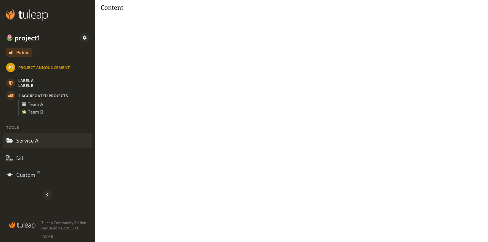

Integration with Web UI
=======================

Tuleap provides plenty of :ref:`REST APIs <rest_api>` for most services. This is useful when the integration is done
with an external system (VSCode, etc). But when one need to render something inside Tuleap UI, REST is not enough.

The overall idea is that, instead of developing something "inside Tuleap" (with all its constraint), one will be able
to develop a standalone application and have a seamless integration with Tuleap. This basically boils down to three things:

* Have the same look and feel than Tuleap.
* Interact with Tuleap data through REST APIs.
* Rely on Tuleap authentication and authorization mechanisms.

No need to explain REST at this point. The look'n feel is covered by Tuleap SideBar and the second one by OAuth2.

For the record, this approach is already used in production with the Tuleap team itself for the integration of MediaWiki 1.35+
in its "Standalone" version.

Tuleap SideBar
--------------

`Tuleap SideBar <https://www.npmjs.com/package/@tuleap/project-sidebar>`_ is a `WebComponent <https://www.webcomponents.org/introduction>`_
that provides everything (HTML/DOM, Javascript) needed to render the left hand SideBar of a Tuleap Project. This WebComponent is meant
to be used together with ``/api/projects/:id/3rd_party_integration_data`` Tuleap REST end point. The payload provides:

- the WebComponent configuration (ie. the list of services, icons, project title, visibility, ...).
- the CSS that corresponds to the current user (to match the user theme preference).

All the details on how to use the package are available on npmjs.org



OAuth2
------

Tuleap is :ref:`OAuth2 & OpenID Connect provider <openidconnect_provider>` it means that your standalone application will be able to:

- leverage Tuleap authentication with Single Sign On
- let Tuleap permissions model be managed by Tuleap itself (it's a very bad idea to duplicate the logic in your app, you will shoot yourself in the feet)

This section is not meant to cover how to implement an OAuth2 client, there is plenty of
documentation already available.

Anonymous users
```````````````

Tuleap supports Anonymous access but it depends of the Site configuration as well as the Project access.

The only valid way to be sure that you won't leak (or restrict) is to follow this process:

1. **always** initiate the OAuth2 authorization flow as soon as a page is loaded with ``prompt=none``
    * if the user is already logged in Tuleap, it will be transparently authenticated in your app
    * if the user is not logged in Tuleap, Tuleap will respond with an error code ``login_required``

2. Then you should call ``/api/projects/:id/3rd_party_integration_data`` to get SideBar information
    * If at step 1. user was authenticated and this new call succeed, it means that user can access the project.
    * If at step 1. you got ``login_required`` but this new call succeed it means that anonymous can access the project.
    * If at step 1. you got ``login_required`` and this new call end with ``403`` it means that anonymous cannot access and you should redo the OAuth2 authorization **without prompt=none**.
