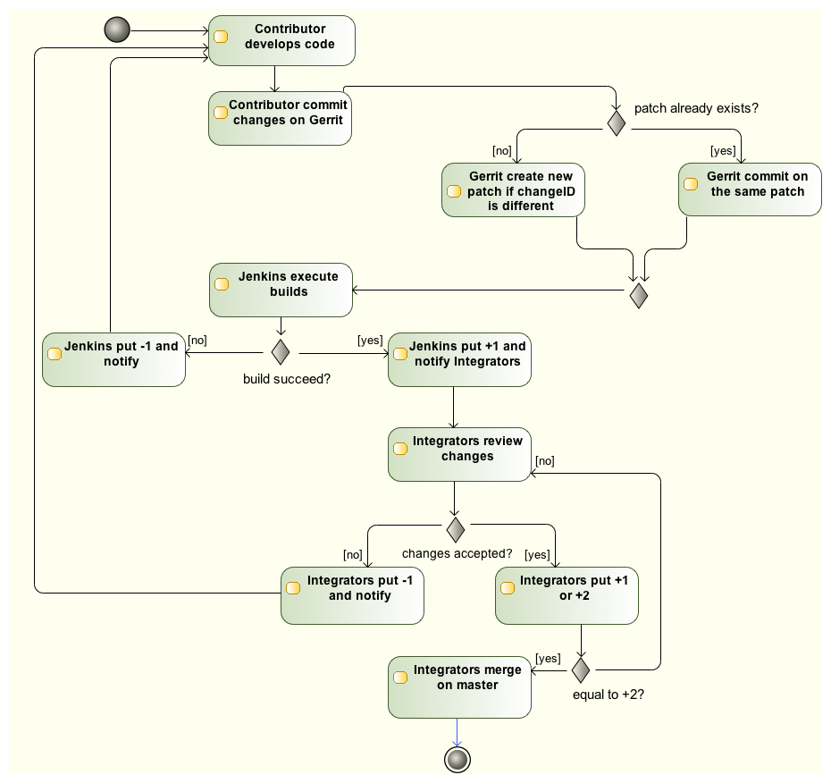

Push your code
==============

.. IMPORTANT::

  As a prerequisite, please read `Don't "Push" Your Pull Requests`_.

.. _Don't "Push" Your Pull Requests: https://www.igvita.com/2011/12/19/dont-push-your-pull-requests/

The Tuleap project uses Gerrit to ensure a proper review and integration of contributed code. It means that:

- Each and every commits is reviewed individually
- A Tuleap-contributor can vote between -2..+2 on each contribution
- A Tuleap-integrator submit is mandatory



  	   Activity diagram: Tuleap contribution

As a commit is reviewed individually, it must be "autonomous" (corresponding to a task).
It's a small part of a bigger story but it's fully functional at its level.

Ideally, a commit is the smallest possible part of a feature.

A good commit:

- Doesn't break existing behaviour (unless it's intended to, well documented and with an escape path for current users).
- Has tests (automated: unit, REST, SOAP or functional, described in commit message)
- Has security guards (filter inputs, escape outputs, csrf tokens)
- Has I18N code
- Can be "not UI perfect" as long as there is a short term action (commit) to address it validated by the Design team
- Might not have a direct effect on UI (modifications not visible) if it helps to reduce the size of upcoming reviews

A bad commit has:

- Fatal errors, warnings, notices
- Was not refactored
- Cannot work without "the next one"
- A meaningless commit message

As a contributor, it's your duty to get your commits integrated, it's useless to sum-up commits that depend of one another if the very first one is not validated.

Development repository is hosted on https://gerrit.tuleap.net

You can checkout https://gerrit.tuleap.net/#/admin/projects/tuleap. You need an account on gerrit in order to do the checkout.

.. NOTE::

  The reference repository, stable, is "the true master" (ie. it's from this
  repository that releases are rolled out). There are mirrors of stable
  repository available on `GitHub <https://github.com/Enalean/tuleap/>`_
  or `repo.or.cz <https://repo.or.cz/tuleap.git>`_, that are synchronized on
  every push on master.

Setting up your environment
---------------------------
1. configure your local config to rebase when you pull changes locally:

  .. code-block:: bash

    $> git config branch.autosetuprebase always

2. Configure your gerrit environment

  Login on https://gerrit.tuleap.net (same account than tuleap.net) and publish your ssh key (not needed if you are
  using http as transport).

  .. code-block:: bash

    $> git clone ssh://USERNAME@gerrit.tuleap.net:29418/tuleap && scp -p -P 29418 USERNAME@gerrit.tuleap.net:hooks/commit-msg tuleap/.git/hooks/

Push you changes
----------------

Tuleap follows the "master only" approach: each and every feature (or fix) shall be decomposed in small chunks meant to be included into master.

Most of the time (everything but small bug fix) the development of a feature
require several commits. Therefore you should decompose your work so each commit is a
small progress toward your goal: the final feature.

Each commit should work but, most important, should not break anything.

Commit message
``````````````

A good contrib has a good commit message. You can look at `Tuleap WIP dashboard <https://gerrit.tuleap.net/#/projects/tuleap,dashboards/main:wip>`_ to see what is expected.

Basically a good commit message has:

* One summary line that starts with the artifact reference (request #123, story #21)
* Summary line ~50 chars
* A description that explains the intent of the change (WHY you made those changes and not WHAT is inside the commit)

.. NOTE::

  You should always reference a public artifact in your commit:

  * You should reference a `request <https://tuleap.net/plugins/tracker/?tracker=140>`_ when it's bug.
  * You should reference a `story <https://tuleap.net/plugins/tracker/?tracker=147>`_ when it's a new development.


Publish workflow
````````````````

The workflow is always the same:

#. Create a local branch
#. Hack & commit within the branch
#. Before publishing, ensure every commit is relevant (history rewrite)
#. Push in draft
#. Ensure everything is correct gerrit side
#. Publish !


Detailed steps:

1. Create local branch:

  .. code-block:: bash

    $> git checkout -b my_fix

2. Hack & commit

  .. code-block:: bash

    $> $EDITOR ...
    $> git commit -am "stuff"

3. Prepare for publish

Here you look at the history and decide whether all the intermediate steps (commits)
are relevant or if you need to clean up a bit

  .. code-block:: bash

    $> git fetch origin
    $> git rebase origin/master
    $> git log origin/master...

If there is only one commit, no problem (ensure there is a public reference like request #1234)
you can move one.

If there are several small commits (like "Work in progress", "typo", ...) they
should be "squashed" together with `git rebase -i`. Example:

  .. code-block:: bash

    $> git rebase -i origin/master
    -> you get an editor with
    pick c36944f request #123: validate git repository name
    pick 098369f fix tests
    pick 3e040e7 typo

Here we have 3 commits but what we want to publish is one commit with the 3 changes.
To do that, you can change the commands in the `git-rebase-todo` file like:

  .. code-block:: bash

    $> git rebase -i origin/master
    pick c36944f request #123: validate git repository name
    fixup 098369f fix tests
    fixup 3e040e7 typo

Save and quit, git will squash the 3 commits in one:

  .. code-block:: bash

    $> git log origin/master...
    c36944f request #123: validate git repository name

You are ready to publish !

4. Send for review

  .. code-block:: bash

    $> git push origin HEAD:refs/for/master%wip

5. Check result on gerrit

The push command should have an url as output, open it and check that everything
is fine.

6. Publish

When everything is allright, start the review ("Start review" button) and set
"tuleap-integrators" as reviewers

Update a contribution
---------------------

You got a review and you need to make a change? There are several ways to do it

#. Commit fix and rebase
#. Checkout and amend

Commit fix and rebase
`````````````````````

The basic workflow is:

#. checkout your branch
#. make the modifications
#. commit the fix with commit message like "fix issue" (we will squash it after)
#. rebase & fixup
#. push draft
#. publish

Most of the things were already described in the precedent section, we will focus
on the "rebase and fixup".

Once you made your fix, the result of a `git log` is something like:

  .. code-block:: bash

    $> git log
    c36944f request #123: validate git repository name
    098369f fix issue from code review

Then, you want to incorporate the fix with the initial commit, so you need to rebase:

  .. code-block:: bash

    $> git rebase -i origin/master
    pick c36944f request #123: validate git repository name
    pick 098369f fix issue from code review

Make your changes:

  .. code-block:: bash

    $> git rebase -i origin/master
    pick c36944f request #123: validate git repository name
    f 098369f fix issue from code review
    # save and let rebase do the job

Now you only have one commit and you can push and eventually publish.

.. NOTE::

  This works best when

  * You have few commits in your branch
  * Those commits are not modifying the same place you have to modify

  This doesn't work when:

  * Someone else modified your commit (you will have to follow the "Checkout and amend" way)


Checkout and amend
``````````````````

In the gerrit interface for your patchset, you have a "Download" section with a
ready to copy/paste git command. Ensure "checkout" is selected and copy/paste
into your git repository.

You should get a message like:

  .. code-block:: bash

    $ git fetch ssh://vaceletm@gerrit.tuleap.net:29418/tuleap refs/changes/50/5050/3 && git checkout FETCH_HEAD
    remote: Counting objects: 13902, done
    remote: Finding sources: 100% (10/10)
    remote: Total 10 (delta 9), reused 9 (delta 9)
    Unpacking objects: 100% (10/10), done.
    From ssh://gerrit.tuleap.net:29418/tuleap
     * branch            refs/changes/50/5050/3 -> FETCH_HEAD
    Warning: you are leaving 1 commit behind, not connected to
    any of your branches:

      457871b request #8804 TV5 : accented letters converted to HTML entities when switching from HTML format to Text format

    If you want to keep them by creating a new branch, this may be a good time
    to do so with:

     git branch new_branch_name 457871b

    HEAD is now at 7de74b4... request #8840 Remove usage of Bless

You can make your own changes.

Then you should `amend` the commit with your changes:

  .. code-block:: bash

    $ git commit -a --amend

And finally you can push your changes (git push origin HEAD:refs/for/master%wip & publish)

.. NOTE::

  This works best when

  * You have only one commit to fix
  * You no longer have the commit locally
  * Someonelse commited in your patchset (so your local reference is no longer up-to-date)

  This far from ideal when

  * You have commits with dependencies (the dependent commits will be OUTDATED)
