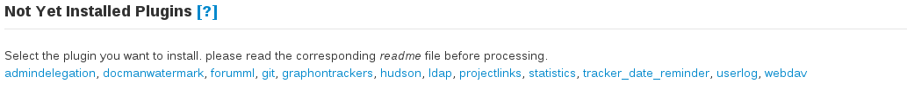

Basic configuration
===================

Installing new plugins
----------------------

You can search new plugins using the following command:

::

    yum list tuleap-*

When you want to install a new plugin, run:

::
    
    yum install tuleap-plugin-awesomestuff

Please note that some packages are deprecated or not maintained:
-  tuleap-plugin-requesthelp

Once the plugin is installed, go to Tuleap site admin home page and enter the plugin administration page.

At the bottom of the plugin list you should see a link to activate and install you plugin. Click on it and install your plugin, following the potential instruction.

|image0|

Now your plugin should appear on the list, you can configure it and set it available for everyone.

