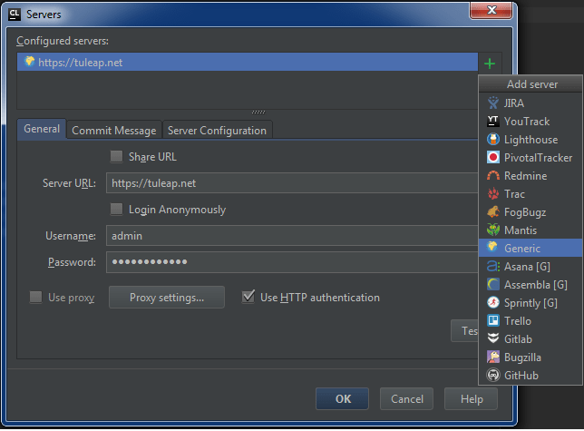
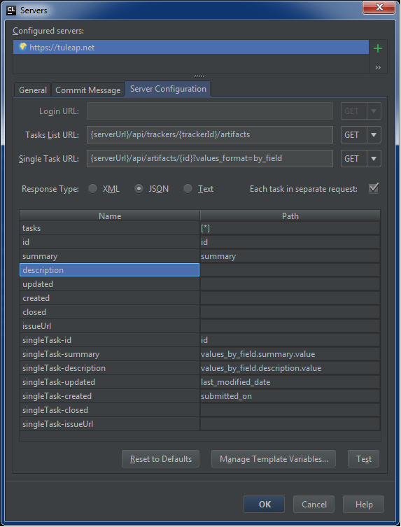
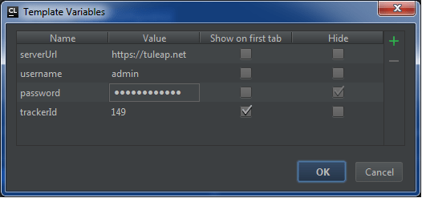
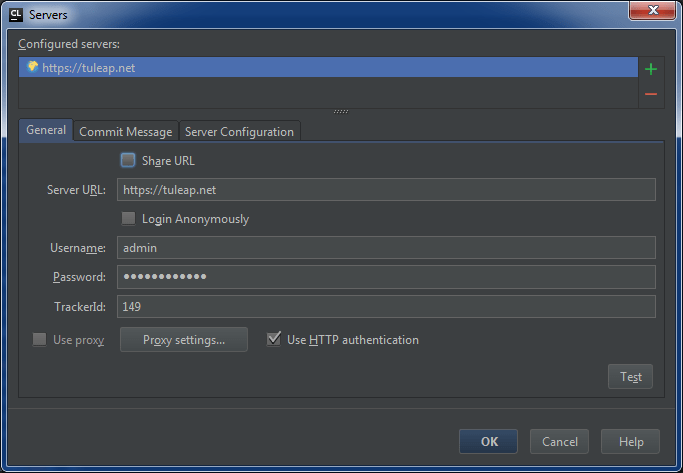
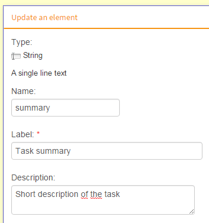
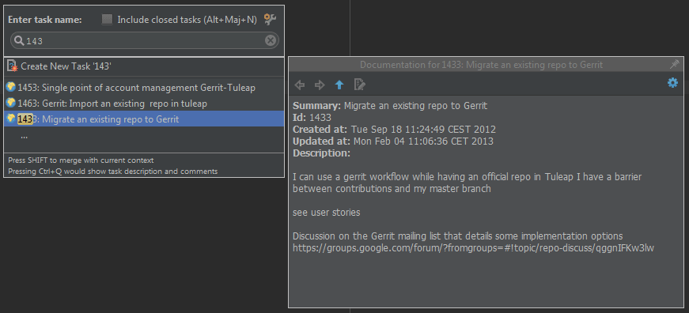

*****
REST API
*****

REST authentication
===================
This documentation is still sparse but all end-points are auto-documented. You should be able to access it on your server at '/api/explorer/' URI (tailing / is important).

You can also see it in action on https://tuleap.net/api/explorer/

Overview
--------

The RESt API is accessible both anonymously and with authentication although some 
resources are accessible with authentication only.

You can authenticate via token and HTTP Basic authentication although the former is
advised as it reduces the risk of leaking a password.

Note that invalid credentials will result in a server error even if the resource is accessible anonymously.

Token-based Authentication
--------------------------

The general principle is to issue a request to the  ``/api/tokens`` route to get a token
and re-use this token later-on to prove identity.

Issued tokens are automatically revoked after 24 hours.

Authentication
``````````````

When authentication is required or when the password expires, you will get a 401 http error

Request:

``POST /api/tokens``

Response:

::

  HTTP/1.1 200 OK
  Content-Type: application/json; charset=utf-8

  {
    "user_id": "115",
    "token": "abcd",
    "uri": "/api/tokens/abcd"
  }

Example:

  ``curl -XPOST --header 'Content-type: application/json' -d '{"username":"john_doe", "password":"weakpassword"}' https://example.com/api/tokens``

Use of the token
````````````````

You must include 2 custom headers in your request:

  * ``X-Auth-Token``: value of ``token`` attribute received from ``/api/tokens``
  * ``X-Auth-UserId``: value of ``user`` attribute received from ``/api/tokens``

Example:

  ``curl -XGET --header 'Content-type: application/json' --header 'X-Auth-Token: abcd' --header 'X-Auth-UserId: 115' https://example.com/api/projects/112``

Token expiration
````````````````

A token lasts for 24 hours. Once it expires you will get a ``401`` HTTP error code.

HTTP Basic authentication
-------------------------

In order to authenticate, simply add your username and password to each request.

Example:

  ``curl -XGET --header 'Content-type: application/json' -u username:password https://example.com/api/projects/112``


REST with XML
==============

*WARNING*: It is possible that the REST API is not working properly using XML. It has been tested only
on those endpoints so far:

    * ``GET /artifacts/:id``
    * ``POST /artifacts``
    * ``PUT /artifacts/:id``

Since Tuleap 7.11, the REST API of Tuleap supports XML as input and ouput. To do so, the first thing
to do is to set properly these headers:

    * ``Content-type``: set at ``application/xml`` if you wish to send XML
    * ``Accept``: set at ``application/xml`` if you wish to receive XML from the REST api

Moreover, there is one main difference between inputs in JSON and inputs in XML as XML is not able to express
array the same way JSON does. Therefore, you need to use the ``<item></item>`` element inform RESTLER that you
are speaking about elements in an array. Here is a quick example of a POST using JSON and XML:

::

    //JSON FORMAT

    {
        "tracker": {"id": 16},
        "values": [
            {
                "field_id": 132,
                "value": "Test Release"
            },
            {
                "field_id": 134,
                "bind_value_ids": [126]
            }
        ]
    }


    // XML FORMAT

    <request>
        <tracker>
            <id>16</id>
        </tracker>
        <values>
            <item>
                <field_id>132</field_id>
                <value>Test Release</value>
            </item>
            <item>
                <field_id>134</field_id>
                <bind_value_ids>
                    <item>126</item>
                </bind_value_ids>
            </item>
        </values>
    </request>

Managing Concurrency
====================

Currently this is only available for tracker artifacts.

Artifact concurrency
````````````````````

Every time you fetch an artifact via the route ``GET /artifacts/:id``, it will return several headers.
Among them there are two that allow you to detect the version of your artifact and ensure you will not
overwrite changes that happened between the time you last fetched your artifact and your current update.
These headers are

    * ``Etag``: a hash of the current artifact version
    * ``Last-Modified``: a timestamp of the last modification

If you want to ensure that your call to ``PUT /artifacts/:id`` updates the latest version then you need to tell
the server so. To do this, you need to send your own headers in the request. You must send at least one of

    * ``If-match``- with the value you received in the Etag header when you last fetched the artifact, or
    * ``If-Unmodified-Since``: with the timestamp received in the Last-Modified header

As you can see, these headers go in pairs: ``(Etag/ If-match)`` and ``(Last-Modified/ If-Unmodified-Since)``.

If the value you provide does not match the value of the current version of the artifact, the API will throw
``412 precondition failed``.

Note: if you do not provide either the ``If-match`` or ``If-Unmodified-Since`` headers in your ``PUT /artifacts/:id``
request then no concurrency check will be done and the artifact will be overwritten.

JetBrains IDE integration with Tuleap trackers
====================

JetBrains IDE integration
````````````````````

Currently available data for an artifact are : 

	* ID
	* Summary
	* Description
	* Creation date
	* Last update date

First, add a generic tracker server	: Tools > Tasks & Contexts > Configure Servers ... Then add a **Generic** tracker server. Set :

	* **Server URL** : Tuleap server (HTTPS Only)
	* **Username** : Your Tuleap username
	* **Password** : Your Tuleap password
	* Check **Use HTTP authentication**
	


At this point, you cannot test your connection as JetBrains IDEs need a configured task list to test the connection.

On the **Server Configuration** page, indicates the following parameters :



As displayed, there is a variable ``{trackerId}``. You can set directly the selected tracker id on the URL or create a variable. Choose **Manage Template Variables...**



If you check ``Show on first tab``, the selected field is displayed on **General**. Set the selected tracker id on the field.
   

      
On the **Server Configuration** page, you can choose the field id on the selectors : 
   
	* The line ``singleTask-id`` refers to the id of the **id** field   
	* The line ``singleTask-summary`` refers to the id of the **summary** field
	* The line ``singleTask-description`` refers to the id of the **description** field
	* The line ``singleTask-updated`` refers to the id of the **last modification date** field
	* The line ``singleTask-created`` refers to the id of the **submission date** field

On the selected tracker, the field id needed are on the administration part :



On the **Server Configuration** page, the right part of the table is a JSONPath expression. It uses selector and can be changed following your tracker structure. To find the field, use the REST API Explorer plugin. For instance, the query ``https://tuleap.net:443/api/artifacts/1433?values_format=by_field`` 
produces :

::

    {
      "id": 1433,
      "uri": "artifacts/1433",
      "tracker": {
        "id": 149,
        "uri": "trackers/149"
      },
      "project": {
        "id": 101,
        "uri": "projects/101"
      },
      "submitted_by": 344,
      "submitted_on": "2012-09-18T11:24:49+02:00",
      "html_url": "/plugins/tracker/?aid=1433",
      "changesets_uri": "artifacts/1433/changesets",
      "values": null,
      "values_by_field": {
        "summary": {
          "field_id": 1280,
          "type": "string",
          "label": "Summary",
          "value": "Migrate an existing repo to Gerrit"
        },
        "artifact_id": {
          "field_id": 1275,
          "type": "aid",
          "label": "Artifact ID",
          "value": 1433
        },
        "description": {
          "field_id": 1281,
          "type": "text",
          "label": "Description",
          "value": "I can use a gerrit workflow while having an official repo in Tuleap\r\nI have a barrier between contributions and my master branch\r\n\r\nsee user stories\r\n\r\nDiscussion on the Gerrit mailing list that details some implementation options\r\nhttps://groups.google.com/forum/?fromgroups=#!topic/repo-discuss/qggnIFKw3lw",
          "format": "text"
        }
      },
      "last_modified_date": "2013-02-04T11:06:36+01:00"
    }

::

With the previous parameters, the task is displayed :


	
An issue may occur for using SNIExtension on the JVM. To fix it, add the flag ``-Djsse.enableSNIExtension=false`` on the .vmoptions files of your IDE.


