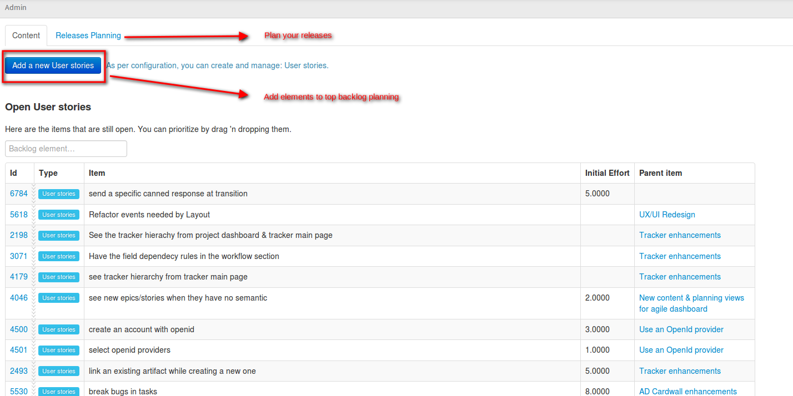

.. _agile-dashboard:

Agile Dashboard
===============

The Tuleap Agile Dashboard is a service provided by Tuleap on top of trackers (see :ref:`trackers-and-real-time-reports`).
It is highly configurable and adapts to almost any agile team.

Features
--------

The Tuleap Agile Dashboard has many features including a cardwall, a burndown and a backlog planner.

The cardwall allows for the visual monitoring of an artifact's progress, the individuals who are working on it
or the remaining effort.

Interactive actions currently include on the fly assigning, edition of the remaining effort and
the drag'n'drop within a workflow.

Tuleap also support Kanban methodology with a dedicated cardwall.

Creating an Agile Dashboard
---------------------------

Creating from Tuleap's template
```````````````````````````````

You can create one from scratch but, given the sheer number of configurations, it is
easier to import and tweak it.
Before anything, you need to ensure that the trackers and Agile Dashboard services are installed and
activated for your project.

Use default templates
`````````````````````

When you first come, as a project administrator, on Agile Dashboard service, you will be asked to create either a Scrum or a Kanban dashboard.

.. figure:: ../images/screenshots/kanban-onboarding.png
   :align: center
   :alt: Agile Dashboard welcome screen
   :name: Agile Dashboard  welcome screen
   :width: 800px

   Agile Dashboard welcome screen

Pick-up the one you need and it will automatically create and configure everything for you.

You inherit a default template provided by Tuleap but you can modify whatever you want:

- use both Scrum and Kanban
- use several Kanban (you will have to create your own tracker first)
- tweak Scrum to use more Plannings
- ...

Creating your Agile Dashboard from scratch
``````````````````````````````````````````
You will have to create your own trackers and link them within the Agile Dashboard administration.

Note that some field names are important to respect:

-  Remaining Effort: the field representing the remaining effort (mainly used in user stories or tasks) must have "remaining_effort" as field name
-  Impediment: the field representing an impediment must have "impediment" as field in order to be displayed on the cards of the cardwall
-  Start Date of a sprint: the field representing the start date must have "start_date" as field name
-  Capacity of a sprint: the field representing the capacity must have "capacity" as field name
-  Duration of a sprint: the field representing the duration must have "duration" as field name
-  Type of a task: the field representing the type must have "type" as field name in order to display the color
   representing the type of the task on the cards of the cardwall.

Note also that the burndown field can be configured for including or not the week-ends (Saturday and Sundays can be excluded from burndown graph)

Using an Agile Dashboard
------------------------

To enter the Agile Dashboard service of a given project, first go to
the project and click on the "Agile Dashboard" item in the sidebar.

You will be directed to the agile dashboard homepage of your project
(see `Agile Dashboard Homepage`_).

The homepage lists and links to all the milestones in your project. they are sorted according to status and date.

-  In the "Done" tab, you have all the milestones whose status is closed.
-  In the "What's hot" tab, you have all the milestones whose status is open and whose start date and duration make them ongoing.
-  In the "What's next" tab, you  have all the milestones whose status is open and whose start date and duration either places them in the future or are not set.

If start_date and duration are not defined in the tracker, but status is open, you will have the milestones both in "What's hot" and "Next".
If start_date and duration are defined but empty, you will have the milestones in the three tabs.


If configured, it provides links to cardwalls, so that the team can directly makes its daily stand up changes.

.. figure:: ../images/screenshots/sc_ad_homepage_new.png
   :align: center
   :alt: Agile Dashboard Homepage
   :name: Agile Dashboard Homepage
   :width: 800px

   Agile Dashboard Homepage

.. _plan-releases-and-sprints:

Plan releases and sprints
`````````````````````````

Tuleap Agile Dashboard lets you plan easily your releases.

.. figure:: ../images/screenshots/sc_plan_releases.png
   :align: center
   :alt: Plan a release
   :name: Plan a release
   :width: 800px

   Agile Dashboard: Plan your releases

From this view, you can drag'n'drop elements from top backlog to one of the planned releases on the right, or add a new releases.

Plan a sprint is as simple as the release plan. Simply go to a release planning to fill your sprint or create a new sprint.

Moreover, a red indicator is automatically displayed when the capacity exceeds of the team capacity for the sprint, or release (if you have one).


Populate backlog
````````````````
A product owner can populate a backlog either going directly to the "Top Backlog planning" or to the release or sprint content.




   Agile Dashboard: Populate the backlog


The agile dashboard also provides the possibility to prioritize the backlog, by drag'n'dropping elements from top to bottom.

Monitor project progress
````````````````````````
By any moment of the sprint, the development team can monitor and update the progress of the sprint by going to the cardwall and the burndown.

The cardwalls and burndowns are directly from the agile dashboard homepage.

The cardwall (see `Cardwall`_) lets the development team manipulates the cards with drag'n drop to change their status, or assign the tasks
and change the remaining effort on the fly, that is to say staying on the same page.

The team can configure the display of the assignement by choosing between the display of the username or the avatar.

This configuration will be the same for all the sprints, but can be changed at any moment thanks to the "Settings"
select box on the right.

Finally, it offers the possibility to filter the cards thanks to the search at the top right of the cardwall. You will be able to filter by
assignee for instance, or by the type of tracker (display only the tasks or only the user stories).

.. figure:: ../images/screenshots/sc_ad_cardwall.png
   :align: center
   :alt: Cardwall
   :name: Cardwall
   :width: 800px

   Agile Dashboard: Cardwall
