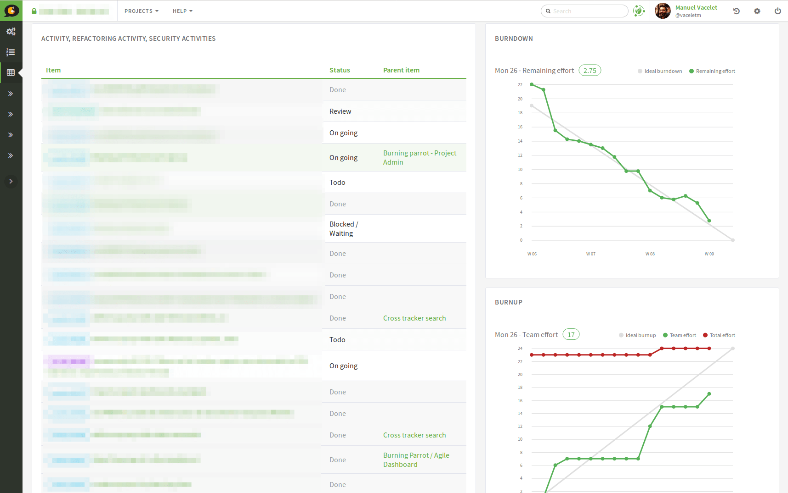
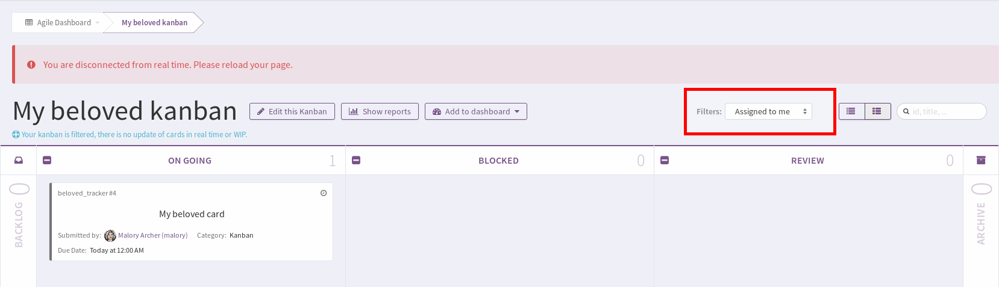
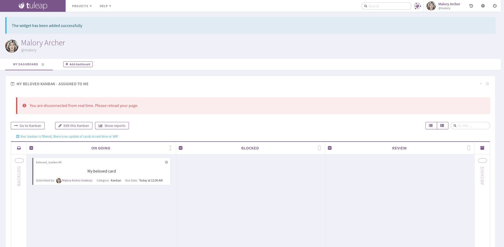

.. _agile-dashboard:

Agile Dashboard
===============

The Tuleap Agile Dashboard is a service provided by Tuleap on top of trackers (see :ref:`trackers-and-real-time-reports`).
It is highly configurable and adapts to almost any agile team.

Features
--------

The Tuleap Agile Dashboard has many features including a taskboard, a burndown and a backlog planner.

The taskboard allows for the visual monitoring of a story or task's progress, the individuals who are working on it
or the remaining effort.

Interactive actions currently include on the fly assigning, edition of the remaining effort and
the drag'n'drop within a workflow.

Tuleap also support Kanban methodology with a dedicated cardwall.

Creating an Agile Dashboard
---------------------------

Creating from Tuleap's template
```````````````````````````````

You can create one from scratch but, given the sheer number of configurations, it is
easier to import and tweak it.
Before anything, you need to ensure that the trackers and Agile Dashboard services are installed and
activated for your project.

Use default templates
`````````````````````

When you first come, as a project administrator, on Agile Dashboard service, you will be asked to create either a Scrum or a Kanban dashboard.


   Agile Dashboard welcome screen

Pick-up the one you need and it will automatically create and configure everything for you.

You inherit a default template provided by Tuleap but you can modify whatever you want:

- use both Scrum and Kanban
- use several Kanban (you will have to create your own tracker first)
- tweak Scrum to use more Plannings
- ...

Creating your Agile Dashboard from scratch
``````````````````````````````````````````
You will have to create your own trackers and link them within the Agile Dashboard administration.

Note that some field names are important to respect:

-  Remaining Effort: the field representing the remaining effort (mainly used in user stories or tasks) must have "remaining_effort" as field name
-  Impediment: the field representing an impediment must have "impediment" as field in order to be displayed on the cards of the cardwall
-  Start Date of a sprint: the field representing the start date must have "start_date" as field name
-  Capacity of a sprint: the field representing the capacity must have "capacity" as field name
-  Duration of a sprint: the field representing the duration must have "duration" as field name
-  Type of a task: the field representing the type must have "type" as field name in order to display the color
   representing the type of the task on the cards of the cardwall.

Using an Agile Dashboard
------------------------

To enter the Agile Dashboard service of a given project, first go to
the project and click on the "Agile Dashboard" item in the sidebar.

You will be directed to the agile dashboard homepage of your project
(see `Agile Dashboard Homepage`_).

The homepage lists and links to all the milestones in your project. they are sorted according to status and date.

-  In the "Done" tab, you have all the milestones whose status is closed.
-  In the "What's hot" tab, you have all the milestones whose status is open and whose start date and duration make them ongoing.
-  In the "What's next" tab, you  have all the milestones whose status is open and whose start date and duration either places them in the future or are not set.

If start_date and duration are not defined in the tracker, but status is open, you will have the milestones both in "What's hot" and "Next".
If start_date and duration are defined but empty, you will have the milestones in the three tabs.


If configured, it provides links to cardwalls, so that the team can directly makes its daily stand up changes.

.. figure:: ../images/screenshots/sc_ad_homepage_new.png
   :align: center
   :alt: Agile Dashboard Homepage
   :name: Agile Dashboard Homepage
   :width: 800px

   Agile Dashboard Homepage

.. _plan-releases-and-sprints:

Plan releases and sprints
`````````````````````````

Tuleap Agile Dashboard lets you plan easily your releases.

.. figure:: ../images/screenshots/agiledashboard/sc_plan_releases.png
   :align: center
   :alt: Plan a release
   :name: Plan a release
   :width: 800px

   Agile Dashboard: Plan your releases

From this view, you can drag'n'drop elements from top backlog to one of the planned releases on the right, or add new releases.

Planning a sprint is as simple as planning a release. Simply go to a release planning to fill your sprint or create a new sprint.

Moreover, the badge color will reflect the total initial effort of cards compared to the team capacity for the sprint, or release (if you have one).

You also can notice that some cards can have a background colors to provide a quick information to the team.
Background colors are defined by the tracker administrator (:ref:`semantic_color`).


Populate backlog
````````````````
A product owner can populate a backlog either going directly to the "Top Backlog planning" or to the release or sprint content.

Explicit backlog
~~~~~~~~~~~~~~~~
The top backlog planning will contains artifact you choose. They are added inside when you directly add them in top backlog view. On every single artifact that can be used in a top backlog planning you will have a link to add it to the top backlog.

You can enable this option in Agiledashboard administration by checking the use explicit backlog option.

Open backlog
~~~~~~~~~~~~
The top backlog planning will contains all open and unplanned artifacts. They are removed from top backlog when you prioritize them in a release or a sprint or when you update their status.

The agile dashboard also provides the possibility to prioritize the backlog, by drag'n'dropping elements from top to bottom.

Monitor project progress
````````````````````````
At any moment of the sprint, the development team can monitor the sprint or release progress with overview tab.

With the burnup and burndown view, you can see how your on going work is progressing.



   Agile Dashboard: Burnup and burndown view

To configure a burnup and burndown charts please refer to (:ref:`burnup_administration`) part of documentation.

When the release end, and during the sprint planning you can use the velocity chart to determine your new team capacity.
The velocity chart display the sum of done effort of linked artifacts.
Only backlog artifacts are taken in account during computation (artifact linked in planning configuration of Agiledashboard).

.. figure:: ../images/screenshots/agiledashboard/velocity.png
   :align: center
   :alt: Velocity chart
   :name: Velocity chart

   Agile Dashboard: Velocity chart

Known limitation: if an artifact is created directly at a "done" status, velocity won't be computed.

To configure a velocity chart please refer to (:ref:`velocity_administration`) part of documentation.


Daily project update
````````````````````
The taskboard lets the development team manipulates the cards with drag'n drop to change their status, or assign the tasks
and change the remaining effort on the fly, that is to say staying on the same page.

.. figure:: ../images/screenshots/agiledashboard/taskboard/sc-taskboard.png
   :align: center
   :alt: Taskboard
   :name: Taskboard
   :width: 800px

.. NOTE::

   Taskboard is replacing the legacy Cardwall feature. Both don't offer the same feature set yet.
   Please refer to the following table for a list of differences:

   +---------------------------------------------------------------------------------------+----------+-----------+
   | Feature                                                                               | Cardwall | Taskboard |
   +=======================================================================================+==========+===========+
   | Display stories, bugs, … as cards on a board                                          | ✓        | ✓         |
   +---------------------------------------------------------------------------------------+----------+-----------+
   | Display expanded cards (card fields semantic)                                         | ✓        |           |
   +---------------------------------------------------------------------------------------+----------+-----------+
   | Display initial effort                                                                |          | ✓         |
   +---------------------------------------------------------------------------------------+----------+-----------+
   | Display number of cards in a column                                                   |          | ✓         |
   +---------------------------------------------------------------------------------------+----------+-----------+
   | Display in fullscreen                                                                 | ✓        | ✓         |
   +---------------------------------------------------------------------------------------+----------+-----------+
   | Change status of a card with drag 'n drop                                             | ✓        | ✓         |
   +---------------------------------------------------------------------------------------+----------+-----------+
   | Reorder cards with drag 'n drop                                                       |          | ✓         |
   +---------------------------------------------------------------------------------------+----------+-----------+
   | Edit in place the assignees                                                           | ✓        | ✓         |
   +---------------------------------------------------------------------------------------+----------+-----------+
   | Edit in place the remaining effort                                                    | ✓        | ✓         |
   +---------------------------------------------------------------------------------------+----------+-----------+
   | Edit in place the title                                                               |          | ✓         |
   +---------------------------------------------------------------------------------------+----------+-----------+
   | Edit or add card with a modal                                                         | ✓        |           |
   +---------------------------------------------------------------------------------------+----------+-----------+
   | Add in place a card in a given column                                                 |          | ✓         |
   +---------------------------------------------------------------------------------------+----------+-----------+
   | Filter cards                                                                          | ✓        |           |
   +---------------------------------------------------------------------------------------+----------+-----------+
   | Progress bars of the milestone                                                        | ✓        |           |
   +---------------------------------------------------------------------------------------+----------+-----------+
   | Progress bars of the story (or equivalent parent card)                                |          | ✓         |
   +---------------------------------------------------------------------------------------+----------+-----------+
   | Sticky (always visible) headers (both columns and swimlanes)                          |          | ✓         |
   +---------------------------------------------------------------------------------------+----------+-----------+
   | Hide closed items                                                                     |          | ✓         |
   +---------------------------------------------------------------------------------------+----------+-----------+
   | Expand/Collapse swimlanes                                                             |          | ✓         |
   +---------------------------------------------------------------------------------------+----------+-----------+
   | Expand/Collapse columns                                                               |          | ✓         |
   +---------------------------------------------------------------------------------------+----------+-----------+
   | IE11 support                                                                          | ✓        |           |
   +---------------------------------------------------------------------------------------+----------+-----------+

.. attention::

  Taskboard is part of :ref:`Tuleap Enterprise <tuleap-enterprise>`. It might
  not be available on your installation of Tuleap.

.. _kanban:

Using a Kanban
--------------

To enter a Kanban, go to the Agile Dashboard service of your project. All your Kanbans are displayed on the right hand side of the screen.

.. figure:: ../images/screenshots/agiledashboard/kanban/kanban-list.png
   :align: center
   :alt: Kanban list
   :name: Kanban list
   :width: 800px

   Agile Dashboard: Kanban List

If you do not have any Kanban yet, you have two choices:

1. Create a Kanban on your own
2. Let Tuleap take care of it for you (``Start scrum`` button or ``Agile Dashboard Administration > Kanban > Activate Kanban``)

Creating your Kanban from scratch
`````````````````````````````````

To create your own Kanban, you will need to create a tracker.
Once your tracker has been created, go to the Agile Dashboard service of your project.
Click on the ``Add a Kanban`` button located in the header of the right hand side section.
In the modal, enter a name for your Kanban, select your newly created tracker and validate.

.. figure:: ../images/screenshots/agiledashboard/kanban/create-new-kanban.png
   :align: center
   :alt: Create a new kanban
   :name: Create a new kanban
   :width: 800px

   Agile Dashboard: Kanban creation

A new Kanban appears in the Kanban section. Click on ``Cardwall`` to open it.

Configure the card fields
`````````````````````````

Card fields are tracker fields to be displayed in the Kanban cards (only in expanded view).
For instance you can easily display who is the creator of the card, who are the assignees, what is the priority etc.
You can also define the card's background color.

.. figure:: ../images/screenshots/agiledashboard/kanban/kanban-card-fields.png
   :align: center
   :alt: Cards fields
   :name: Cards fields
   :width: 500px

   Agile Dashboard: Card fields in Kanban

To do so, you have to configure the :ref:`semantic_color` in the tracker administration (``my_tracker > Administration > Manage Semantic > Card Semantic``).

Filtered Kanban
```````````````

Your Kanban can be filtered using the public reports of its tracker.
For instance, let's imagine you want to setup a filter showing the tasks assigned to the current user accessing the Kanban. To do so, you have to:

1. Define a public report (ex: ``assigned_to = MYSELF()``)
2. Go back to your Kanban
3. Click on ``Edit this Kanban``
4. Choose your report in the ``Tracker report filters`` section
5. Save

Once it is done, a filter selectbox appears in the header of the Kanban.



   Agile Dashboard: Filtered Kanban

Your Kanban will be reloaded with cards matching the query defined in the report, each time you change the filter.

.. NOTE:: Filtered Kanbans are not working with the realtime feature of Tuleap.

Add a Kanban to a dashboard
```````````````````````````

You can add your Kanban to one of your dashboards as a widget.
To do it, click on the ``Add to dashboard`` button and select the target dashboard in the dropdown.



   Agile Dashboard: Kanban widget

If a filter is selected when adding the widget to the dashboard, then the Kanban widget will be filtered too.
It is particularly interesting when you want to have several views for a same Kanban.
To edit the current filter, all you have to do is to click on the cog icon in the widget header and choose another filter.

.. NOTE:: You can't add more than one Kanban widget per dashboard.
