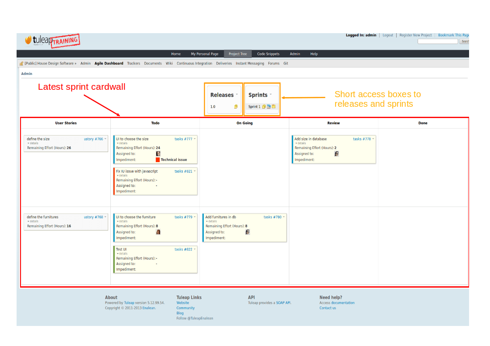

.. |SYSPRODUCTNAME| replace:: Tuleap

.. _agile-dashboard:

Agile Dashboard
===============

The Tuleap AgileDashboard is a new service provided by Tuleap.
It is highly configurable and adapts to almost any agile team.

Features
--------

The tuleap AgileDashboard has many features including a cardwall, a burndown and a backlog planner.

The cardwall allows for the visual monitoring of an artifact's progress, the individuals who are working on it
or the remaining effort.

Interactive actions currently include on the fly assigning, edition of the remaining effort and
the drag'n'drop within a workflow.


Creating an Agile Dashboard
---------------------------

Creating from Tuleap's template
```````````````````````````````

You can create one from scratch but, given the sheer number of configurations, it is
easier to import and tweak it.
Before anthing, you need to ensure that the trackers and AgileDashboard services are installed and
activated for your project.

There is currently only one way to import an AgileDashboard and that is via the command line.
To do this, you must have access and permissions on the directory in which Tuleap is installed.
You can download an xml AgileDashboard template (agiledashboard_template.xml) from the Tuleap website.

Let's assume you have an empty project with group_id = 123 in which you wish to create an AgileDashboard.

First, shell into the box and navigate to the Tuleap directory- this is normally
::

    $> cd /usr/share/codendi/

Then feed your template to the AgileDashboard importer like so:
::

    $> src/utils/php-launcher.sh src/utils/import_project_xml.php 123 admin /path/to/agiledashboard_template.xml

    please note that "admin" correspond to a valid site admin user name.

This should create new trackers and an AgileDashboard ontop of them.


Duplicating an existing one
```````````````````````````

You can duplicate an AgileDashboard from one project to another. To do this, you need to
export the one you want to duplicate. This is done in a very similar way to the import (above).

Let's assume the AgileDashboard you wish to export is in the project has group_id = 456.

First, shell into the box and navigate to the Tuleap directory- this is normally
::

    $> cd /usr/share/codendi/

Then export your AgileDashboard as an xml template:
::

    $> src/utils/php-launcher.sh src/utils/export_project_xml.php 456 > my_agiledashboard_template.xml

This should create a new xml file that contains all the necessary data. Now use this file in the step above.

Creating your Agile Dashboard from scratch
``````````````````````````````````````````

A training video is available to explain you how to create your agile dashboard.

.. raw:: html

   <iframe align=center width="560" height="315" src="http://www.youtube.com/embed/sypv1C_yY_o" frameborder="0" allowfullscreen></iframe>


Note that some field name are important to respect:

-  Remaining Effort: the field representing the remaining effort (mainly used in user stories or tasks) must have "remaining_effort" as field name
-  Start Date of a sprint: the field representing the start date must have "start_date" as field name
-  Capacity of a sprint: the field representing the capacity must have "capacity" as field name
-  Duration of a sprint: the field representing the duration must have "duration" as field name

Note also that the burndown field can be configured for including or not the week-ends (Saturday and Sundays can be excluded from burndown graph)

Using an Agile Dashboard
------------------------
To enter the Agile Dashboard service of a given project, first go to the Project
Dashboard (see :ref:`accessing-a-project-dashboard`) and click on the "Agile Dashboard" item in the Project
Main Menu located in the upper part of the page.

You will be directed to the agile dashboard homepage of your project
(see `Agile Dashboard Welcome Screen`_).
This homepage gives short access to the 5 last items of the planning defined, for instance to the Sprint planning and the Release planning.
It provides also the latest sprint cardwall, so that the team can directly makes its daily stand up changes from this homepage.



   Agile Dashboard Homepage

Note that a training video is available to explain you how to create your agile dashboard.

.. raw:: html

   <iframe align=center width="560" height="315" src="http://www.youtube.com/embed/wAJ_MosYgAM" frameborder="0" allowfullscreen></iframe>

Plan releases and sprint
````````````````````````

Populate backlog
````````````````

Monitor project progress
````````````````````````