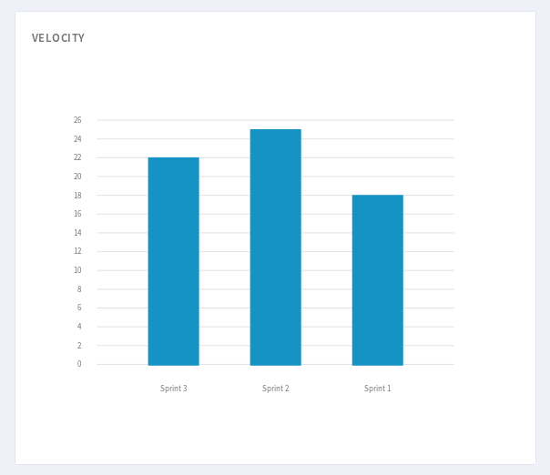

.. _backlog:

Backlog
=======

The Backlog is a service provided by Tuleap on top of trackers (see :ref:`trackers`).
It is highly configurable and adapts to almost any agile team.

Features
--------

The Backlog has many features including a taskboard, a burndown and a backlog planner.

The taskboard allows for the visual monitoring of a story or task's progress, the individuals who are working on it
or the remaining effort.

Interactive actions currently include on the fly assigning, edition of the remaining effort and
the drag'n'drop within a workflow.

Using Backlog
-------------

To enter the Backlog service of a given project, first go to
the project and click on the "Backlog" item in the sidebar.

.. _plan-releases-and-sprints:

Plan releases and sprints
`````````````````````````

Backlog lets you plan easily your releases.


   Backlog: Plan your releases

From this view, you can drag'n'drop elements from top backlog to one of the planned releases on the right, or add new releases.

Planning a sprint is as simple as planning a release. Simply go to a release planning to fill your sprint or create a new sprint.

.. NOTE:: To ease navigation, the last five current releases and their sprints will appear in the project sidebar.

  In order to be displayed in the sidebar, releases and sprints must have a :ref:`semantic-title`, must be open (:ref:`status-semantic`), and current date must be within their :ref:`semantic-timeframe`.

  This behavior can be disabled in backlog administration » Display milestones in sidebar

Moreover, the badge color will reflect the total initial effort of cards compared to the team capacity for the sprint, or release (if you have one).

You also can notice that some cards can have a background colors to provide a quick information to the team.
Background colors are defined by the tracker administrator (:ref:`semantic_color`).


Populate backlog
````````````````
A product owner can populate a backlog either going directly to the "Top Backlog planning" or to the release or sprint content.

Explicit backlog
~~~~~~~~~~~~~~~~
The top backlog planning will contains artifact you choose. They are added inside when you directly add them in top backlog view.

On every single artifact that can be used in a top backlog planning you will have a link to add it to the top backlog.


A :ref:`workflow <tracker-workflow>` post-action named ``AddToTopBacklog`` can also be defined. It will automatically add the artifact to the top backlog when it reaches a given state.


You can enable this option in Backlog administration by checking the use explicit backlog option.

Open backlog
~~~~~~~~~~~~
The top backlog planning will contains all open and unplanned artifacts. They are removed from top backlog when you prioritize them in a release or a sprint or when you update their status.

The Backlog also provides the possibility to prioritize elements, by drag'n'dropping them from top to bottom.

Monitor project progress
````````````````````````
At any moment of the sprint, the development team can monitor the sprint or release progress with overview tab.

With the burnup and burndown view, you can see how your on going work is progressing.

.. figure:: ../images/screenshots/agiledashboard/burnup.png
   :align: center
   :alt: Burnup and burndown view
   :name: Burnup and burndown view

   Backlog: Burnup and burndown view

To configure a burnup and burndown charts please refer to :ref:`burnup_administration` part of documentation.

.. _plugin_velocity:

Velocity
~~~~~~~~

When the release end, and during the sprint planning you can use the velocity chart to determine your new team capacity.
The velocity chart display the sum of done effort of linked artifacts.
Only backlog artifacts are taken in account during computation (artifact linked in planning configuration of Backlog).



   Backlog: Velocity chart

Known limitation: if an artifact is created directly at a "done" status, velocity won't be computed.

To configure a velocity chart please refer to :ref:`velocity_administration` part of documentation.

.. _plugin_taskboard:

Daily project update
````````````````````
The taskboard lets the development team manipulates the cards with drag'n drop to change their status, or assign the tasks
and change the remaining effort on the fly, that is to say staying on the same page.


.. NOTE::

   Taskboard is replacing the legacy Cardwall feature. Both don't offer the same feature set yet.
   Please refer to the following table for a list of differences:

   +---------------------------------------------------------------------------------------+----------+-----------+
   | Feature                                                                               | Cardwall | Taskboard |
   +=======================================================================================+==========+===========+
   | Display stories, bugs, … as cards on a board                                          | ✓        | ✓         |
   +---------------------------------------------------------------------------------------+----------+-----------+
   | Display expanded cards (card fields semantic)                                         | ✓        |           |
   +---------------------------------------------------------------------------------------+----------+-----------+
   | Display initial effort                                                                |          | ✓         |
   +---------------------------------------------------------------------------------------+----------+-----------+
   | Display number of cards in a column                                                   |          | ✓         |
   +---------------------------------------------------------------------------------------+----------+-----------+
   | Display in fullscreen                                                                 | ✓        | ✓         |
   +---------------------------------------------------------------------------------------+----------+-----------+
   | Change status of a card with drag 'n drop                                             | ✓        | ✓         |
   +---------------------------------------------------------------------------------------+----------+-----------+
   | Reorder cards with drag 'n drop                                                       |          | ✓         |
   +---------------------------------------------------------------------------------------+----------+-----------+
   | Edit in place the assignees                                                           | ✓        | ✓         |
   +---------------------------------------------------------------------------------------+----------+-----------+
   | Edit in place the remaining effort                                                    | ✓        | ✓         |
   +---------------------------------------------------------------------------------------+----------+-----------+
   | Edit in place the title                                                               |          | ✓         |
   +---------------------------------------------------------------------------------------+----------+-----------+
   | Edit or add card with a modal                                                         | ✓        |           |
   +---------------------------------------------------------------------------------------+----------+-----------+
   | Add in place a card in a given column                                                 |          | ✓         |
   +---------------------------------------------------------------------------------------+----------+-----------+
   | Filter cards                                                                          | ✓        |           |
   +---------------------------------------------------------------------------------------+----------+-----------+
   | Progress bars of the milestone                                                        | ✓        |           |
   +---------------------------------------------------------------------------------------+----------+-----------+
   | Progress bars of the story (or equivalent parent card)                                |          | ✓         |
   +---------------------------------------------------------------------------------------+----------+-----------+
   | Sticky (always visible) headers (both columns and swimlanes)                          |          | ✓         |
   +---------------------------------------------------------------------------------------+----------+-----------+
   | Hide closed items                                                                     |          | ✓         |
   +---------------------------------------------------------------------------------------+----------+-----------+
   | Expand/Collapse swimlanes                                                             |          | ✓         |
   +---------------------------------------------------------------------------------------+----------+-----------+
   | Expand/Collapse columns                                                               |          | ✓         |
   +---------------------------------------------------------------------------------------+----------+-----------+

.. attention::

  Taskboard is part of :ref:`Tuleap Enterprise <tuleap-enterprise>`. It might
  not be available on your installation of Tuleap.


Add in place limitations
~~~~~~~~~~~~~~~~~~~~~~~~

In order to be able to add in place in the taskboard, few conditions must be met (we are assuming in the following that you are trying to add tasks to a user story swimlane; please adapt the example to your situation).

* The user story tracker must have only one child tracker: task
* The user story tracker must have an artifact link updatable by the current user
* The task tracker must have column mapping defined (aka ``column field``) in planning configuration
* The task tracker must have a title semantic (aka ``title field``)
* The ``title field`` and ``column field`` must be submitable by the current user
* The ``title field`` and ``column field`` are the only one allowed to be required

Please note that the workflow is not checked *a priori*. This means that if nothing allows the creation of a task in a given status ``done``, then the add in place will be displayed in the ``done`` column, but the card won't be created at form submition (you will get an error modal).

Please also note that you can only add tasks artifacts. Adding in place user stories (or swimlanes) is not allowed yet.

Cover requirements with tests
`````````````````````````````

When used in combination with Tuleap Test Management, the Backlog can be covered with tests.

.. figure:: ../images/screenshots/testmanagement/testplan.png
   :align: center
   :alt: Test plan over a release
   :name: Test plan over a release

The full documentation is available in :ref:`Test Management <testmgmt_link_tests_requirements>` section.

Creating a Backlog
------------------

Creating from Tuleap's template
```````````````````````````````

You can create one from scratch but, given the sheer number of configurations, it is
easier to import and tweak it.
Before anything, you need to ensure that the trackers and Backlog services are installed and
activated for your project.

Use default templates
`````````````````````

When you first come, as a project administrator, on Backlog service, you will be asked to create a Backlog.

You inherit a default template provided by Tuleap but you can modify whatever you want:

- use both Scrum and Kanban
- use several Kanban (you will have to create your own tracker first)
- tweak Scrum to use more Plannings
- ...

Creating your Backlog from scratch
``````````````````````````````````
You will have to create your own trackers and link them within the Backlog administration.

Note that some field names are important to respect:

-  Remaining Effort: the field representing the remaining effort (mainly used in user stories or tasks) must have "remaining_effort" as field name
-  Impediment: the field representing an impediment must have "impediment" as field in order to be displayed on the cards of the cardwall
-  Start Date of a sprint: the field representing the start date must have "start_date" as field name
-  Capacity of a sprint: the field representing the capacity must have "capacity" as field name
-  Duration of a sprint: the field representing the duration must have "duration" as field name
-  Type of a task: the field representing the type must have "type" as field name in order to display the color
   representing the type of the task on the cards of the cardwall.
