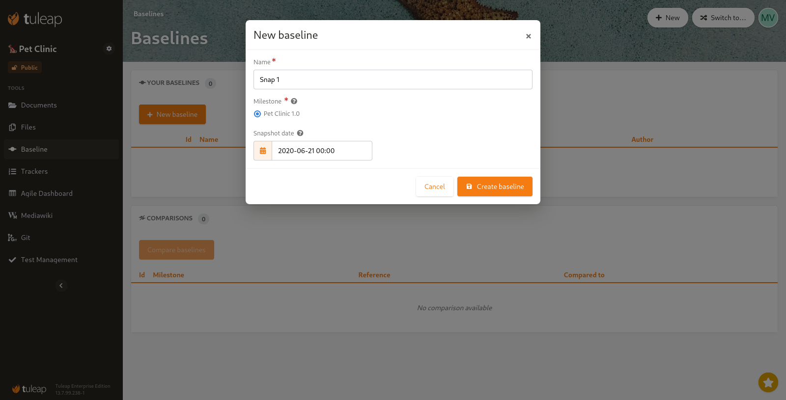
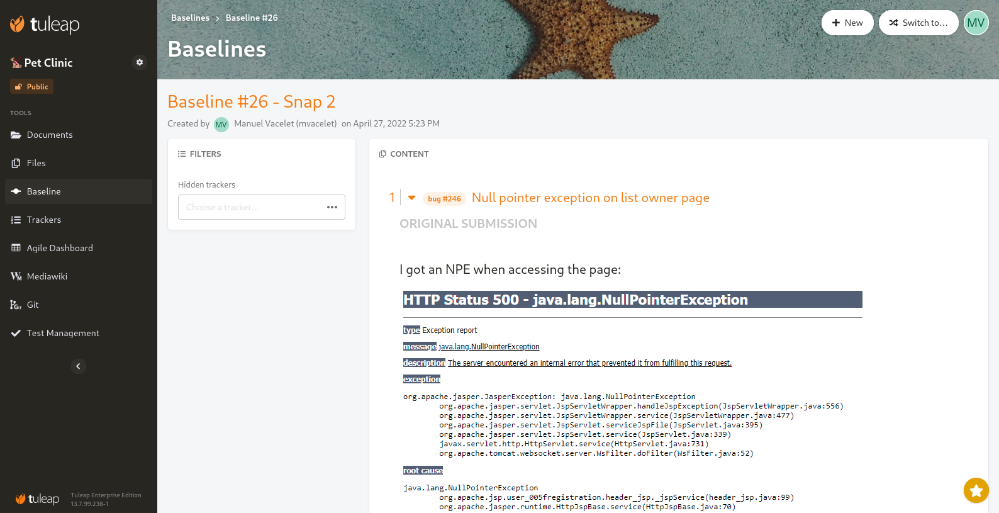
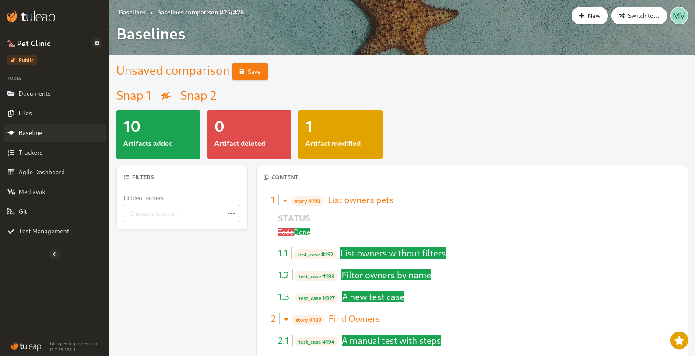

.. _plugin_baseline:

Baseline
--------

.. attention::

    This module is part of :ref:`Tuleap Enterprise <tuleap-enterprise>`. It might
    not be available on your installation of Tuleap.

Baseline allows to take snapshot of Agile Dashboard's milestone content and to compare them. Baseline allows to:

* capture the state of a milestone at given time,
* identify what changed between two milestones.

.. note::

    This plugin is in early delivery phase. It means that's not feature complete and is delivered to gather feedback
    about usage on how it could evolves in the feature. Feel free to reach us to discuss your use cases.

Create a Baseline
=================

As of today, a baseline can be created from a top level milestone of the agile dashboard (most of the time, it's releases). The user who creates a baseline is expected to provide a name for this baseline.

	Create a new baseline

By default, the baseline is created with the current content but it's also possible to define a date in the past. This can be useful when one forgot to create it back then.

What is displayed in a Baseline?

- The title (as per semantic)
- The description (as per semantic)
- The status (as per semantic)
- The children (linked artifacts)

	Show a baseline

Compare two Baselines
=====================

When there are at least two baseline for a milestone, it's possible to generate a comparison between those.

	Compare two baselines

It's also possible to save the comparison for further reference.