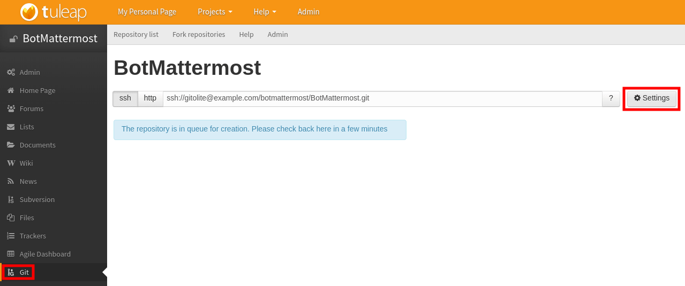

.. _botmattermost-plugins:

Bot Mattermost plugins
======================

Configuration
-------------

.. NOTE:: These plugins must be made available by your site admin. To administrate these plugins, go to the :ref:`botmattermost-plugins-admin` section.

.. _botmattermost-git:

BotMattermost-Git
`````````````````

To use this feature, **BotMattermost-Git plugin** must be installed and available for the project.

Go in your tuleap-git repository and click on **Settings**. In the **Notification** section,
you have the possibility to link bots previously created with the repository.
After that, every push effectuated on this repository will be notified in **Mattermost**.



.. _botmattermost-agiledashboard:

BotMattermost-AgileDashboard
````````````````````````````
To use this feature, **BotMattermost-Agiledashboard plugin** need to be installed and available for the project you need to use.

Go in your project and select **Agile Dashboard** service. In **Admin** section click on **Notification** pane.


Fill the form and select the bot that should send the stand-up summary.
Now, every day, you will receive your stand-up summary in your **Mattermost** every day after the report time.

________________________________________________________________________________


