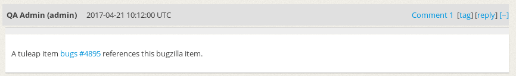

Using cross-references between Bugzilla and Tuleap
``````````````````````````````````````````````````

You can link a Tuleap item to a Bugzilla reference.


Declare reference
-----------------
First as a platform administrator you should add the keyword you want to use
and the Bugzilla server you want to be linked on.


Use reference
-------------
Now you can use the new reference in Tuleap and you will see link in both Tuleap and Bugzilla.


