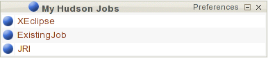

.. _continuous-integration-with-Hudson/Jenkins:

Continuous Integration with Hudson/Jenkins
==========================================

Introduction to Continuous Integration
--------------------------------------

Continuous Integration is the given name for the good practices used in
software engineering. These good practices aim at checking that a source
code modification does not lead to a regression on the developping
software application. This checking is usually performed on a different
machine than your development one (this machine is called an integration
server); and this checking is carried out rather frequently  [#f1]_, and
so it's called Continuous Integration.

The tool responsible for this checking is a Continuous Integration tool
such as CruiseControl or Hudson/Jenkins. This checking is called a
**Build**. A build will correspond, according to your project, in a
succession of steps, such as:

-  Compilation,

-  Documentation generation (javadoc for instance),

-  Unit tests execution,

-  Quality analysis on source code (coding conventions, number of
   comments, code metrics, etc.),

-  Delivery generation (exe, zip, tar, etc.).

The continuous integration tool does not perform the build itself, but
just launch it with regular interval, display the result of the build,
and is able of sending notification to project members if a modification
involved any regression.

This development method, initiated at the beginning by the Extreme
Programming community and adopted by Agiles methods, brings adding value
to your development process. For instance:

-  Tests are immediatly executed after each modification (step sometimes
   neglected by developers),

-  Integration issues are continuously detected, to be fixed as soon as
   possible,

-  It always exists an operational version of deliveries available for
   tests, demo or distribution.

The continuous integration tool we decided to integrate in
Tuleap is **Hudson/Jenkins**, which is one of the best tool.
Jenkins is a fork of Hudson. So in this chapter we will use the name
Hudson. It stands both for Hudson and Jenkins. Hudson configuration can
be easily done on the web interface, and there is a contextual help for
each step of the configuration, which is really appreciable.

The lexicon of Continuous integration and Hudson is quite specific.
Let's then give a definition:

=================================   ============================================================================================
        Word                                                    Definition
=================================   ============================================================================================
        **Job**                     The concept of Job can be associated with the concept of project. 
                                    The job will trigger the build, but it's also in charge of setting the building 
                                    environment required for executing the build (updating the source code for instance). 
                                    It will also be able to execute the build, and then perform some tasks such as 
                                    publishing generated documentation, publishing test results, sending notifications, etc.)
        **Build**                   Process is made of several steps executed periodically on a continuous integration server.
        **Artifact**                Item are generated during the build, and are published  by the continuous integration tool. 
                                    The continuous integration notion of artifact is obviously different than the notion of a 
                                    Tuleap artifact (which is an item tracked in a tracker).
        **Workspace**               Directory where the project will be deployed in order to perform the build, and 
                                    enventually publish artifacts.
        **Status (of the build)**   Build status can take several values regarding the tool. 
                                    Hudson has 4 status:     
  
                                        -  Successfull : everything went fine, all tests were successfull,
  
                                        -  Unstable : the build was successfull but unstable (failed tests for instance),    
  
                                        -  Failed : the build fatally failed         
  
                                        -  Disabled : the project has never been built before, or the project is disabled.
        **Trend (of the builds)**   Trend based on the latest 5 builds. This trend is represented by a weather report 
                                    (sun, thunder, etc.) meaning that the trend is good or not.
=================================   ============================================================================================

                    Glossary of Hudson and continuous integration specific words

Hudson Installation
-------------------

A JVM (1.5 or higher) is required for Hudson installation. Hudson can be
run standalone, but we will describe the installation in a container,
such as Tomcat. Install Tomcat Download the Hudson war file (hudson.war)
at https://hudson.dev.java.net/ Set the environment variable
HOME\_HUDSON if you want to define the install folder of Hudson Deploy
the war file in Tomcat manager. You're done! Hudson is installed. By
default, you can access the interface at http://localhost:8080/hudson

Hudson Configuration
--------------------

Before creating your own jobs, (see `Hudson Jobs Creation and Configuration`_), you need to configure Hudson.
All these steps are optional, you only have to configure what you really
need.

System Configuration
````````````````````

To configure Hudson, select the link "Manage Hudson" in the top menu in
Hudson interface, and then the link "Configure System".

All these steps have an online contextual help. Don't be afraid to use
it. To do it, you only have to select the question mark corresponding to
the option needed.

External Tools
~~~~~~~~~~~~~~

In order to be able to execute builds of your projects, Hudson needs to
know the path to the tools required to.

You can specify here the path to the external tools you need. By
default, the available tools are JDK, Shell, Ant, Maven and CVS. If you
install some plug-ins (see `Hudson Plug-ins`_) that need external tools, you will be able
to configure them in this section. You can define several instances of
the same tool (several version of JDK for instance).

.. figure:: ../images/screenshots/sc_hudsonexternaltoolsconfiguration.png
   :align: center
   :alt: External Tools Configuration
   :name: External Tools Configuration

   External Tools Configuration

Authentication
~~~~~~~~~~~~~~

By default, everyone can browse Hudson, browse the jobs, see the builds
results and schedule builds on the web interface.

You can nevertheless restrict the permissions. To do that, yo need to
check the box "Enable security" (still in the menu "Manage Hudson" ->
"Configure System"). You have several options:

-  **Delegate to servlet container:** in our case, it means Tomcat. The
   Tomcat configuration file for user definition and permissions is
   *<tomcat>/conf/tomcat-users.xml*. See container documentation for
   more details.

-  **LDAP:** if you already have a LDAP directory, you only need to
   specify the address of the server, and Hudson will recognize the
   users.

-  **Hudson's own user database:** Hudson can manage its own user
   database. In this case, you have to create yourself the users, or
   allow them to register.

The choice of enabling security or not will depend on your company
internal rules, or the specificity of your projects or the size of the
teams.

Email Notification
~~~~~~~~~~~~~~~~~~

Hudson is able to send notification to warn about build result. You can
of course configure this for each job. To enable notification, you need
to state a mail server (SMTP server). Leave the field empty if you want
to use the default mail server (localhost).

You can also define a default user email suffix. By default, all of the
Tuleap users have an email address of the form
**login@tuleap.example.com** that is mapped to the real email address.
You can then fill this field with the value **@tuleap.example.com**
and the emails will be automatically sent to the right users.

You can also specify the system Admin Email Address. Notification
e-mails from Hudson to project owners will be sent with this address in
the from header.

You finally need to state the URL of the Hudson server. URL in sent
emails will then be correct.

Jabber Notification
~~~~~~~~~~~~~~~~~~~

If you have installed the Jabber plug-in for Hudson (see `Hudson Plug-ins`_), you will
find in the section "Manage Hudson" -> "Configure System" a part to
configure Jabber notification. If the Jabber plugin for
Tuleap is installed and enabled, every Tuleap
user has a Jabber account (see :ref:`instant-messaging-plug-in`) and each project has a Chat Room.
Jabber plug-in lets you the ability to send notification to users or
chat rooms.

To use the Jabber notification, please give the name of the server (by
default tuleap.example.com) as well as the JabberID of the user that
will send the notifications.

Hudson Plug-ins
```````````````

Lots of plug-ins are available to extend Hudson. Among them, we can
quote: checkstyle, CI game, Crap4J, LDAP Email, MSBuild, NAnt, NUnit,
Selenium, etc. You will find a detailed list of all these plug-ins at
http://hudson.gotdns.com/wiki/display/HUDSON/Plugins

The list of available plug-ins is also available in the menu "Manage
Hudson" -> "Manage plugins". The list is dynamicaly updated. If your
continuous integration server is behind a proxy, you will need to
configure it in the "Advanced" tab.

To install a plug-in, check the box in front of the wished plug-in,
press the Install button and then follow the instructions.

Hudson Jobs Creation and Configuration
--------------------------------------

Once the system is configured, you can start defining your jobs. To do
that, select the link "New job" in the menu on top left. You just have
to give a name (the name of your project for instance) and choose the
type. Several types of jobs are possible. The most common is "free style
software project" that we are using as an example in this documentation.
There is also a type "Maven2" if you already use this build tool.

Select the Ok button to confirm the job creation. The next screen is
then the job configuration screen. You can add a description if you
want. Then, you will be able to specify the source code repository, and
the way that Hudson will handle the source code updates, define the
steps of the build, and tell Hudson what to do after the build.

CVS and Subversion
``````````````````

By default, Hudson suggests the same two SCM (Source Code Management) as
Tuleap: CVS and Subversion. Select the manager you're using
for your project, and then enter the information about the paths to your
project's repository.

CVS
~~~

To configure CVS, you need to give the CVSROOT of your project. The
expecting format is **:protocol:user@host:path**

You can find the details of the expecting string selecting the CVS tab
of your project in Tuleap. It looks like
**:pserver:[username]@[projectname].tuleap.example.com:/cvsroot/[projectname]**

You can also provide one or several modules and/or a branch.

Subversion
~~~~~~~~~~

To configure Subversion, you need to provide the URL of the repository.
This piece of information is available on the Tuleap
interface, by selecting the SVN tab of your project. It looks like
**http://tuleap.example.com/svnroot/[projectname]**

Hudson will then ask you to give credentials for Subversion, to be able
to access the repository. You can then choose several options for
managing this authentication (either give your login/password or use SSH
public key authentication or HTTPS client certificate). We let you
choosing what option better fits your needs.

You can add several repositories by pressing the button "Add more
locations...".

Finally, if you want to give the ability to the users to navigate in the
source code repository through Hudson interface, you can select
"ViewSVN" in the field "Repository browser", and then enter the folowing
string:
**http://tuleap.example.com/svn/viewvc.php?roottype=svn&root=[your\_projet\_short\_name]**

Builds Schedule
```````````````

As explained in introduction, the big thing with continuous integration
is the fact that once configured, the build is continuously done, and
you don't have to think about it. However, we still need to configure
the way hudson will schedule the build. Two main options are available:

-  **Poll SCM**: will poll changes in your project SCM (CVS or
   Subversion). You can define the frequency following the cron syntax
   (see Hudson inline help). This option can however be expensive
   operations for the Tuleap server. You can think of using
   the 'push' option to avoid this problem (see below).

-  **Trigger builds remotely**: this 'push' option avoids server
   overloading. The build is triggered by an URL. To avoid anybody to
   trigger builds, you can protect the operation by specifying an
   authentication token. To really enable the build trigger after each
   commit, you will need to configure it in Tuleap, in the
   'Build' tab of your project (See :ref:`link-hudson-job-with-your-Tuleap-project`). You will be able to specify your
   token if you have defined one.

Build configuration (steps)
```````````````````````````

You now need to define what the build will effectively do (compile your
project, generate documentation, launch unit tests, etc.). To do that,
you can add as many steps as needed. By default (meaning without any
other plug-ins), Hudson offers 4 types of possible steps:

-  **Execute shell**: let you simply enter a shell script in the text
   area. You can use several environment variables (see inline help).

-  **Execute Windows batch command**: let you simply enter a Windows
   batch script in the text area. You can use several environment
   variables (see inline help).

-  **Invoke Ant**: let you invoke an Ant script. If several Ant version
   are available (see `External Tools`_), you can choose the one you want. You can also
   precise the Ant target if needed. Pressing the "Advanced" button, you
   will be able to specify properties and Java options.

-  **Invoke top-level Maven targets**: let you invoke Maven targets. You
   can specify the expected targets. The "Advanced" button lets you
   define POM file, properties and Java options.

The step configuration is specific to your project. We will let you
configure it as needed.

Post-build Actions
``````````````````

After a build, Hudson can do some actions. Among them:

-  **Archive the artefacts**: if your build produces deliveries (such as
   exe, zip, or tar), or generate user documentation for instance, you
   can publish these artifacts on the Hudson build page of your job. You
   need then to specify the path to the artifacts to publish (the
   reference directory is the workspace of your project). You can use
   the wildcard (\*) to state artifacts to publish. You can also decide
   to keep the history of artifacts, or just the latest successfully
   generated ones to save space.

-  **Publish Javadoc**: if your build produces javadoc, you can publish
   it on the build page by giving the path to the root folder of the
   generated javadoc. The reference folder is the workspace. You can
   also use the wildcard, and can choose either archive old versions of
   the javadoc or not.

-  **Publish JUnit test result report**: if your build executes JUnit
   tests, you can publish a result report on the build page in
   specifying the path of the JUnit generated XML report files. If you
   use another test plug-in, you will find nearly the same.

-  **Build other projects**: Your job can depend on another one. In this
   case, you maybe want to build another project after the current
   build. If so, just indicate the name of the job to build after this
   build. You can specify if the job has to be built even if the current
   build failed or not.

-  **Email notification**: Hudson is able to send emails while some
   events happen. You can enter a list of email addresses to be
   notified. A good practice could be giving a mailing list address
   (specific for Hudson or not) in order to notify all the team (see :ref:`creation`
   to know how to create mailing lists). Events that trigger
   notification are managed as followed:

   -  Every failed build triggers a new e-mail.

   -  A successful build after a failed (or unstable) build triggers a
      new e-mail, indicating that a crisis is over.

   -  An unstable build after a successful build triggers a new e-mail,
      indicating that there's a regression.

   -  Unless configured, every unstable build triggers a new e-mail,
      indicating that regression is still there.

   For lazy projects where unstable builds are the norm, Uncheck "Send
   e-mail for every unstable build".

   You can also send a separate email to people who broke the build. To
   do this, the continuous integration server must be well configured
   (see `Email Notification`_).

Integration in Tuleap
---------------------

As continuous integration is a good practice in software engineering,
Tuleap integrates Hudson tool. We know how to install (see
`Hudson Installation`_) and configure (see `Hudson Configuration`_) Hudson, and how to create and configure Hudson
jobs (see `Hudson Jobs Creation and Configuration`_). Let's see now how Hudson is integrated to
Tuleap.

Hudson Service
``````````````

If Hudson plugin is installed and enabled on your Tuleap
server, each project can enable the Hudson service (see :ref:`service-configuration` to know how to
enable services for your project).

Once the service is enabled, you will see a "Build" tab in the service
bar of your project : the Hudson continuous integration tab.

.. _link-hudson-job-with-your-Tuleap-project:

Link Hudson job with your Tuleap project
~~~~~~~~~~~~~~~~~~~~~~~~~~~~~~~~~~~~~~~~

In order to link Hudson job with your project, select the Build tab of
your project, and then select the 'Add a job' link. You need then to
give the URL of the Hudson job you want to associate with your project
(for instance: http://[my\_ci\_server]:8080/hudson/job/[my\_job]).

.. figure:: ../images/screenshots/sc_hudsonaddjob.png
   :align: center
   :alt:  Link Hudon job with your project
   :name:  Link Hudon job with your project

   Link Hudon job with your project

You may also want to enable the auto trigger of the build for this job
after each commit in your project repository (CVS or Subversion). If you
have protected your build with a token, you can specify this token (see
`Builds Schedule`_ for more information). By checking this option, each commit will
trigger a build of the associated job, using the pre-commit hook (you
don't have anything more to do).

By the way, it is possible to link several Hudson jobs with one
Tuleap project.

Browse Hudson jobs and builds
~~~~~~~~~~~~~~~~~~~~~~~~~~~~~

When you select the Build tab of your project, you can see a table with
all the jobs associated with your project. For every job, you can see
the current status (colored bullet left to the name of the job), the
name, the last successfull build, the last failed build, if you have
enabled SCM trigger or not (see ?). Project admins will also see for
each job some icons that let them modify the job or delete it (remove
the link with Tuleap).

.. figure:: ../images/screenshots/sc_hudsonbrowsejobs.png
   :align: center
   :alt:  Hudson jobs associated with your project
   :name:  Hudson jobs associated with your project

   Hudson jobs associated with your project

The name of the job is automatically detected during job creation. But
you can change it if needed. This is pretty convenient if you want to
make references to Hudson items (see `Make a reference to a Job`_). Spaces in the name of jobs are
not allowed. They are replaced by (\_), in order to allow references.

The name of the job and the latest builds are hypertext links that will
be opened the corresponding Hudson section in a frame below the table.
This is really convenient to browse Hudson interface while staying in
the Tuleap interface. If you want to open the Hudson frame
in a specific window, just select the 'show only this frame' link.

The table provides also links to Hudson jobs RSS feed.

Hudson Widgets
``````````````

Hudson service lets you adorn your personal and project dashboards with
many widgets. To know how to add widgets to your personal dashboard, see
:ref:`login-and-personal-page`. The procedure is similar to add widgets to
project dashboards (see :ref:`project-dashboard-content`).

-  **My Hudson jobs**: only available on the personal dashboards. By
   default, it gives an overview of all the jobs of all the projects you
   are member of. You can of course select the jobs you wish to display
   by selecting the preferences link of the widget.



   "My Hudson Jobs" Widget

-  **Jobs Overview**: this widget is only available on project
   dashboards. It can display an overview of all the jobs associated with
   this project. You can always choose the ones you want to display in
   the widget (preferences link).

.. figure:: ../images/screenshots/sc_hudson_widget_jobs_overview.png
   :align: center
   :alt: "Jobs Overview" Widget
   :name: "Jobs Overview" Widget

   "Jobs Overview" Widget

-  **Last Builds**: this widget is available for both personal and
   project dashboards. It is linked to only one job, and show the last
   builds for this job (last one, last successfull, last failed). It
   also displays the project weather report (project trend, see `Introduction to Continuous Integration`_).

.. figure:: ../images/screenshots/sc_hudson_widget_last_builds.png
   :align: center
   :alt: "Lasts Builds" Widget
   :name: "Lasts Builds" Widget

   "Lasts Builds" Widget

-  **Test Results**: this widget is available for both personal and
   project dashboards. It is linked to only one job, and show the test
   results of the latest build for the selected job. To display
   something, your job needs to execute tests and publish them. The
   result is shown on a pie chart.

.. figure:: ../images/screenshots/sc_hudson_widget_test_results.png
   :align: center
   :alt: "Test results" Widget
   :name: "Test results" Widget

   "Test results" Widget

-  **Test Trend**: this widget is available for both personal and
   project dashboards. It is linked to only one job, and show the test
   result trend for the job. Of course, your job needs to have tests to
   display something. The graph will show the number of tests (failed
   and successfull) along time. It can be very convenient for project
   managers to check that the number of tests is increasing while the
   number of build and commits are increasing too.

.. figure:: ../images/screenshots/sc_hudson_widget_test_trend.png
   :align: center
   :alt: "Tests Trend" Widget
   :name: "Tests Trend" Widget

   "Tests Trend" Widget

-  **Build History**: this widget is available for both personal and
   project dashboards. It is linked to only one job, and show the build
   history, under the form of RSS feed. For each build of the list, you
   can see the build number, the status and the date the build has been
   scheduled.

.. figure:: ../images/screenshots/sc_hudson_widget_builds_history.png
   :align: center
   :alt: "Builds History" Widget
   :name: "Builds History" Widget

   "Builds History" Widget

-  **Last Artifacts of the Build**: this widget is available for both
   personal and project dashboards. It is linked to only one job, and
   show the last artifacts published. To display something, your job
   needs to publish artifacts.

.. figure:: ../images/screenshots/sc_hudson_widget_last_artifacts.png
   :align: center
   :alt: "Last artifacts of the Build" Widget
   :name: "Last artifacts of the Build" Widget

   "Last artifacts of the Build" Widget

Hudson References
`````````````````

It is possible to make references to Hudson items in Tuleap.
There are some predefined references (job, build), but you can also
create your own references if needed (see :ref:`reference-overview` for more details about
references)

Make a reference to a Job
~~~~~~~~~~~~~~~~~~~~~~~~~

The keyword to make a reference to a Job is: **job**. To make a
reference to a job, you can use the expressions:

-  job #JobNameToReference (the job must be in the current project)

-  job #project:JobNameToReference (will make a reference to the job
   'JobNameToReference' of the project 'project')

-  job #project\_num:JobNameToReference (will make a reference to the
   job 'JobNameToReference' of the project with number 'project\_num')

Make a reference to a build
~~~~~~~~~~~~~~~~~~~~~~~~~~~

The keyword to make a reference to a build is: **build**. To make a
reference to a build, you can use the expressions:

-  build #XXX (there must be only one job associated with the current
   project, and the referenced build will be the build number 'XXX' of
   this job)

-  build #AJob/XXX (will make a reference to build number 'XXX' of job
   named 'AJob' of the current project)

-  build #project:AJob/XXX (will make a reference to the build number
   'XXX' of the job 'AJob' of project 'project')

-  build #projet\_num:AJob/XXX (will make a reference to the build
   number 'XXX' of the job 'AJob' of the project number 'project\_num')

.. [#f1]
   Several strategies are possible: after each commit, with regular
   interval (every hours, every night). It depends on the size of the
   project, the number of developers, the frequency of modifications.
