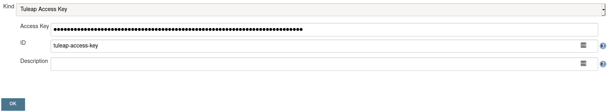
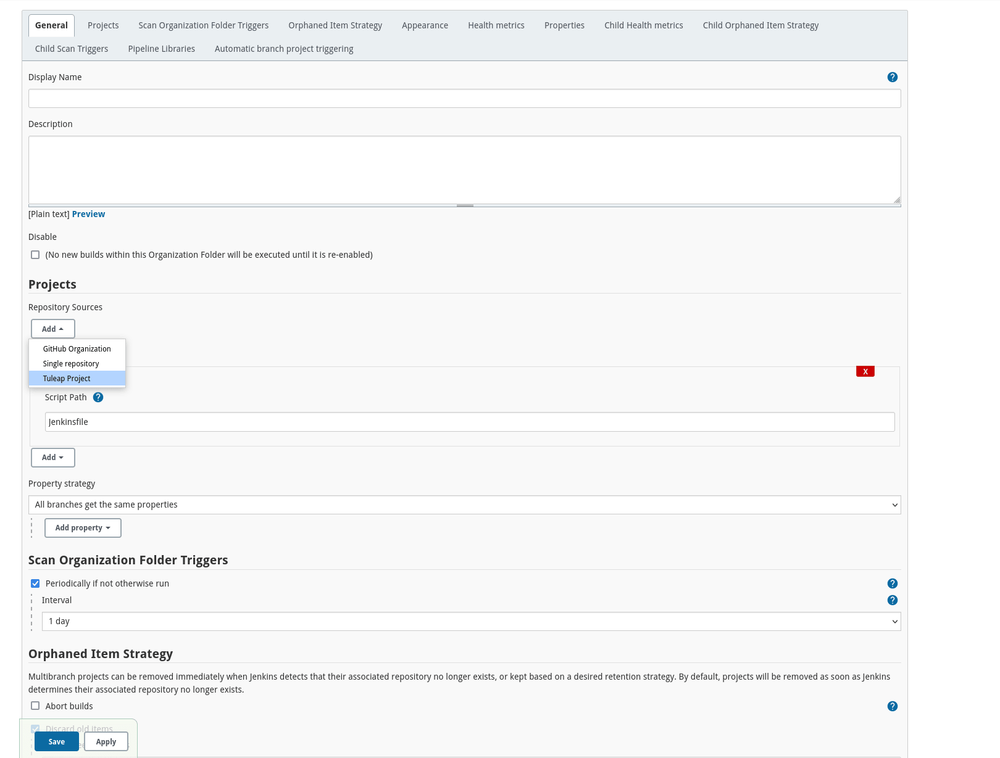
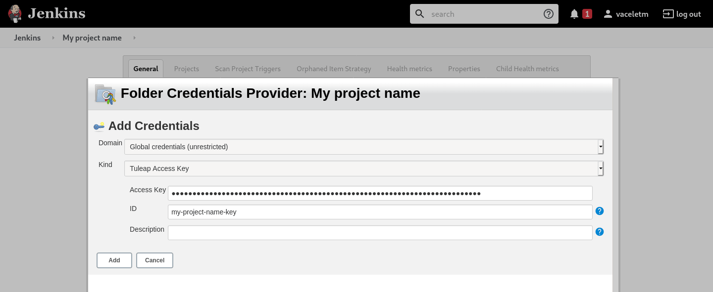
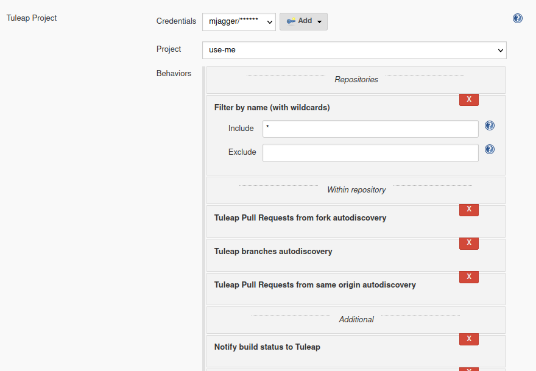

.. _continuous-integration-with-Hudson/Jenkins:

Continuous Integration
======================

Tuleap provides Continuous Integration to teams via a deep integration with Jenkins.

Tuleap team recommends to avoid big Jenkins instances shared by many projects and many teams as the security model of
Jenkins doesn't allow to have a strict split of areas. That is to say, to guaranty that 2 concurrent teams that share
the same Jenkins sever cannot have access to the code of each other.

In case of doubt the strategy of "One Tuleap Project, one Jenkins Master" is safe and efficient.

Jenkins Configuration
---------------------

This section will cover how to configure a Jenkins server to be used efficiently with Tuleap. We assume a fresh Jenkins
instance that was just installed.

Some adaptations might be needed if you modify an existing Jenkins server (be very careful with authentication to not lock
yourself out of Jenkins).

.. attention::

    Both Jenkins and Tuleap servers **must** be in https and certificate must be either `valid <https://certbot.eff.org/lets-encrypt/centosrhel7-nginx.html>`_
    or, at least, trusted.

    If you cannot have valid certificates:

    - `Jenkins must trust Tuleap server certificate <https://support.cloudbees.com/hc/en-us/articles/203821254-How-to-install-a-new-SSL-certificate>`_
    - `Jenkins must run behind a reverse proxy that does TLS termination <https://www.jenkins.io/doc/book/system-administration/reverse-proxy-configuration-nginx/>`_
    - :ref:`Tuleap must trust Jenkins server certificate <admin_howto_add_certicate>`

Plugins installation
````````````````````

Three plugins should be installed:

- `Tuleap Git Branch Source <https://plugins.jenkins.io/tuleap-git-branch-source/>`_
- `Tuleap Authentication <https://plugins.jenkins.io/tuleap-oauth/>`_
- `Tuleap API <https://plugins.jenkins.io/tuleap-api/>`_

They are available publicly on the Jenkins plugin marketplace and the installation is done from within Jenkins in "Manage Plugins"
section.

.. note::

    ``Tuleap API`` is automatically installed if you install ``Tuleap Git Branch Source`` or ``Tuleap Authentication``.

Ideally, you will want to install the `Pipeline plugin <https://plugins.jenkins.io/workflow-aggregator/>`_ as well, as the targeted workflows make an extensive use of ``Jenkinsfile``.
The examples provided below assume you have this plugin installed on your Jenkins instance.

Finally, you might also need to install other plugins related to your pipeline of email notifications, artifact publishing to Artifactory, etc.
This is business specific to each project and not covered in this documentation.

Plugins configuration
`````````````````````

The plugins configuration can be done thanks to Tuleap API plugin.
First, you need to associate your Jenkins server with a Tuleap server. This is done in "Manage Jenkins > System configuration".


If the connection to the Tuleap server is successful you will see ``Connexion established with these Urls`` message in
the Jenkins interface (as in the previous screenshot). Otherwise you will get a stacktrace (Jenkins...) with, hopefully,
an error message that will help to diagnose the problem.

Most common issues are related to DNS (is your server name valid and can Jenkins access it) and TLS (does jenkins trust
Tuleap server).

.. _pullrequest_jenkins_notification_configuration:

Pull request notification configuration
---------------------------------------

Tuleap API Plugin provides the pipeline command to send the build result of your Jenkins job to a pull request in Tuleap.

Before using the command, you will need to provide Jenkins a way to authenticate on Tuleap's side to ensure
that it's your Jenkins's job that recorded the build status.

There are currently two ways to proceed:
 - Either `using the CI token`_ of the repository
 - Either `using an access key`_ of a user belonging to a user group authorized to set build statuses.

To do so, go into repository *Settings > CI Builds*:

.. figure:: ../images/screenshots/pullrequest/ci-token.png
      :align: center
      :alt: CI token
      :name: CI token


Using the CI token
``````````````````

The CI token has to be saved on Jenkins's side as a ``Secret text``. In our example we will add the credential in the "global" domain.
In Jenkins, go to *Credentials > global > Add Credentials*, select the ``Secret text`` type and fill in the inputs:

 - ``Secret`` must contains the CI token retrieved previously.
 - ``ID`` input is the ID that you want for the credential, the value will be used in the Jenkinsfile. Here it will be ``tuleap-ci-token``. If you do not fill this field, you have to use the credential ID generated by Jenkins instead
 - ``Description`` is optional. This field will not be used in our example.


See the `Credentials plugin <https://github.com/jenkinsci/credentials-plugin/blob/master/docs/user.adoc>`_ documentation for more information about credentials management in Jenkins.

Using an access key
```````````````````
In Jenkins, go to *Credentials > global > Add Credentials*, select the ``Tuleap Access Key`` type and fill in the inputs:

 - ``Access Key`` must contains the access key of your Tuleap user.
 - ``ID`` input is the ID that you want for the credential, the value will be used in the Jenkinsfile. Here it will be ``tuleap-access-key``. If you do not fill this field, you have to use the credential ID generated by Jenkins instead
 - ``Description`` is optional. This field will not be used in our example.



.. note::

    If you want to use the same access key as the one provided during the registration of your repository on Jenkins,
    no need to follow the steps above since it is already registered.

Make sure that the user owning the access key is member of one of the groups having the permission to set builds statuses (see *Settings > CI Builds* in your repository on Tuleap).

Send builds results
```````````````````

To send the result you have to add the following command in your Jenkinsfile:

.. sourcecode:: groovy

    tuleapNotifyCommitStatus status: 'BUILD_STATUS',
                             repositoryId: 'GIT_REPOSITORY_ID',
                             credentialId: 'CRED_ID_OF_CI_TOKEN_OR_ACCESS_KEY'

Where:
 - ``BUILD_STATUS`` is either 'pending', 'failure' or 'success'.
 - ``GIT_REPOSITORY_ID`` is the ID of the concerned git repository. The ID can be found in the URL query (repo_id=XXX) in the 'Settings' menu of the repository.
 - ``CRED_ID_OF_CI_TOKEN_OR_ACCESS_KEY`` is the Jenkins credential ID of the CI token OR the access key bound to your repository. In the example below, it is ``b9a4832d-f26d-46ca-acd7-15b935de9069``

Here is an example Jenkinsfile using the tuleapNotifyCommitStatus command:

.. sourcecode:: groovy

    // The git repository id is 1
    pipeline {
        // Add you own build/test stages instead of this
        stages {
            stage('Build') {
                steps {
                    tuleapNotifyCommitStatus status: 'pending', repositoryId: '1', credentialId: 'b9a4832d-f26d-46ca-acd7-15b935de9069n'

                    sh('make all')
                }
            }
        }
        post {
            failure {
                tuleapNotifyCommitStatus status: 'failure', repositoryId: '1', credentialId: 'b9a4832d-f26d-46ca-acd7-15b935de9069'
            }
            success {
                tuleapNotifyCommitStatus status: 'success', repositoryId: '1', credentialId: 'b9a4832d-f26d-46ca-acd7-15b935de9069'
            }
        }
    }

The concerned Pull Request is updated with the last build status from Jenkins:


See :ref:`Pull requests <code-review-with-pullrequest>` documentation for more information.

.. _jenkins_configuration_for_test_automation:

Jenkins configuration for test automation
-----------------------------------------

First of all you will need an Access Key to access Tuleap API. Generate one for your user and then create a new credential in Jenkins selecting "Tuleap Access Key" as "Kind" and giving it an ID or
copying the one generated by Jenkins. For this example we'll consider that you chose ``tuleap-access-token`` as the ID.

Create a new Jenkins job "Pipeline" and point it to your SCM repository (you might want to use ``jenkins-tuleap-bot``
credentials to access the repo). You should also allow it to be triggered remotely. Check the "Trigger builds remotely" checkbox in the "Build Triggers" section and provide a secret Authentication token.

With Tuleap API you can also send to TTM Junit XML output. The automated tests which are concerned will be automatically updated.

In your Jenkinsfile you have to add the following command:

.. sourcecode:: groovy

    tuleapSendTTMResults filesPath: 'XML_FILES',
                         campaignId: 'CAMPAIGN_ID',
                         credentialId: 'CRED_ID_OF_ACCESS_KEY'

Where :
 - XML_FILES are the Junit XML outputs.
 - CAMPAIGN_ID is the TTM concerned campaign ID
 - CRED_ID_OF_ACCESS_KEY is the Jenkins credentials ID of your access key. Here it is ``tuleap-access-token``

Here is an example Jenkinsfile using the tuleapSendTTMResults command:

.. sourcecode:: groovy

    pipeline {
      agent any
      parameters {
        string(name: 'campaignId', defaultValue: '', description: 'ID of the campaign')
      }
      stages {
         stage('Reporting') {
            steps {
                tuleapSendTTMResults filesPath: 'outputs/*.xml', campaignId: "${params.campaignId}", credentialId: 'tuleap-access-token'
            }
         }
      }
   }

See :ref:`Test Automation <testmgmt_automation>` documentation, for more information.

Authentication configuration
````````````````````````````

This section requires that your Tuleap server has :ref:`OAuth2 Server <openidconnect_provider>` plugin installed.

First, on your Tuleap server, in one of your project, you need to create a new :ref:`OAuth2 app <openidconnect_provider_client_registration>`.
The app will ask for a callback URL. This callback URL is your Jenkins server base URL (eg. https://jenkins.example.com/jenkins) + ``/securityRealm/finishLogin``.
The plugin allows the PKCE usage for the authentication. You can force its usage at the creation of the :ref:`OAuth2 app <openidconnect_provider_client_registration>`.

Keep the generated Client Secret securely until the next step.


Then Jenkins, go In *Manage Jenkins > Configure Global Security*, and select *Tuleap Authentication* and fill:

- Client ID
- Client Secret

With the values provided by Tuleap.


Ensure that *Authorization* (bellow *Authentication section*) is still set to *Anyone can do anything* and click save.

You should then be able to login on Jenkins with you Tuleap credentials and still have access to *Manage Jenkins*.

.. note::

    If you locked yourself out of Jenkins you can start over by `disabling security <https://stackoverflow.com/questions/16323896/locked-out-of-jenkins>`_.

Authorization configuration
```````````````````````````

This section depends on the previous one. If you don't use Tuleap Authentication, you cannot do the following configurations.

In the `Authorization Matrix <https://plugins.jenkins.io/matrix-auth/>`_ you can reference:

- Tuleap users with their ``login_name``
- Tuleap user groups in the form ``project-shortname#user-group-name``

Most of the time should refer to user groups to ease the maintenance. Once you setup the groups, you only have to deal
with people management at Tuleap side without having to bother with their Jenkins permissions anymore.

In the following screenshot you have a good start point in term of permissions management with the default groups defined
in Tuleap:

- Access to Jenkins must be authenticated. Controlled by Tuleap => only the people who have access to Tuleap will have access to Jenkins
- The people who can access can only Read your jobs. That correspond to a "Public" project (or "Public including Restricted" if you have restricted users in Tuleap).
- The project members of the Tuleap mozilla project can manage jobs, builds and credentials.
- The project administrators of Tuleap mozilla project can administer Jenkins (plugins, grants & co).


At this point you are almost done with Jenkins administration. You might need to install and configure other plugins depending
of the content of your pipelines, configure agent to distribute the load and, of course, update jenkins itself but you are done
for the permission and user management.

.. _continuous_integration_git_branch_source:

Tuleap Git / Jenkins integration
--------------------------------

Thanks to `Tuleap Git Branch Source <https://plugins.jenkins.io/tuleap-git-branch-source/>`_ Jenkins plugin, most of the
integration between the two tools is completely streamlined.

The configuration is done once at project level, then every new git repository created in Tuleap will be automatically
discovered by Jenkins, branches will be inspected to find ``Jenkinsfile`` and created corresponding pipelines.

Whenever a new commit will be pushed, the corresponding job will be triggered on Jenkins.

Step 1: Have an access key to your repositories
```````````````````````````````````````````````

In Tuleap, either with a service or personal account that have read access to the project's repositories go in user preferences,
"Keys & Tokens" section and generate a new Access Key with both ``Git`` and ``REST`` scopes.


Step 2: Create a Tuleap Project
```````````````````````````````

In Jenkins, create a new job with type "Tuleap Project". It should be named after your Tuleap project name to ease organisation.



Once the job created you should grant it access to Tuleap with the credential you generated at Step 1. Near the credential
drop down, you have a "Add" button. Create a new "Project name" credential of type "Tuleap Access Key" and give it a
descriptive id so you can find it later.



Once the credential is saved, select it in the "Credentials" dropdown.

In the "Project" dropdown right after, select the Tuleap project you want to automate.

You can adjust "Behaviours" to match your need. By default we suggest to remove ``*`` from ``Exclude`` field of "Filter by name (with wildcards)" section
otherwise nothing will be built at all.



When the configuration is ready, save it. This will trigger a scan of your project to look for git repositories, their branches
and ``Jenkinsfile`` to create Jenkins jobs.


When the scan is completed, you will find all the git repositories where Jenkins found a ``Jenkinsfile`` and the status
of the builds that were triggered.


.. attention::

    On Jenkins, in your project settings, you might also want to adjust "Scan Project Triggers" to a shorter period
    otherwise you will have to wait for 1 day between a new repository creation and jenkins to discover it.

    As this will trigger a full analyze of all branches of git repositories of your Tuleap project, you need to find a
    balance between reactivity and Tuleap server overloading.

    If you don't create a new repository every other hours, you might want to let 1 day period and trigger manually the
    scan whenever you create a new repository.

Step 3: Tell Tuleap where the Jenkins server is
```````````````````````````````````````````````

The final step is on Tuleap. You need to inform the git server where is the Jenkins server that must be informed about
new commits that are pushed.

In the administration of the Git service of your project, there is a ``Jenkins`` tab where you set the Jenkins root url.
For instance ``https://jenkins.example.com/jenkins``.


That's it
`````````

When those 3 steps are completed, you no longer have to worry about Jenkins / Tuleap integration, everything is automated.

Continuous Integration service in Tuleap
----------------------------------------

.. note::

    The "Continuous Integration" service in Tuleap refers to an historical implementation that was mainly targeting Subversion
    and CVS.

    It also provides some widgets that can be used on Project and Personal dashboards.

.. _link-hudson-job-with-your-Tuleap-project:

Reference Jenkins job with your Tuleap project
``````````````````````````````````````````````

In order to link Jenkins job with your project, select the Continuous Integration tab of
your project, and then select the 'Add a job' link. You need then to
give the URL of the Hudson job you want to associate with your project
(for instance: ``https://[my\_ci\_server]:8080/jenkins/job/[my\_job]``).


You may also want to enable the auto trigger of the build for this job
after each commit in your project repository (CVS or Subversion). If you
have protected your build with a token, you can specify this token.

By checking this option, each commit will
trigger a build of the associated job, using the pre-commit hook (you
don't have anything more to do).

By the way, it is possible to link several Jenkins jobs with one
Tuleap project.

Jenkins jobs and builds
```````````````````````

When you select the Continuous Integration tab of your project, you can see a table with
all the jobs associated with your project. For every job, you can see
the current status (colored bullet left to the name of the job), the
name, the last successful build, the last failed build, if you have
enabled SCM trigger or not.

Project admins will also see for
each job some icons that let them modify the job or delete it (remove
the link with Tuleap).


The name of the job is automatically detected during job creation. But
you can change it if needed. This is pretty convenient if you want to
make references to Jenkins items (see `Make a reference to a Job`_). Spaces in the name of jobs are
not allowed. They are replaced by (\_), in order to allow references.

Jenkins References
------------------

It is possible to make references to Jenkins items in Tuleap.
There are some predefined references (job, build), but you can also
create your own references if needed (see :ref:`reference-overview` for more details about
references)

Make a reference to a Job
`````````````````````````

The keyword to make a reference to a Job is: **job**. To make a
reference to a job, you can use the expressions:

-  job #JobNameToReference (the job must be in the current project)

-  job #project:JobNameToReference (will make a reference to the job
   'JobNameToReference' of the project 'project')

-  job #project\_num:JobNameToReference (will make a reference to the
   job 'JobNameToReference' of the project with number 'project\_num')

Make a reference to a build
```````````````````````````

The keyword to make a reference to a build is: **build**. To make a
reference to a build, you can use the expressions:

-  build #XXX (there must be only one job associated with the current
   project, and the referenced build will be the build number 'XXX' of
   this job)

-  build #AJob/XXX (will make a reference to build number 'XXX' of job
   named 'AJob' of the current project)

-  build #project:AJob/XXX (will make a reference to the build number
   'XXX' of the job 'AJob' of project 'project')

-  build #projet\_num:AJob/XXX (will make a reference to the build
   number 'XXX' of the job 'AJob' of the project number 'project\_num')
