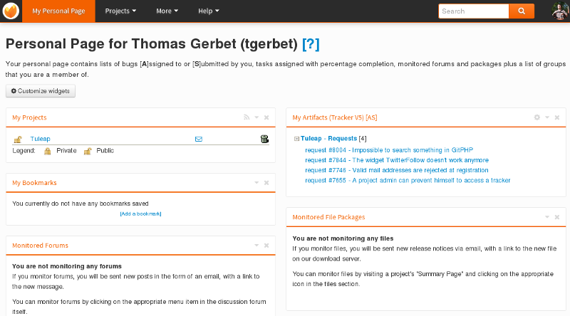

.. |SYSPRODUCTNAME| replace:: Tuleap

Becoming a |SYSPRODUCTNAME| Citizen
=====================================

.. _classes-of-citizens:

Classes of Citizens
===================

Before we go further into the user registration process it is worth
reviewing the various types of |SYSPRODUCTNAME| citizens. There are
basically 4 of them:

-  **Anonymous Users**: when you first visit the |SYSPRODUCTNAME| site
   you are typically an anonymous user. Anonymous users can browse the
   |SYSPRODUCTNAME| site but many of the |SYSPRODUCTNAME| services
   or |SYSPRODUCTNAME| resources cannot be used or accessed by an
   anonymous user (e.g. source code access is not possible, all the
   monitoring facilities aren't either, etc.). So we strongly advise you
   to become a registered user to take full advantage of the
   |SYSPRODUCTNAME| site.

-  **Registered Users**: once you have created your own account (see
   below) you can use your login/password to authenticate yourself with
   |SYSPRODUCTNAME|. Registered users have access to all
   |SYSPRODUCTNAME| projects including source code unless the project
   administrators decided otherwise. And since the system knows about
   you, it enables you to customize your view of the system through your
   Personal Page, monitor Forums, software release, receive support
   request follow-ups, site updates and many other useful things.

-  **Project Members**: users who are actively working on a
   |SYSPRODUCTNAME| hosted project. To become a project member, you
   must first become a registered user and then ask a project
   administrator to include you in the project members. Most of the time
   project members are part of the project team but are not limited to
   software developers. They can be in charge of the support activity,
   the project documentation or the project management. Project members
   can be granted different rights by the Project Administrator
   according to their role in the team (see :ref:`project-administration` for more details).

-  **Project Administrators**: registered users who create a new
   |SYSPRODUCTNAME| project are elected as the first Project
   Administrators. Project Administrators have full rights over their
   projects except project deletion - a very unusual operation - that
   can only be done by a |SYSPRODUCTNAME| Team member. In the course
   of the project life, the initial project administrator can grant (or
   revoke) the status of project administrator to any project member.

-  **Restricted Users**: users who are project members, or even project
   administrators, but with restricted access rights: they cannot access
   pages from projects they are not member of. This special role is only
   enabled on |SYSPRODUCTNAME| servers in heterogeneous environments
   where corporate users and external consultants share the same server.

User Registration
=================

As suggested above, the first thing to do for a newcomer is to create
her own account on |SYSPRODUCTNAME|. Becoming a registered
|SYSPRODUCTNAME| user doesn't imply any commitment on your part to
host any of your software projects on |SYSPRODUCTNAME|. It simply
gives you more freedom when you browse the site and allows
|SYSPRODUCTNAME| to serve you with personalized information.

Registering on |SYSPRODUCTNAME| is quick and easy:

    1. Select the "New User" link

    2. Give the following information (all items marked with an asterisk are
       mandatory):

        a. **Login Name**: your user name. On some |SYSPRODUCTNAME| systems that
           are connected to an enterprise directory you may have to use a
           pre-defined user name.

        b. **Password**: 6 characters minimum and repeat it twice to make sure you
           didn't make any typo in the first occurrence

        c. **Full Real Name**: what's your name again?

        d. **E-mail Address**: depending on the site configuration valid email
           addresses may be limited to those in the SYS\_ORG\_NAME domain (or
           SYS\_ORG\_NAME affiliated domains). Make sure your email address is
           correct or you won't receive the registration confirmation message in
           your mailbox and won't be able to complete the registration process.

        e. **Time Zone**: choose the time zone you live in. Choosing the correct
           time zone is really important. Behind the scene |SYSPRODUCTNAME|
           stores all time stamps in GMT time. Choosing the right time zone allow s
           |SYSPRODUCTNAME| to translate all time stamps to your local time on
           the Web pages.

        f. **Site Updates**: check this box if you want to receive site updates
           from the |SYSPRODUCTNAME| Team. This is a low traffic distribution
           list and we strongly advise you to check this box (default). You'll
           receive e-mail from us about the site maintenance, the important event
           in the life of the site, |SYSPRODUCTNAME| presentation/training
           announcement and the |SYSPRODUCTNAME| newsletter.

        g. **Additional Community Mailings**: check this box if you want to receive
           notification about less important events. You can safely check this box
           as well if you want because we seldom use it. So we assure you that you
           won't be overwhelmed with tons of e-mail.

    3. Shortly after you validate the registration form you will receive a
       message in your mailbox which includes a URL. Clicking on this URL will
       bring you to a |SYSPRODUCTNAME| form asking for your login/password
       again. If they match then your account is validated and you are now
       logged into the |SYSPRODUCTNAME| site.

    **Tip**

    Your |SYSPRODUCTNAME| server might be set up to use an external
    LDAP directory for authentication. In this case, the registration
    phase is even simpler: simply type your LDAP login and password, and
    the system will automatically extract most of the required
    information from the LDAP directory: email address, real name, etc.

This 3 step registration process has been put in place for security
reasons. Assuming people create their account with an alien e-mail
address while they have access to the Intranet, they won't be able to
validate their account from the outside because the |SYSPRODUCTNAME|
machine is behind the firewall. Therefore, an account cannot be
validated from outside.

    **Tip**

    Don't Panic and, above all, do not create a new account! Go to the
    |SYSPRODUCTNAME| Login Page and click on the [Lost your password?]
    link. You'll be asked your login name and from that
    |SYSPRODUCTNAME| will send you an e-mail message with an embedded
    URL. Click on this URL and give your new password.

    And what if I loose both my login and password? Gee! In this case
    use the search box and, assuming that you gave your full real name
    when you first registered, search for your last name and see if you
    can find your login again in the list of selected users. If so,
    apply the previous procedure. If not then contact us!

.. _login-and-personal-page:

Login and Personal Page
=======================

To log into the |SYSPRODUCTNAME| site, go to the |SYSPRODUCTNAME|
Site at `http://SYS\_DEFAULT\_DOMAIN <http://&SYS_DEFAULT_DOMAIN;/>`__
and click on the "Login" link. If you typed your login and password OK,
|SYSPRODUCTNAME| presents you with your Personal Page (or Personal
Dashboard) (see `The Personal Page of a Tuleap user`_). At any point in time you can return to your
|SYSPRODUCTNAME| Personal Page by selecting the "My Personal Page" in
the upper part of the |SYSPRODUCTNAME| Main Menu.

Your Personal Page is a dashboard from where you can quickly go to
|SYSPRODUCTNAME| workplaces and information spaces. You'll see bugs
and tasks assigned to you in the various projects you belong to. In
addition the bug section also shows those bugs that you have submitted
including to foreign projects. By doing so, |SYSPRODUCTNAME| allows
you to follow the evolution of bugs that you have reported and you might
be impatient to see fixed.

   The Personal Page of a Tuleap user

|SYSPRODUCTNAME| allows you to personalize your page to fit your
needs. The content of your page is made of *widgets*. All widgets can be
moved, collapsed or closed. Some of them can provide an rss feed or
preferences can be set.

New widgets can be added through the link "Add widgets". Here is an
incomplete list of available widgets for the personal page:

-  **Monitored File Packages** lists packages that you are currently
   monitoring, by project. To cancel any of the monitored items just
   click on the trash icon (|image1|) next to the item label.

-  **Monitored Forums** lists forums that you are currently monitoring,
   by project. To cancel any of the monitored items just click on the
   trash icon (|image2|) next to the item label.

-  **My Artifacts** lists artifacts you have submitted or assigned to
   you, by project.

-  **My Bookmarks** lists your favorite bookmarks (your favorite pages
   in |SYSPRODUCTNAME| or external). Note that in many cases
   |SYSPRODUCTNAME| uses URL with enough embedded information to
   bookmark sophisticated items like Software Map browsing, typical
   search in your project Bug or Task database, etc ... Bookmarked items
   can be edited which means that both the title of the bookmark and its
   destination URL can be modified.

-  **My Projects** lists the projects you belong to. Selecting any of
   these projects brings you to the corresponding Project Dashboard.

-  **Quick Survey**: On going site survey (if any) not yet taken.

-  **RSS Reader** allows you to include public rss (or atom) feeds into
   your personal page.

Account Maintenance
===================

You provided a certain amount of demographic information to
|SYSPRODUCTNAME| when you first registered on the |SYSPRODUCTNAME|
site. This and other information can be modified at any time by
selecting the "Account Maintenance" item in the |SYSPRODUCTNAME| Main
Menu.

Most of the items on the "Account Maintenance" page will look obvious to
you. However, we would like to draw your attention on some of them:

-  **Edit My Skills Profile**: a user can make his resume available on
   |SYSPRODUCTNAME|. The intent here is to let people know about you,
   your technical background and your domain of expertise. Very useful
   to get to know each other.

-  **SSH shared keys**: this one has to do with the Shell Account
   service. When you are a registered user, the |SYSPRODUCTNAME|
   server gives you a personal shell account with the same
   login/password as for the Web interface. To automate the shell login
   you can share a public encryption key with |SYSPRODUCTNAME| and use
   the secure shell SSH to access |SYSPRODUCTNAME| instantly without
   having to type a password. More on that in :ref:`shell-account`

.. _preferences:

Preferences
===========

Your preferences are available in My personal Page -> Preferences. Here
are some of the preferences you can define:

-  **Remember my Login/Password**: by default your current login session
   on |SYSPRODUCTNAME| is terminated whenever you stop your Web
   browser. When you restart your browser and visit |SYSPRODUCTNAME|
   you will be asked for your login/password again. By checking this box
   you ask |SYSPRODUCTNAME| to remember about your login/password
   forever or at least until you explicitly select the "Logout" item in
   the |SYSPRODUCTNAME| Main Menu. For security reasons we do not
   recommend using this feature unless you are equipped with a strictly
   personal desktop machine

-  **CSV separator**: |SYSPRODUCTNAME| provides you export and import
   functionalities (See :ref:`project-data-export` for details). The import/export format is CSV
   format. Like CSV norm is not implemented by the same way in each
   software, we allow you to change the CSV separator, in order to fit
   with your preferred software! The available separators are:

   -  comma (,) : the default separator.

   -  semicolon (;) : used by default by the french version of Excel.

   -  tab (tab).

-  **CSV date format**: |SYSPRODUCTNAME| provides export and import
   functionalities (See :ref:`project-data-export` for details). The import/export format is CSV
   format. Like CSV norm is not implemented by the same way in each
   software, we allow you to change the CSV date format, in order to fit
   with your preferred software! The available formats are:

   -  month/day/year : the default format (generally used in United
      States).

   -  day/month/year : used by default by the french version of Excel.

   This format will be used to generate the exported artifacts, and will
   also be used when importing. Then, don't forget to check your dates
   value before importing. They should be the same format as defined in
   your preferences.

.. |The Personal Page of a |SYSPRODUCTNAME| user| image:: ../../screenshots/en_US/sc_mypersonalpage.png

