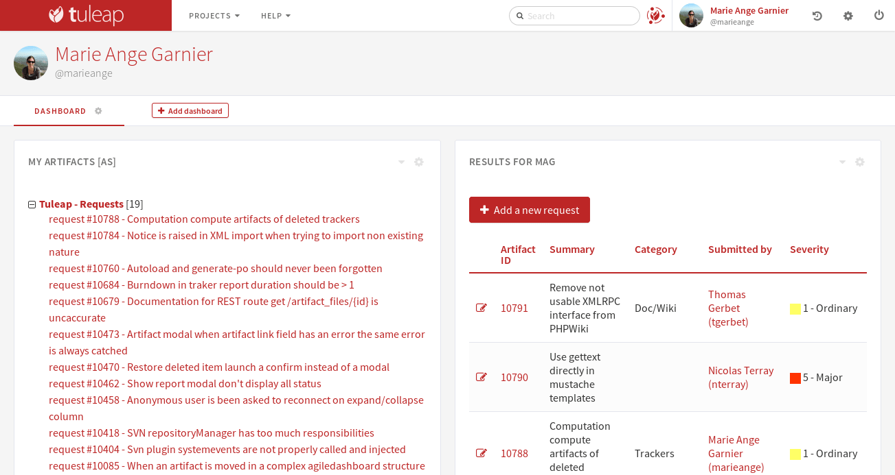

Becoming a Tuleap Citizen
=========================

You can learn more about the various class of Tuleap citizens in the dedicated section
(see  :ref:`classes-of-citizens`).

User Registration
-----------------

As suggested above, the first thing to do for newcomers is to create their own account
on Tuleap. Becoming a registered Tuleap user doesn't imply any commitment on your part
to host any of your software projects on Tuleap. It simply gives you more freedom when
you browse the site and allows Tuleap to provide you with personalized information.

Registering on Tuleap is quick and easy:

    1. Select the "New User" link

    2. Give the following information (all items marked with an asterisk are
       mandatory):

        a. **Login Name**: your user name. On some Tuleap systems that
           are connected to an enterprise directory, you may have to use a
           pre-defined user name.

        b. **Password**: 6 characters minimum, type it twice to make sure you
           didn't make any typo

        c. **Full Real Name**: what's your name again?

        d. **E-mail Address**: depending on the site configuration valid email
           addresses may be limited to those in the SYS\_ORG\_NAME domain (or
           SYS\_ORG\_NAME affiliated domains). Make sure your email address is
           correct or you won't receive the registration confirmation message in
           your mailbox and won't be able to complete the registration process.

        e. **Time Zone**: choose the time zone you live in. Choosing the correct
           time zone is really important. Behind the scene Tuleap
           stores all time stamps in GMT time. Choosing the right time zone allow s
           Tuleap to translate all time stamps to your local time on
           the Web pages.

        f. **Site Updates**: check this box if you want to receive site updates
           from the Tuleap Team. This is a low traffic distribution
           list and we strongly advise you to check this box (default). You'll
           receive e-mail from us about the site maintenance, the important event
           in the life of the site, Tuleap presentation/training
           announcement and the Tuleap newsletter.

        g. **Additional Community Mailings**: check this box if you want to receive
           notification about less important events. You can safely check this box
           as well if you want because we seldom use it. So we assure you that you
           won't be overwhelmed with tons of e-mail.

    3. Shortly after you validate the registration form you will receive a
       message in your mailbox which includes a URL. Clicking on this URL will
       bring you to a Tuleap form asking for your login/password
       again. If they match then your account is validated and you are now
       logged into the Tuleap site.

.. NOTE::

    Your Tuleap server might be set up to use an external
    LDAP directory for authentication. In this case, the registration
    phase is even simpler: simply type your LDAP login and password, and
    the system will automatically extract most of the required
    information from the LDAP directory: email address, real name, etc.

This 3 step registration process has been put in place for security
reasons. Assuming people create their account with an alien e-mail
address while they have access to the Intranet, they won't be able to
validate their account from the outside because the Tuleap
machine is behind the firewall. Therefore, an account cannot be
validated from the outside.

.. NOTE::

    Don't panic and, above all, do not create a new account! Go to the
    Tuleap Login Page and click on the [Lost your password?]
    link. You'll be asked your login name and from that
    Tuleap will send you an e-mail message with an embedded
    URL. Click on this URL and give your new password.

    And what if I loose both my login and password? Gee! In this case
    use the search box and, assuming that you gave your full real name
    when you first registered, search for your last name and see if you
    can find your login again in the list of selected users. If so,
    apply the previous procedure. If not then contact us!

.. _login-and-personal-page:

Login and Personal Page
-----------------------

To log into the Tuleap site, go to the Tuleap
Site and click on the "Login" link. If you typed your login and password correctly,
Tuleap displays your Personal Page (or Personal
Dashboard). At any point in time you can return to your
Tuleap Personal Page by clicking on your avatar or user name.

User Dashboard Content
-----------------------

A sample user dashboard is available below. The page is split in several areas:

-  The header with your user name and avatar
-  A navigation bar to access to each dashboard. This is where you can add a new dashboard, and edit or delete a dashboard.
   You can also add widgets to the current dashboard.
-  The various information presented by widgets.

Tuleap allows you to personalize your dashboards. Your dashboard is personal, nobody except you can access it.
The content of the page is made of *widgets*. All widgets can be moved, collapsed or removed.
Some of them can provide an rss feed or be edited.

New widgets can be added through the dropdown entry “Add widget”. Here is an example of available widgets for the user dashboard:

-  **My Artifacts** lists artifacts you have submitted or assigned to
   you, by project.

-  **My Projects** lists the projects you belong to. Selecting any of
   these projects brings you to the corresponding Project Dashboard.

-  **Monitored File Packages** lists packages that you are currently
   monitoring, by project. To cancel any of the monitored items just
   click on the trash icon next to the item label.

-  **RSS Reader** allows you to include public rss (or atom) feeds into
   your personal page.

.. _account-maintenance:

Account Maintenance
-------------------

You provided a certain amount of demographic information to
Tuleap when you first registered on the Tuleap
site. This and other information can be modified at any time by
clicking on the "cog" image near your user name.

Most of the items on the "My Account" page will look obvious to
you. However, we would like to draw your attention on some of them:

-  Add an avatar by clicking on the image at the top left of the page.

-  Change your password or email adress.

-  **SSH shared keys**: this one has to do with the Shell Account
   service. When you are a registered user, the Tuleap
   server gives you a personal shell account with the same
   login/password as for the Web interface. To automate the shell login
   you can share a public encryption key with Tuleap and use
   the secure shell SSH to access Tuleap instantly without
   having to type a password. More on that in :ref:`shell-account`

   Your public key(s) here and they will be placed on the server in
   your '~/.ssh/authorized_keys' file.
   To generate a public key, run the program 'ssh-keygen' (or ssh-keygen1) on your desktop machine.
   Then look at the file '~/.ssh/identity.pub' where the generated public key has been stored.
   Read the ssh documentation for further information on sharing keys.

Your preferences are available at the right of the page. Here
are some of the preferences you can define:

-  **Remember my Login/Password**: by default your current login session
   on Tuleap is terminated whenever you stop your Web
   browser. When you restart your browser and visit Tuleap
   you will be asked for your login/password again. By checking this box
   you ask Tuleap to remember about your login/password
   forever or at least until you explicitly select the "Logout" item in
   the Tuleap Main Menu. For security reasons we do not
   recommend using this feature unless you are equipped with a strictly
   personal desktop machine

-  **CSV separator**: Tuleap provides you export and import
   functionalities (See :ref:`project-data-export` for details). The import/export format is CSV
   format. Like CSV norm is not implemented by the same way in each
   software, we allow you to change the CSV separator, in order to fit
   with your preferred software! The available separators are:

   -  comma (,) : the default separator.

   -  semicolon (;) : used by default by the french version of Excel.

   -  tab (tab).

-  **CSV date format**: Tuleap provides export and import
   functionalities (See :ref:`project-data-export` for details). The import/export format is CSV
   format. Like CSV norm is not implemented by the same way in each
   software, we allow you to change the CSV date format, in order to fit
   with your preferred software! The available formats are:

   -  month/day/year : the default format (generally used in United
      States).

   -  day/month/year : used by default by the french version of Excel.

   This format will be used to generate the exported artifacts, and will
   also be used when importing. Then, don't forget to check your dates
   value before importing. They should be the same format as defined in
   your preferences.

-  **Activate the Lab mode**: give access to features in preview. This is for advanced users who
    know what they are doing.
