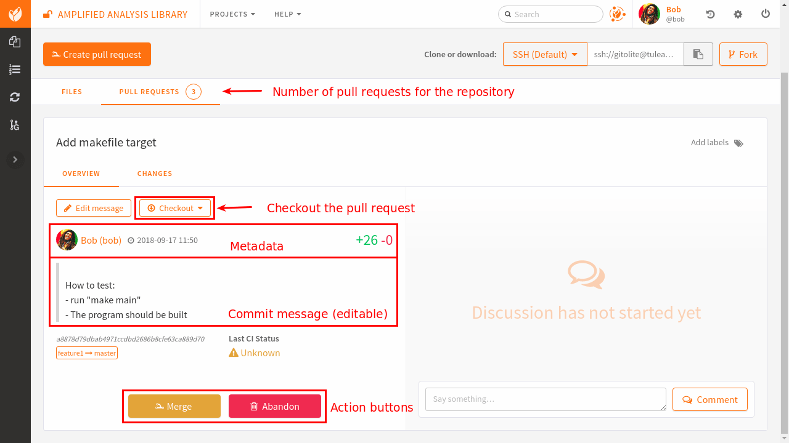
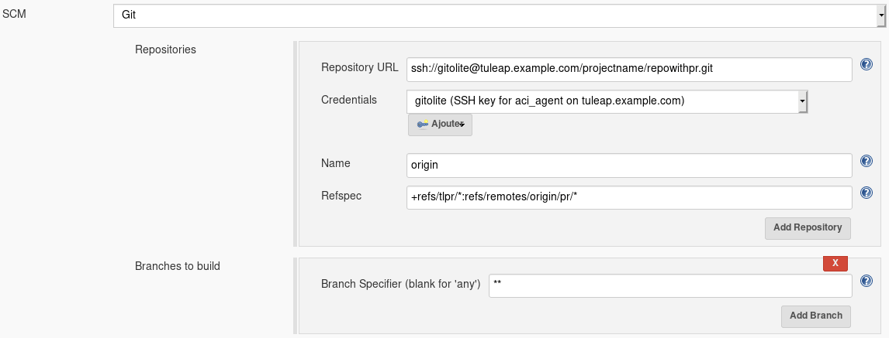

.. _code-review-with-pullrequest:

Pull requests
=============

Tuleap pull requests (aka PR) are built on top of Git. They provide an easy way to do
code review and integration workflow.

Tuleap also supports code review with :ref:`Gerrit <code-review-with-gerrit>`.

Features:

* Create requests across branches in the same repository
* Create requests from a :ref:`personal fork <git-personal-fork>`
* Comment in files reviewed
* Comment requests globally
* (cross)-reference requests from any point of Tuleap
* Integrate with Jenkins to know if tests passed on the code to integrate
* Dedicated dashboard to follow-up pull requests status

.. figure:: ../../images/screenshots/pullrequest/pr-home.png
   :align: center
   :alt: Pull requests home page
   :name: Pull requests home page

Ways of working
---------------

There is not a single way to use pullrequests. The way you will use it depends
on the size of your team, the knowledge team members have with git and the workflow
you are already used to.

In this documentation we will present two possible workflows that will allow to
demonstrate all supported features. Keep in mind that you can define your own.

Simple workflow
~~~~~~~~~~~~~~~

The simple workflow doesn't require specific setup or to do advanced commands with
git. It's suited for a small team or for git beginners.

We have 2 developers, Alice and Bob. Bob is a contributor who wants to push a
new feature into the repository and Alice is the integrator who will review and
eventually merge the code produced by Bob.

Bob has a local working copy of libaa and made a new contribution "feature 1". He thinks
the feature is ready to be integrated inside the public repository.

.. figure:: ../../images/screenshots/pullrequest/simple_step1.png
   :align: center
   :alt: Local development
   :name: Local development

Create a pull request
'''''''''''''''''''''

Bob needs to push his development to the Tuleap server and then generate a pull
request.p

.. figure:: ../../images/screenshots/pullrequest/simple_step2.png
   :align: center
   :alt: Push code and create PR
   :name: Push code and create PR

Once the code is on the server, Bob goes to the Tuleap web interface, in the
repository (git service).

From there he can create a pull request by selecting the source and target branches.

Source branch is where the work was done, target is where it should be integrated.

Bob is redirected on the pull request screen where he can quickly see the major
information about his work.

The pull request's summary is automatically extracted from the first line of the first commit
message in the branch. The description is the rest of the commit message.

This information can be edited directly from the web browser.

Review the code
'''''''''''''''

Once Bob has created the pull request, Alice can review it. The majority of the
work is available in the "Files" tab.

.. attention::

    The diff is generated between the latest commit and the base of the branch
    (common ancestor).

    If master evolved in the mean time, you won't see those changes (and potential
    conflicts) in this view.

    To have an accurate review, you should rebase your work locally with the
    tip of the branch you want to push in before creating the pull request.

Alice can then comment lines of the diff by clicking on the line number.

.. figure:: ../../images/screenshots/pullrequest/simple_step7.png
      :align: center
      :alt: Inline comment
      :name: Inline comment

Update a pull request
'''''''''''''''''''''

Bob can see all of Alice's comments from the discussion view.

.. figure:: ../../images/screenshots/pullrequest/simple_step8.png
      :align: center
      :alt: Discussion thread
      :name: Discussion thread

Then he should go back to work and update the branch. When he pushes his work again, the pull request will be
automatically updated.

.. figure:: ../../images/screenshots/pullrequest/simple_step9.png
      :align: center
      :alt: After PR update
      :name: After PR update

.. note::

    You can notice that Alice's comments are greyed out. We can see that she placed
    a comment but we can no longer see it in the diff nor can we access the
    line from the comment.

    This is a known limitation when lines change from one diff to another. The
    comment was placed on Makefile L4 at the first review but in the second
    review L4 was changed (the first 2 lines of the Makefile were removed).

    .. figure:: ../../images/screenshots/pullrequest/simple_step10.png
          :align: center
          :alt: Diff detail
          :name: Diff detail

Merge the request
'''''''''''''''''

The work is now done, Alice can click on the "Merge" button and the code will be
integrated inside master.

Alice can also merge "by hand" in her own working copy and then push to the repository,
the end result will be the same.

See side-by-side diff
'''''''''''''''''''''

In addition to the unified diff, you can also view changes as a side-by-side diff.
Deleted lines will show up on the left-hand side, added lines will show up on the
right-hand side.

Advanced workflows
~~~~~~~~~~~~~~~~~~

In the previous example, we followed a basic "feature branch" model where only
basic git features are involved. It's the easiest way to start with code reviews
because it basically change nothing to developers workflow (they create branches,
commit within and when the work is ready, merge in master).

For developers with more git skills there are two popular practices:

* Rebase
* Rebase and squash

Those two practices happen at the end of the review cycle, when the branch is
"ready to go".

Rebase
''''''

As already said, the diff under review in a PR is a difference of the branch itself.
It doesn't reflect the changes that were done on the target branch (typically master).

So when a feature is ready, integrator might ask for a rebase. Developer would
then run on its working copy:

  .. code-block:: bash

      $> git fetch origin
      $> git checkout dev/feature1
      $> git rebase origin/master
      $> git push -f origin dev/feature1

For this to work, developer must be granted the "rewind" permission on the
given branch.

.. attention::

      Be very careful with "rewind" permission. People granted to rewind can completely
      erase the repository if they want to.

      If you want to generalize the rebase pattern we strongly suggest that you either:

      * Use path based permission to grant rewind to developers into a given namespace eg ``dev/*``
      * Use personal fork so developers can mess-up their own repository without impacting anyone else.

Rebase & squash
'''''''''''''''

As you might expect, rebase and squash is a variation of the previous one. In addition
to rebasing your work with the target, `squash` means that you will rewrite the branch
history to only keep what is relevant as history steps.

Imagine your branch ``git log`` after Alice review:

* 2c74d67ae fix after review 1
* c8658adbc fix after alice comment
* 676b89ac3 typo
* 9792c7bed request #2314: fix OutOfMemory exception in core

Most of this history doesn't really make sense and will polluate master. You can
group all those commit into one:

  .. code-block:: bash

      $> git fetch origin
      $> git checkout dev/feature1
      $> git rebase -i origin/master

At this step, your favorite text editor will pop-up and present a "menu" of changes:

  .. code-block:: text

      pick 9792c7bed request #2314: fix OutOfMemory exception in core
      pick 676b89ac3 typo
      pick c8658adbc fix after alice comment
      pick 2c74d67ae fix after review 1

      # Rebase 9792c7bed..2c74d67ae onto 274b801 (4 command(s))
      #...

You can dig into ``git help rebase`` menu to understand all the possible commands
but if you want to only have one commit that groups the 4 changes, you'll need to
update and save the file like:

  .. code-block:: text

      pick 9792c7bed request #2314: fix OutOfMemory exception in core
      fixup 676b89ac3 typo
      fixup c8658adbc fix after alice comment
      fixup 2c74d67ae fix after review 1

      # Rebase 9792c7bed..2c74d67ae onto 274b801 (4 command(s))
      #...

After save, the rebase will be applied (you might have to solve some conflicts)
and then, if you issue ``git log`` again you will see only one commit:

* 2de53ac74 request #2314: fix OutOfMemory exception in core

And you can push the result to the branch:

  .. code-block:: bash

      $> git push -f origin dev/feature1

.. note::
    If you are using pull requests in a repository relying on fine grained permissions
    and the Git plugin based on `tuleap-plugin-git` you will not have access to the
    merge and abandon buttons in the web UI. To make it works, you will need to
    migrate to Gitolite3 (`tuleap-plugin-git-gitolite3`). You can find more information
    on how to do that in the administration guide.

Reference pull requests
-----------------------

One of the key feature of Tuleap is to be able to reference anything from anywhere
and having a back reference automatically created on the other end. Pull requests
make no exceptions and follow this pattern.

From the PR, either in description, in global comments or directly within the diff
you can reference any Tuleap element (artifact, document, file release, ...). The
example below is a reference to an artifact in PR description:

.. figure:: ../../images/screenshots/pullrequest/xref-to-tracker.png
      :align: center
      :alt: Cross reference from pull request
      :name: Cross reference from pull request

Note: in this example, the bug n°1, automatically got a link back to pull request:

From any element in Tuleap, you can reference the pull request using ``pr`` or
``pullrequest`` keywords:

.. figure:: ../../images/screenshots/pullrequest/xref-from-tracker.png
      :align: center
      :alt: Cross reference to pull request
      :name: Cross reference to pull request

Mail notifications
------------------

A mail notification is sent to the reviewers of a pull request, the creator of the pull request
and to the users having updated the pull request when one of the following actions happen:

* the pull request is updated (new commit are pushed into the pull request branch)
* the pull request is merged
* the pull request is abandoned
* a new global comment is added
* a new inline comment is added

User being added to list of reviewers of a pull request also receive a notification.

Notifications are not sent to the user doing the action, i.e. a user will not
receive a mail for a comment she has posted.

**Notification by @ mention**

While writing comments or editing the pull request's description, you can mention somebody by typing ``@`` and their Tuleap username. For example: ``@admin``. After typing three or four letters, an auto-completer appears and suggests users matching what was written after the ``@``. When you submit the comment, each mentioned user will receive an e-mail notification, unless they do not have permission to see the pull request.

This is a one-time notification, mentioned users will not receive updates for new comments or changes of the pull request.

Integrate with Jenkins
----------------------

A good pullrequest is a pullrequest that doesn't break master.

Hence, before reviewing a PR, the team can ensure that the proposed code has the
green light from Jenkins.

The integration is a two step process:

* first you need to configure your repository to trigger builds on Jenkins whenever
  there is a commit in your repository
* then, in the Jenkins job definition, you must add an extra step to feed tuleap
  back with job status (success or failure).

Configure Tuleap to Jenkins trigger
~~~~~~~~~~~~~~~~~~~~~~~~~~~~~~~~~~~

You need to configure Jenkins webhook as described in the  :ref:`git documentation section<git-jenkins-webhook>`.

.. note::

    If you are using pullrequests across repositories, you must
    ensure that the CI job is properly configured to use the target repository.

To trigger a new build each time a pull request is created or updated, set the
name to ``origin``, the refspec to ``+refs/tlpr/*:refs/remotes/origin/pr/*`` and
the branch specifier to ``**``.

.. _pullrequest-with-jenkins-feedback:

Configure Jenkins to Tuleap feedback
~~~~~~~~~~~~~~~~~~~~~~~~~~~~~~~~~~~~

The Jenkins to Tuleap feedback is possible thanks to `Tuleap API <https://plugins.jenkins.io/tuleap-api/>`_ plugin which can be installed via the Jenkins plugins manager.
The configuration of this plugin is :ref:`here <pullrequest_jenkins_notification_configuration>`
