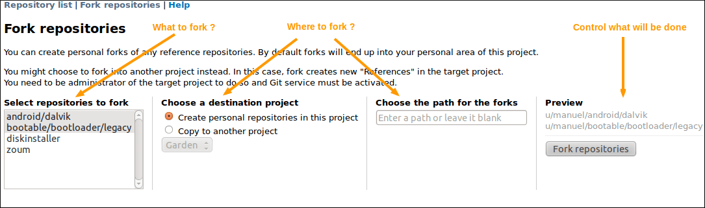

.. _version-control-with-git:

Git
===

This chapter is not a Git Tutorial. It focuses on the integration of Git
with Tuleap and how to use it in an optimal way in this
context. If you are not familiar with Git we warmly advise you to first
read some of the documents listed in the references section (see `Git References`_).

Git support has been designed to support multiple repositories for a
given project as well as "Personal repositories" for each developer.
This is consistent with the Distributed Version Control System
philosophy which allows to delegate project features to be developed in
separated repositories.

Git over SSH access (for both read and write operations) requires a valid SSH key
to be configured in user account preference. See :ref:`account-maintenance` for details.
Git over HTTPS access requires your username and ap personal access key with the *Git repository*
scope. Access keys can be created from your user account preference.

Two types of repositories are available:

-  Project References: the default, aims to catch the official version
   of project repositories. There might be several repositories and they
   can be organized into folders for grouping.

-  Personal Fork (clone): each project member can clone References in
   order to publish it's personal work. It aims to support the
   publish/integrator development model.

How to use a Git repository:
----------------------------

Go to the repository, and under its name, copy the clone url. Now you can paste the url after your ``git clone`` command:

::

        git clone ssh://gitolite@tuleap.example.com/project_name/repository_name.git


Or just add this repository as a remote to an existing local repository:

::

        git remote add your_repository_name ssh://gitolite@tuleap.example.com/project_name/repository_name.git
        git fetch your_repository_name
        git checkout -b my-local-tracking-branch your_repository_name/master


Reference
---------

A reference can be created by project admin from the Git service home
page, a reference name can be like reference-project\_1.

A reference must be initialized:

::

        cd mysources
        git init
        git add .
        git commit -m 'initial commit'
        git push gitolite@tuleap.example.com:<project_shortname>/<repo_name>.git master


If you have an existing repository with branches and tags you want to
push, as an alternative you can run:

::

        git push --mirror gitolite@tuleap.example.com:<project_shortname>/<repo_name>.git

.. _git-personal-fork:

Fork
----

Personal forks allow to support a fully decentralized development model
where "References" are maintained by integrators and represent the
official repositories of the project.

In this context, developments should happen in developers repositories
(on developer's computer) and are regularly pushed into a public
repositories for sharing with other developers.

Tuleap "Personal Fork" are those public repositories.

If you ever need to group the selected repositories into a common
namespace, you can give a specific path the repositories will be created
in.



   	   Git repositories fork screen

This screen also allows to fork across projects. Given you are
administrator of a project with Git service activated, you can choose to
create the forks in this project instead of into the personal area of
the current project.

In this case, the forked repositories become "References" into the
target project.

Repository settings
-------------------

As a project admin, you are allowed to modify the configuration of any
project repositories. This includes:

-  textual description of the repository,

-  default branch,

-  allowing to close artifacts with Git commit message

-  access control,

-  and "Email notification on push"

.. _git-default-branch:

Default Branch
``````````````

In repositories with multiple branches, administrators can choose the default branch
of the repository.

The branch selected as the default one:

- is the one selected when users open the repository via the web UI
- is the one selected when users clone the repository
- cannot be deleted

Access control
``````````````

Project administrators can control permissions details of each
repository. By default a repository is readable by all active users of
the platform but only project member can modify it.

In "Git repository management" screen, project administrator can select
the User Groups allowed to:

-  READ: access the repository

-  WRITE: push content into the repository (commits, new branches, etc)

-  REWIND: references deletion (branches, tags) and full history rewriting.
   This is highly un-advised to activate it if you don't know exactly what you
   are doing, you can erase your whole repository. You are warned!


   	   Control Git repository permissions

Fine grained permissions
````````````````````````

For a better permissions customization, project administrators can manage
permissions branch by branch and tag by tag.

To do it, administrators must enabled fine-grained permissions.
If the platform allows it, regexp can be used in pattern.

.. IMPORTANT:: When regex are enabled, they are kept the way administrators
  wrote them, it might end up in a non working state, invalids regex
  are ignored without errors. Please see Gitolite regex documentation:
  https://gitolite.com/gitolite/regex.html


    Control Git repository fined grained permissions

Email notification
``````````````````

It's often a good idea to notify the whole team when someone pushes some
new content into a repository. You can configure your repository to send
an email a list of addresses (or even better a mailing list) upon
pushes.

The content of the mail will depend on the push but you can modify:

-  the email subject prefix

-  the list of recipients

When you add a new recipient, the autocompletion is done with the list
of valid users. You are not mandated to use them, you can force any
address, like a mailing list one.

Once configured, any subsequent push will send an email to the selected
addresses. Emails will contain:

-  the list of commit pushed in the repository,

-  the modified files (+diffstats)

-  for each commit, the link to the diff in Tuleap gitweb
   interface

-  for each reference (in commit description for instance), the
   corresponding automagic link

Please note that cross-reference extraction will not work if email
notification is not configured.

Repository deletion
-------------------

A repository can be deleted, this will create a backup named after
{PROJECT\_SHORT\_NAME}\_{REPOSITORY\_NAME}\_{DEL\_TIMESTAMP}.tar.bz2 and
move it into Git Plugin backup directory defined in plugin
configuration. See import repository section `Importing an existing Git Repository`_ for backup reactivation.

Importing an existing Git Repository
------------------------------------

There is no automatic procedure to perform repository import.
To move one Git repository from one Tuleap project to another, there are two commands to type (after creating the new repository in the destination project):
::


        git clone --mirror gitolite@tuleap.example.com:<source_project_shortname>/<repo_name>.git
        git push --mirror gitolite@tuleap.example.com:<destination_project_shortname>/<repo_name>.git

Webhooks
--------

You can configure you repository so that each time a ``push`` is made, a webhook endpoint is called. Two categories of
webhooks are available:

#. Custom Webhooks
#. Jenkins Webhooks
#. Jenkins Webhooks for Tuleap Branch Source Jenkins plugin

Custom Webhooks
```````````````

Custom webhooks are available for Git. See the :ref:`webhook-git` section in the webhook documentation section.

.. _git-jenkins-webhook:

Jenkins Webhooks
````````````````

The best way to integrate a project with Hudson/Jenkins is to configure a Jenkins Webhook.
Please read `Push notification from repository`_ from Jenkins documentation for more information.

You can create one Jenkins webhook per repository. In the project-level settings of the Git plugin you can
also add multiple ones that will triggered for all repositories of this project.

You can see the list of triggered jobs in the logs section of the Jenkins Webhook.

A notifyCommit access token will be requested to configure the webhook. You can generate it in the *Global Security*
page of your Jenkins instance.

.. IMPORTANT::

    The ``hudson_git`` plugin needs to be installed in order to be able to create Jenkins Webhook.

.. _Push notification from repository: https://plugins.jenkins.io/git/#plugin-content-push-notification-from-repository

Jenkins Webhooks for Tuleap Branch Source Jenkins plugin
````````````````````````````````````````````````````````

The feature is documented in :ref:`continuous_integration_git_branch_source` section.

.. IMPORTANT::

    The ``hudson_git`` plugin needs to be installed in order to be able to create Jenkins Webhook.

.. _git_markdown_document:

Markdown documents
------------------

Tuleap supports rendering :ref:`Markdown documents <write_in_markdown>` directly in the
web interface of your Git repository.

It is possible to link to other files in your repo or to images stored in the repository:

.. sourcecode::

    ## Feature A

    You can find more information about Feature A in this [document](docs/feature-a.md)
    

Relative links operands ``./`` and ``../`` can be used to link to a file relatively to the current file.

Close Tracker Artifacts with Git commit message
-----------------------------------------------

It is possible to close a :ref:`Tracker Artifact <tracker-terminology>` by referencing it in a Git commit message.
If a commit with a message containing a closing keyword (see below) before a reference to an artifact is pushed, the artifact's status will be set to "Done".

Several conditions are needed:

1. The Git repository setting "Allow artifact closure" must be enabled.
2. You must push commits on the :ref:`default branch<git-default-branch>` of the repository.
3. The reference must have the form ``<closing_keyword> <reference_keyword> #<artifact_id>``. For example: ``Implements story #123`` or ``closed art #456``.
4. The referenced artifact belongs to the same Project as the Git repository.
5. The referenced artifact's :ref:`Status <status-semantic>` is not already closed.
6. The :ref:`"Done" semantic <done-semantic>` of the Tracker is defined. If it isn't defined, the Tracker's :ref:`"Status" semantic <status-semantic>` is configured and all the values are not "open" (there is at least one "closed" value).
7. The artifact's Tracker :ref:`Workflow <tracker-workflow>` applies and may prevent closing the artifact.
8. :ref:`Field dependencies<tracker-field-dependencies>` apply and may prevent closing the artifact.

The following keywords (case insensitive) can be used to close an artifact:

* ``Closes`` art #123
* ``Resolves`` art #123
* ``Fixes`` art #123
* ``Implements`` art #123

Some variations of these keywords are allowed, including some from `Conventional Commits <https://www.conventionalcommits.org/en/v1.0.0/>`_:

* ``Close``/``Closes``/``Closed``/``Closing``/``chore:``
* ``Fix``/``Fixes``/``Fixed``/``Fixing``/``fix:``
* ``Implement``/``Implements``/``Implemented``/``Implementing``/``feat:``
* ``Resolve``/``Resolves``/``Resolved``/``Resolving``

When all those conditions are met, the referenced artifact's status will be changed to the first valid :ref:`"Done" semantic <done-semantic>` value. If the "Done" semantic is not defined, the first "closed" value (per "Status" semantic configuration) will be used. The artifact will be closed by a Tuleap bot named ``Tracker Workflow Manager`` with a follow-up comment explaining why it has been closed.

It is possible to close several Tracker Artifacts at once in a single commit message.

.. _git_lfs:

Git Large File Storage (LFS)
----------------------------

Managing large binary files such as video, graphic or audio files is not the strong suit of Git. Large Git repositories
will quickly encounter performance issues. To work around that, Git LFS can be used.

.. IMPORTANT:: The ``gitlfs`` plugin needs to be installed and activated in order to be able to use Git LFS.

Using Git LFS
`````````````

The basic workflow to get started with Git LFS is:

::

    git clone gitolite@tuleap.example.com:<project_shortname>/<repo_name>.git
    git lfs install                 # Make sure Git LFS is installed
    git lfs track "*.mkv"           # Select the file types you want to manage with Git LFS
    git add .gitattributes          # Make sure the .gitattributes file is tracked, otherwise Git LFS will not be able to manage the files

    git add video.mkv               # Just work as usual, Git LFS works in a transparent way
    git commit -m "Add video file"
    git push


More information about Git LFS can be found on the `Git LFS website <https://git-lfs.com/>`_ and the
`Git LFS wiki <https://github.com/git-lfs/git-lfs/wiki/Tutorial>`_.

Existing repositories can be migrated to Git LFS. To rewrite all, e.g., `*.mp4` files not present
on the remote, for example if you accidentally committed files not yet tracked by Git LFS:

::

    git lfs migrate import --include='*.mp4'

You can also rewrite all, e.g., `*.mp4` files on given branches. Note this might require to rewrite the
history of the repository and, as such, require Rewind access right. Only do this if you really need it
and coordinate with the other contributors of the repository.

::

    git lfs migrate import --include="*.mp4" --include-ref=refs/heads/master --include-ref=refs/heads/dev


After the conversion, push the new repository:

::

    git push


Git file size restrictions
--------------------------

Files bigger than 50MB will be rejected automatically by Tuleap. Git doesn't handle very will large
files (esp. binary ones) and those files should really be handled by git lfs (see previous section).

Note: If you were using tuleap before 10.9 and you already had files bigger than 50MB, you will still be able to modify them.

.. IMPORTANT:: Site administrators might grant your project an exception and allow arbitrary file size in your projects.
  See :ref:`increase max file size <increase_max_file_size>` section.


Git branch creation through Tracker artifact actions
-----------------------------------------------------

.. IMPORTANT:: To have this action available, both ``Git`` and ``Tracker`` plugins must be installed, and some Git repositories must exist in the same project of the artifact.

Starting Tuleap 13.11, a new action is available in Tracker artifact actions, the ability to create a new Git branch and the associated pull-request.

   .. figure:: ../../images/screenshots/git/artifact-action-create-branch.png
      :align: center
      :alt: Artifact action create Git branch and pull request
      :name: Artifact action create Git branch and pull request

Once selected, a modal to create the branch and the associated pull-request will appear.

In the modal, you will have the Git project repositories user is able to write in. No personal forks are listed.

When selecting a repository, the reference input will be updated with the default branch name of the selected repository.
You can also write another Git branch name or a commit reference (SHA-1) from the repository. The new branch will be based on it.

There is a preview of the Git branch name that will be created. This name is fixed by Tuleap and cannot be updated. 
The format of the branch name is: ``tuleap-{artifact_id}-{artifact-title}``

The checkbox to create the associated pull-request is checked by default.

   .. figure:: ../../images/screenshots/git/artifact-action-create-branch-modal.png
      :align: center
      :alt: Artifact action create Git branch and pull request modal
      :name: Artifact action create Git branch and pull request modal

.. IMPORTANT:: The ``pull-request`` plugin needs to be installed and activated for the project in order to be able to create the pull-request. Otherwise only Git branches can be created.

Pre-receive hook
----------------

.. WARNING:: Technology preview: several things might be adjusted in future releases.

Tuleap offers the possibility to write scripts for git pre-receive hook. Your scripts must take an input from ``stdin`` and return an output on ``stdout``. 

Only WASM modules build with WASI Preview 1 support can be used as scripts for the hook.

Input
`````

.. code-block:: javascript

    {
        "updated_references": {
            "<reference>": {
                "old_value": "string",
                "new_value": "string"
            }
        }
        "repository_path": "string"
    }

..

Output
``````

.. code-block:: javascript

    {
        "rejection_message": "string"|null
    }

..

To be used, the WASM module needs to put on server at ``/var/lib/tuleap/untrusted-code/git/pre-receive-hook/<repo-id>.wasm``. 
``<repo-id>`` correspond to the git repository id for which you want the hook to be executed. 
There is also some strict resource limitations (time, memory) and you don't have write access to the repository (only read access).

Git References
---------------

-  The Git SCM Web Site. See https://git-scm.com/

-  Pro Git book https://git-scm.com/book/en/v2.
