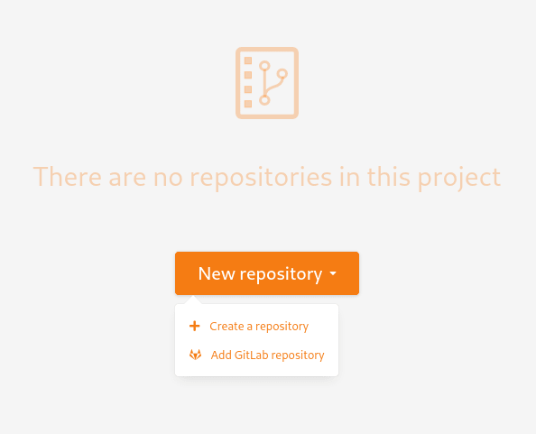

.. _version-control-with-gitlab:

GitLab plugin
=============

.. note::

  This plugin is under construction, the documentation and the plugin can change.

Overview
--------

The purpose of this integration is to link Tuleap projects and GitLab repositories.

If you are using GitLab and want to keep a trace of your commits in Tuleap, this plugin will
allow you to reference Tuleap artifacts in your commit messages and conversely.

References
----------

A GitLab repository can be referenced in several Tuleap artifacts, in different projects.
A Tuleap artifact can reference several commits, in different GitLab repositories.

Reference a Tuleap artifact
'''''''''''''''''''''''''''

To be able to create GitLab cross-references, you need to:

* Register your GitLab repository in the Git service of your Tuleap project
* Reference Tuleap artifacts in GitLab commit messages

To link your commit to the Tuleap artifact of your choice, you must add the keyword ``TULEAP-<artifact_id>`` (case-sensitive)
to your commit message. 

You can reference as many artifacts as you want. However, you must ensure that the projects your artifacts
belong have your GitLab Repository registered.

When the committer email is matching a Tuleap account, then its avatar and username will be displayed in the reference.
Otherwise, the committer name is displayed as received from the Gitlab API.

Reference a GitLab commit in Tuleap
'''''''''''''''''''''''''''''''''''

Please refer to :ref:`reference-overview` for more details on references.

You can reference a commit of one of the GitLab repositories registered in your Tuleap project.

To do so, you have to use the keyword ``gitlab_commit`` followed by a ``#`` and the commit URL:

``gitlab_commit #<repository_name>/<sha1>``.

``<repository_name>`` must be a registered GitLab repository. If not, no reference will be created.

When you click on this reference, you will be redirected to your GitLab instance, on the page displaying the commit details.

Register your GitLab repository
-------------------------------

Prerequisites
'''''''''''''

To be able to register a GitLab repository in your project, please ensure that:
- both Git and GitLab plugins are installed and activated.
- you have admin privileges in the Git service of your project.
- you are identified by GitLab as the maintainer of the repository 
- you have a GitLab API token authorized to be used to query the GitLab API (see below)

The name of the token is not important, but you need at least to check ``api`` in the scopes list.

Once your GitLab API token is created, copy it and save it for later.

GitLab repository registration
''''''''''''''''''''''''''''''

Go to the Git service of your Tuleap project, click on [New repository], then click on [Add GitLab repository].

In the modal, provide the URL of your GitLab instance and your API token.

.. figure:: ../../images/screenshots/gitlab/modal-server-instance.png
   :align: center
   :alt: Modal to enter server instance and API token
   :name: Modal to enter server instance and API token

The list of the repositories you maintain is displayed. Select the repository to link.

.. figure:: ../../images/screenshots/gitlab/modal-choose-repository.png
   :align: center
   :alt: Modal to choose GitLab repository
   :name: Modal to choose GitLab repository

Once the GitLab repository is registered, it is displayed in the repositories list and is visually identifiable thanks to a GitLab symbol.

.. figure:: ../../images/screenshots/gitlab/tile-gitlab.png
   :align: center
   :alt: GitLab repository tile
   :name: GitLab repository tile

From now on, each time you reference an artifact in a commit, a cross-reference will be created in the target artifact.

.. note::
  During the registration, a "post push" webhook is created in the GitLab repository.
  If the parameters of this webhook change (URL, events, or anything else), we cannot ensure that cross-references will
  be continue to be created.

Unlinking repositories 
'''''''''''''''''''''''

As a Git administrator, go to the Git service of your project and find the repository to be unregistered in the list. Then click on the trash icon in the top right corner of the tile. 

.. figure:: ../../images/screenshots/gitlab/tile-gitlab.png
   :align: center
   :alt: unlink GitLab repository tile
   :name: unlink GitLab repository tile

Confirm the action.

.. figure:: ../../images/screenshots/gitlab/modal-confirm-unlink.png
   :align: center
   :alt: Modal to confirm unlink
   :name: Modal to confirm unlink

From now on, existing references won't work anymore and any new commit in this repository referencing a Tuleap artifact in this project will create cross-references.

.. attention:: Known issues / limitations

  * If you already have a project reference named ``gitlab_commit``, it will override the one used by the plugin.
  * GitLab provides two names for a repository:
      * ``name_with_namespace`` is displayed in UI
      * ``path_with_namespace`` is used to clone/checkout the repository
      * Tuleap displays only ``path_with_namespace`` and references are created with it.
  * Two repositories with the same name and path from two different GitLab instances cannot be integrated into the same project.
  * For the moment, the project name and namespace of your GitLab project must **not** contain a "-" or a ".".
