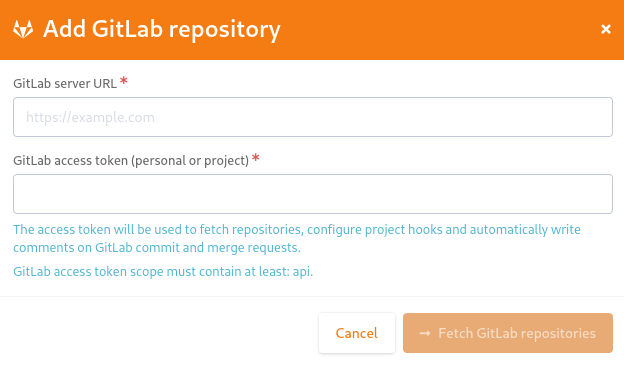

.. _version-control-with-gitlab:

GitLab
======

.. note::

  This plugin is under construction, the documentation and the plugin can change.

.. attention::

  This module is part of :ref:`Tuleap Enterprise <tuleap-enterprise>`. It might
  not be available on your installation of Tuleap.

.. attention:: Known issues / limitation

  * If you already have a reference project named ``gitlab_commit``:
      * If you create a reference that references a GitLab commit, a link will be created to that commit
      * Else your reference project behavior is used.
  * GitLab provides two names for a repository:
      * ``name_with_namespace`` is displayed in UI
      * ``path_with_namespace`` is used to clone/checkout the repository
      * Tuleap displays only ``path_with_namespace`` and references are created with it.
  * 2 repositories with the same name and path from 2 different GitLab instances cannot be integrated in the same project.
  * For the moment, the project name and namespace of your GitLab project must **not** contain "-" or ".".

How to use it
-------------

You need to install both Git and GitLab plugins.
The different integrations are displayed as a tile in the Git plugin with a GitLab symbol next to it.

.. figure:: ../../images/screenshots/gitlab/tile-gitlab.png
   :align: center
   :alt: GitLab repository tile
   :name: GitLab repository tile

   GitLab repository tile

You cannot do anything except add or remove an integration.
Name, namespace and description are taken from GitLab, so you cannot change them.

The purpose of an integration is to create a link between Tuleap project and GitLab repository.

References
----------
A GitLab repository can be referenced in several Tuleap projects.
A Tuleap project can reference several GitLab repositories.

Please refer to :ref:`reference-overview` for more details on References.

Reference in same project:
''''''''''''''''''''''''''
You can reference a commit of an integrated GitLab repository in Tuleap.

To reference a commit in the project where the GitLab repository is integrated you can reference a commit with:

``gitlab_commit #<repository_name>/<sha1>``.

``<repository_name>`` must be an integrated GitLab repository. If not, no reference will be created.

When you click on this reference, you will redirect to the commit with the sha1 ``<sha1>`` in the GitLab instance.

Reference in another project:
'''''''''''''''''''''''''''''
To reference a commit in another project where the GitLab repository is integrated you can reference a commit with:

``gitlab_commit #<project_name>:root/mozilla/<sha1>``.

``<project_name>`` must a valid short name project.
``<repository_name>`` must be an integrated GitLab repository in the project.

When you click on this reference, you will redirect to the commit with the sha1 ``<sha1>`` in the GitLab instance.

Cross References
'''''''''''''''''
An integration allows to reference a Tuleap artifact in the message of a integrated GitLab commit.
The reference of an artifact must be made with ``TULEAP-XXX``, where ``XXX`` is the id of the artifact.

How to create an integration
----------------------------

Before integration
''''''''''''''''''

Before integrate a GitLab repository, you need to be Git administrator and provide:

* The GitLab instance URL
* GitLab API token (GitLab API token scope must contain at least "api")

You can only integrate GitLab repository that you maintain.

To integrate GitLab repository
''''''''''''''''''''''''''''''

To create integration, a "post push" webhook will be added on the integrated GitLab repository.
If this webhook changes, we cannot ensure the good behavior of the plugin.

Go to the Tuleap project where you want to integrate GitLab repository.
There is a button "Add GitLab repository".

.. figure:: ../../images/screenshots/gitlab/button-gitlab-integration.png
   :align: center
   :alt: Button integrate GitLab
   :name: Button integrate GitLab

   Button integrate GitLab

When you click on, a modal opens and asks you your GitLab instance URL and GitLab API token.

Your GitLab API token scope must contain at least "api".

   Modal to enter server instance and API token

After, you can choose which repository you want to integrate.

.. figure:: ../../images/screenshots/gitlab/modal-choose-repository.png
   :align: center
   :alt: Modal to choose GitLab repository
   :name: Modal to choose GitLab repository

   Modal to choose GitLab repository

At this point, when you reference an artifact in commit a cross reference will be created in the referenced artifact.

.. note::

  You can only integrate one repository. If you want to integrate several repositories in the same Tuleap project,
  you must start the operation again.

To unlink integration
'''''''''''''''''''''

You need to be Git administrator and go to Git plugin on the project where you want to delete the integration.

On each tile of GitLab repository, there is a trash icon.

.. figure:: ../../images/screenshots/gitlab/tile-gitlab.png
   :align: center
   :alt: unlink GitLab repository tile
   :name: unlink GitLab repository tile

   Unlink GitLab repository tile

On the click, you need to confirm the unlink.

.. figure:: ../../images/screenshots/gitlab/modal-confirm-unlink.png
   :align: center
   :alt: Modal to confirm unlink
   :name: Modal to confirm unlink

   Modal to confirm unlink

At this moment, the integration is deleted. All your created references can't be used anymore.
After removing, any GitLab commit with ``TULEAP-XXX`` in this repository will no more create Cross References.