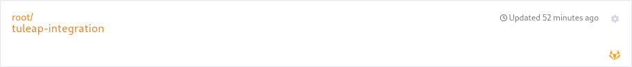

.. _version-control-with-gitlab:

GitLab
======

Overview
--------

The purpose of this integration is to link Tuleap projects and GitLab repositories.

If you are using GitLab and want to keep a trace of your commits and merge requests in Tuleap, this plugin will
allow you to reference Tuleap artifacts in your commit messages or merge requests title/description/branch source name and conversely.

References
----------

A GitLab commit, tag or merge request can reference several Tuleap artifacts, in different projects.
A GitLab branch name can only reference one Tuleap artifact.

A Tuleap artifact can reference several commits, tags, branches or merge requests, in different GitLab repositories.

Reference a Tuleap artifact
'''''''''''''''''''''''''''

To be able to create GitLab cross-references, you need to:

* Register your GitLab repository in the Git service of your Tuleap project
* Reference Tuleap artifacts in GitLab commit messages
* Reference Tuleap artifacts in GitLab merge request title, description or source branch name
* Reference Tuleap artifacts in GitLab tag message
* Reference Tuleap artifacts in GitLab branch name

To link your commit (or merge request or tag or branch) to the Tuleap artifact of your choice, you must add the keyword ``TULEAP-<artifact_id>`` (case-sensitive)
to your commit message (or merge request title, description or source branch name).
You can reference as many artifacts as you want in the same commit message (or merge request title/description or tag message).
You can reference only one artifact in a branch name or in the source branch name of a merge request.

Reference a Tuleap artifact in GitLab commit
`````````````````````````````````````````````

When the committer email is matching a Tuleap account, then its avatar and username will be displayed in the reference.
Otherwise, the committer name is displayed as received from the GitLab API.

On GitLab side, when a commit message contains some references to Tuleap, then a comment is automatically added to the commit.

A comment is composed of a list of Tuleap references included in the commit message, with links to Tuleap.


Reference a Tuleap artifact in GitLab merge request
```````````````````````````````````````````````````

When the public email of the author of the Merge Request is matching a Tuleap account, then its avatar and
username will be displayed in the reference.
Otherwise, the author name is displayed as received from the GitLab API.

.. note::
    If the author of the Merge Requests changes its public email after creating the Merge Request, then no refresh will be
    performed to update data displaying in the reference on Tuleap.

On GitLab side, when a merge request contains some references to Tuleap, then a comment is automatically added.

A comment is composed of a list of Tuleap references included in the merge request title, description or source branch name, with links to Tuleap.

.. figure:: ../../images/screenshots/gitlab/bot-on-mr-gitlab.png
   :align: center
   :alt: Comment on GitLab merge request
   :name: Comment on GitLab merge request

Reference a Tuleap artifact in GitLab tag message
`````````````````````````````````````````````````

The Tuleap reference will display the tag name, the tag message and the associated commit SHA-1.

.. note::
    If the tag is moved, all previous information will be deleted on Tuleap side and recreated with new ones.

On GitLab side, no backlink can be added because it's not possible to add comments on tags.

Reference a Tuleap artifact in GitLab branch name
`````````````````````````````````````````````````

The Tuleap reference will display the branch name, the associated commit SHA-1 and the last push date received for this branch.

.. note::
    If the branch is removed, all previous information will be deleted on Tuleap side.
    Only one artifact can be referenced in the branch name. If multiple references are found, only the first one will be taken into account.

On GitLab side, no backlink can be added because it's not possible to add comments on branch.

Reference a GitLab commit or merge request
''''''''''''''''''''''''''''''''''''''''''

Please refer to :ref:`writing-in-tuleap-references` for more details on references.

You can reference a commit or merge request of one of the GitLab repositories registered in your Tuleap project.

Reference a GitLab commit in Tuleap
```````````````````````````````````

To reference GitLab commit, you have to use the keyword ``gitlab_commit`` followed by a ``#``, the repository name, and the commit sha1:

``gitlab_commit #<repository_name>/<sha1>``.

``<repository_name>`` must be a registered GitLab repository. If not, no reference will be created.

When you click on this reference, you will be redirected to your GitLab instance, on the page displaying the commit details.

Reference a GitLab merge request in Tuleap
``````````````````````````````````````````

To reference GitLab merge request, you have to use the keyword ``gitlab_mr`` followed by a ``#``, the repository name, and the merge request id:

``gitlab_mr #<repository_name>/<merge_request_id>``

``<repository_name>`` must be a registered GitLab repository. If not, no reference will be created.

When you click on this reference, you will be redirected to your GitLab instance, on the page displaying the merge request details.

Reference a GitLab tag in Tuleap
````````````````````````````````

To reference GitLab tag, you have to use the keyword ``gitlab_tag`` followed by a ``#``, the repository name, and the tag name:

``gitlab_tag #<repository_name>/<tag_name>``

``<repository_name>`` must be a registered GitLab repository. If not, no reference will be created.

When you click on this reference, you will be redirected to your GitLab instance, on the page displaying the commit tagged with ``<tag_name>``.

Reference a GitLab branch in Tuleap
````````````````````````````````````

To reference a GitLab branch, you have to use the keyword ``gitlab_branch`` followed by a ``#``, the repository name, and the branch name:

``gitlab_branch #<repository_name>/<branch_name>``

``<repository_name>`` must be a registered GitLab repository. If not, no reference will be created.

When you click on this reference, you will be redirected to your GitLab instance, on the page displaying the commit details 
of the last commit in the branch ``<branch_name>``.

Close Tuleap artifact with GitLab commit messages
`````````````````````````````````````````````````

When integrating a GitLab repository in a Tuleap project, there is an option (disabled by default) that allow to close artifacts in this project based on GitLab commit messages.
If a commit message containing a closing pattern is pushed in a GitLab repository integrated in a Tuleap project and this integration has activated this feature, 
then the artifact will be closed :

* If the artifact is in the same project of the integration
* If a :ref:`done semantic <done-semantic>` or a :ref:`status semantic <status-semantic>` is defined for this artifact
* If the artifact is not yet closed
* If the push occurs in the GitLab repository's default branch

The following keywords (case insensitive) can be used to close an artifact:

* ``Closes`` TULEAP-1234
* ``Resolves`` TULEAP-1234
* ``Fixes`` TULEAP-1234
* ``Implements`` TULEAP-1234

Some variations of these keywords are handled: 

* ``Close``/``Fix``/``Resolve``/``Implement``
* ``Closes``/``Fixes``/``Resolves``/``Implements``
* ``Closed``/``Fixed``/``Resolved``/``Implemented``
* ``Closing``/``Fixing``/``Resolving``/``Implementing``

The artifact will be closed by a Tuleap bot named ``Tracker Workflow Manager`` and a comment will be added to explain why it has been closed.
The first done value retrieved by Tuleap will be used to close the artifact. If there is no done semantic defined, then the first closed value will be used.

Create GitLab branches from Tuleap artifact
```````````````````````````````````````````

If some preconditions are met, user can be able to create a GitLab branch and the corresponding merge request directly from a Tuleap artifact.
Those preconditions are:

* At least one GitLab repository is integrated in the artifact's project with token well configured
* User is a project member
* User can view the artifact

The branch name cannot be chosen. It follows the pattern ``(prefix)tuleap-{artifact_id}(-slugified artifact title)`` with:

* ``prefix`` that can be defined for each integration
* ``tuleap-{artifact_id}`` to create a cross-reference between the branch and the artifact
* ``slugified artifact title`` if artifact has a semantic title defined and an associated value

This action can be performed through the artifact action button.


Register your GitLab repository
-------------------------------

Prerequisites
'''''''''''''

To be able to register a GitLab repository in your project, please ensure that:

    * both Git and GitLab plugins are installed and activated.
    * you have admin privileges in the Git service of your project.
    * you have a GitLab access token authorized to be used to query the GitLab API (see :ref:`gitlab-access-token`)

.. _gitlab-access-token:

GitLab access Token
```````````````````

You can use a personal or project access token. The token will be used to manage integration of GitLab repository in Tuleap,
and to write comments automatically on GitLab commit or merge requests.


With a project access token, you can only integrate the GitLab repository which provides the project access token.
With a personal access token, you can integrate all repositories which you maintain.
Don't forget that comments will be added automatically on GitLab commits and merge requests. These comments will be
written with the access token, so if you provide a personal access token, the user providing this token will be displayed
next to comments.


.. note::

    If you use a personal access token, you need to be identified by GitLab as the maintainer of the repository that you want integrate.

.. figure:: ../../images/screenshots/gitlab/gitlab-api-scope.png
   :align: center
   :alt: GitLab API scope
   :name: GitLab API scope

.. note::

    The name of the token is not important, but you need at least to check ``api`` in the scopes list.

Once your GitLab access token is created, copy it and save it for later.

.. _register_gitlab_repository:

GitLab repository registration
''''''''''''''''''''''''''''''

Go to the Git service of your Tuleap project, click on [New repository], then click on [Add GitLab repository].

.. figure:: ../../images/screenshots/gitlab/button-gitlab-integration.png
   :align: center
   :alt: Button integrate GitLab
   :name: Button integrate GitLab

In the modal, provide the URL of your GitLab instance and the GitLab access token.

.. figure:: ../../images/screenshots/gitlab/modal-server-instance.png
   :align: center
   :alt: Modal to enter server instance and access token
   :name: Modal to enter server instance and access token

The list of the repositories that you can integrated is displayed. Select the repository to link.

.. figure:: ../../images/screenshots/gitlab/modal-choose-repository.png
   :align: center
   :alt: Modal to choose GitLab repository
   :name: Modal to choose GitLab repository

Once the GitLab repository is registered, it is displayed in the repositories list and is visually identifiable thanks to the GitLab icon.



From now on, each time you reference an artifact in a commit or merge request, a cross-reference will be created in the target artifact.

.. note::
  During the registration, a webhook is created in the GitLab repository.
  If the parameters of this webhook change (URL, events, or anything else), we cannot ensure that cross-references will
  continue to be created. See :ref:`gitlab-regenerate-webhook` to have more details.

Possible actions on GitLab repository
'''''''''''''''''''''''''''''''''''''

As a Git administrator, go to the Git service of your project and find the repository that you want to apply action.

When you click on cog icon in GitLab tile, you can:

* Edit access token
* Regenerate the GitLab webhook
* Allow artifacts closure option
* Edit create branch prefix
* Unlink the repository

.. figure:: ../../images/screenshots/gitlab/tile-gitlab-dropdown.png
   :align: center
   :alt: Others actions on GitLab repository tile
   :name: Others actions on GitLab repository tile

Edit access token
`````````````````

If the token used during the integration has been revoked, you can change it by clicking on [Edit access token].
See :ref:`gitlab-access-token` to have more details.

.. figure:: ../../images/screenshots/gitlab/gitlab-edit-token-modal.png
   :align: center
   :alt: Editing GitLab access token
   :name: Editing GitLab access token

Confirm the action.


.. note::
  When you change access token, the :ref:`webhook is also regenerated <gitlab-regenerate-webhook>` on GitLab side.

.. _gitlab-regenerate-webhook:

Regenerate the GitLab webhook
`````````````````````````````

A webhook allows GitLab to communicate with Tuleap. This webhook is composed of a secret generated automatically by Tuleap
and some events (push and merge requests events).
If the webhook has been changed and is not functional, you can regenerate it by clicking on [Regenerate GitLab webhook].

.. figure:: ../../images/screenshots/gitlab/gitlab-regenerate-webhook-modal.png
   :align: center
   :alt: Modal to regenerate webhook
   :name: Modal to regenerate webhook

When the webhook is regenerated, the old is deleted from GitLab server, and a new webhook with a new secret is created.

Allow artifacts closure option
``````````````````````````````

This option can be selected at repository integration. It can also be edited by any Git administrator.


Edit create branch prefix
`````````````````````````

This option allows to edit the prefix used in the branch name while creating a GitLab branch from a Tuleap artifact. 
It's empty by default. It can be edited by any Git administrator.


Unregister repositories
```````````````````````

If you want to unregister a repository, you need to select [Unlink the repository] in the list. Then a modal opens and
you need to confirm the action.


From now on, existing references will be removed and any new commit in this repository referencing a Tuleap artifact in this project will not create cross-references.

.. attention:: Known issues / limitations

  * If you already have a project reference named ``gitlab_commit``, ``gitlab_mr``, ``gitlab_tag`` or ``gitlab_branch``, it will override the one used by the plugin.
  * GitLab provides two names for a repository:
      * ``name_with_namespace`` is displayed in UI
      * ``path_with_namespace`` is used to clone/checkout the repository
      * Tuleap displays only ``path_with_namespace`` and references are created with it.
  * Two repositories with the same name and path from two different GitLab instances cannot be integrated into the same project.
  * For the moment, the project name and namespace of your GitLab project must **not** contain a "-" or a ".".
