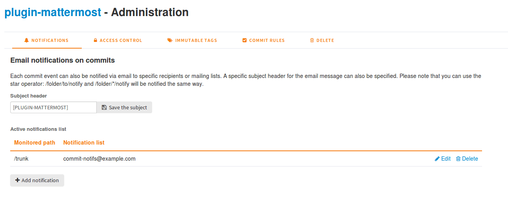

.. |SYSPRODUCTNAMES| replace:: *Tuleap*

.. _version-control-with-subversion:
.. _version-control-with-multiple-svn-repo:

Subversion
==========

The Subversion Browsing Interface
---------------------------------

Tuleap offers a number of facilities that allow you to
interact with several Subversion repositories within the same project.
The Subversion user interface does not intend to replace the Subversion
client that you should normally use on your computer. It rather
focuses on providing you with additional features not found in
Subversion clients.

The Multiple SVN repositories plugin can be accessed via the "SVN" item
in your project menu. It provides the following features to end-users:

Accessing the SVN repositories
``````````````````````````````
The welcome page of the Tuleap SVN service lists all the existing repositories, and gives you a quick access to
their administration if you are allowed to.
You can also create new svn repository.


Browsing The SVN Repository
```````````````````````````

In order to interact with the Subversion repository of any
Tuleap-hosted project, you normally need to have Subversion
installed on your machine. However Tuleap also offers a
built-in Web browsing interface to the Subversion repository which
allows you to navigate in the source code, download it, view a file
history or compare two revisions of the same file. It also indicates what the Subversion root path
is and how to checkout the source code.


Cross-Referencing Artifacts and Subversion Commits
``````````````````````````````````````````````````

While working in the development or the maintenance phase of a software
project, it is vital to keep track of the changes made to the source
code. This is what Version Control systems like Subversion do. In
addition to keeping track of the source code change history it is often
critical to relate the changes to the artifact (a task, a defect or a
support request) that led the developers to make a change in the code.
And conversely, when reading the artifact description it is also very
helpful to immediately see how the change was implemented.

The integration of Subversion in Tuleap precisely provides
Tuleap users with this bi-directional cross-referencing
mechanism. This is achieved through the use of reference patterns that
are automatically detected by Tuleap in either the follow-up
comments of the project artifacts or in the messages attached to a
Subversion commit.

The text patterns to type in a commit message or a follow-up comment are
as follows:

-  **XXX #NNN**: this pattern refers to the artifact XXX number NNN,
   where NNN is the unique artifact ID, and XXX is the tracker short
   name (e.g. "bug #123", "task #321", "req #12", etc.). If you don't
   know the tracker short name or don't want to specify it, you may
   simply use "art #NNN". When browsing a message containing this
   pattern anywhere in Tuleap, the pattern will be
   automatically transformed into an hyperlink to the artifact
   description.

-  **revision #YYY or rev #YYY**: this pattern refers to the commit YYY
   where YYY is the commit revision number. When browsing a message
   containing this pattern anywhere in Tuleap, the pattern
   will be automatically transformed into an hyperlink to the commit
   description which include log messages, impacted files, versions and
   author of the change.

-  The Tuleap reference mechanism allows cross-referencing
   with any Tuleap object: artifacts, documents, files, etc.
   Please refer to :ref:`writing-in-tuleap-references` for more details on References.

    **Tip**

    It is considered a best practice to always reference a bug, a task
    or a support request in any of the log message attached to a
    Subversion commit. Similarly when closing the related artifact
    (task, bug,etc.) make sure you mention the revision number in the
    follow-up comment. You will find this extremely convenient while
    trying to keep track of the changes and why they were made.

Subversion Settings
-----------------------------------

Through the Tuleap Web interface, project administrators can
perform the most common administration and configuration tasks on their
Subversion repository. The administration functions can be accessed
through the ``Settings`` button available  on welcome page or at any time while browsing the repository.

Notifications
`````````````

Tuleap can also send an email message each time there is a change
in the source code. The email message contains the log message, the
author of the change, the list of impacted files and pointers to the
Subversion repository showing what changes were made.

Project Administrators can configure the following settings for email
notification:

-  **Subject Header**: is a piece of text that will appear as a trailer
   in the Subject of all the email notifications sent to the addressees.
   This trailer is supposed to help the addressee to quickly spot the
   messages in their Inbox or to put filters in place to route the email
   notification to a given folder.

-  **Monitored Path**: subversion path on which notification will be sent.

-  **Notification list**: you can define users, groups or emails.



Access Control
``````````````

Default Access Permissions
~~~~~~~~~~~~~~~~~~~~~~~~~~

Subversion access permission depends upon the project status (private or
public) and the class of citizen a user belongs to (see :ref:`classes-of-citizens`).

Regarding private projects, only project members have access to the
Subversion repository. By default they all have read and write access.
This can be modified by customizing access permissions as explained
below.

With respect to the public projects, the default access permissions are
as follows:

-  **Anonymous Users**: users who have not registered with
   Tuleap (or are not logged in) have *no access at all* to
   the Subversion repositories.

-  **Registered Users**: have read-only access to Subversion
   repositories. In other words they can checkout a working copy of the
   software but they are not allowed to commit any changes they have
   made to the source code. Source code contributions (bug fix,
   enhancements…) from this class of user must return to the project
   team via the Patch Tracker (see ? ).

       **Note**: if the "restricted users" mode is on (See :ref:`classes-of-citizens`), then
       there is no access for non project members by default.

       **Note**: all source code accesses are recorded by
       Tuleap. Project administrators always have access to
       the list of people who accessed the source code (see :ref:`access-logs`).

-  **Project Members**: members of a Tuleap hosted project
   are granted a password protected read/write access. As mentioned
   above in the section about private projects, it is also possible to
   grant read-only access to the project members.

-  **Project Administrators**: same as project members.

Customized Access Permissions
~~~~~~~~~~~~~~~~~~~~~~~~~~~~~

Thanks to the integration of Subversion in the Tuleap
environment, project administrators can redefine access permissions for
some or all Tuleap users.

This can be achieved by specifying access permission rules that will
complement or even override the default settings. The syntax of the
access permission rules follows the following pattern:

::

    [path]
    name = permission


where:

-  ``path`` is the path to the directory or to the filename (relative to
   ``/svnplugin/projectname/reponame``) in your repository for which you want to
   redefine access permissions.

-  ``name`` is either a Tuleap login name or group name. The
   name \* (star) means any registered user.

   If it is a group name it must be preceded with the @ character. The
   line ``name = permission`` can be repeated as many times as necessary
   for a given path. To define groups of users use the following block
   statement:

   ::

       [groups]
       groupname = username1,username2,...


   All project defined user groups (see :ref:`user-groups`) are also defined in the
   Tuleap default permissions settings and ready to use if
   you wish to redefine access permissions.

-  ``permission`` is either ``r`` for read-only access, ``rw`` for
   read-write access or blank if access is forbidden.

As an illustration, the default permission settings of a
Tuleap repository, in a public project, as explained in the previous section,
are expressed through the following set of rules:

::

    [groups]
    members = member1,member2,...,memberN

    [/]
    * = r
    @members = rw


where ``member1,member2,...,memberN`` are the Tuleap login
name of the Tuleap project members.

Additionally, all existing user groups defined in this project are
listed in this section.

Note that if the user group is not defined neither in the default
permission settings nor defined by the user, each permission definition
for that group will be commented.

Attributing permissions to a specific user or to manually defined groups could
cause security issues. It is recommended that you only use Tuleap user groups to
define permissions.

These default permission settings are automatically generated, and
cannot be edited. You should consider this section as the beginning of
the Subversion permission file: project administrators can then edit
additional permissions that will be added below the automatic section.

So, a project administrator can change the default rules, for instance
to define stricter rules:

::

   [/]
   * =
   @members = r
   @staff = rw

Here, only members of the internal staff can update the repository.

It's also possible to restrict access on a subfolder:

::

    [/secret]
    @members =
    @staff = rw

will indeed prevent non ``staff`` group users from reading the ``/secret``
directory.

::

    [/inputs/customer]
    @members =
    @staff = r
    @customer = rw

will ensure only a customer can act on its inputs.

For more information about the format of this file you should refer to
the Subversion Book: https://svnbook.red-bean.com/en/1.8/svn.serverconfig.pathbasedauthz.html.

.. warning:: Keep in mind that you may thus change obvious behaviours.
             Since the last definition wins, you can, for instance,
             give access to unregistered users on a private project.

Subversion Immutable tags
`````````````````````````

Thanks to the integration of Subversion in Tuleap, SVN Administrators
can define immutable tag paths.
An immutable tag is a path where contributors won't have right to
update or delete exiting files.

**Immutable Tags:**

Given the following structure :

::

   └ repository_name
     └ tags
       └ README.txt

And given an immutable tag define on ``/repository_name/tags``:


- I cannot update or delete ``README.txt``
- I can create a new file like ``/repository_name/tags/new_file.txt``


+----------------------------------------------+-------------+
| Action                                       | Is allowed? |
+==============================================+=============+
| Update ``/repository_name/tags/README.txt``  | Yes         |
+----------------------------------------------+-------------+
| Delete ``/repository_name/tags/README.txt``  | Yes         |
+----------------------------------------------+-------------+
| Add ``/repository_name/tags/new_file.txt``   | No          |
+----------------------------------------------+-------------+

**Whitelist:**

It is possible to define folders where you can enhance this rule
and add new content by defining paths in immutable tags whitelist.

Given the following structure :
::

 ├ trunk
 └ tags
   ├ moduleA
   │ └ README.txt
   └ moduleB
     └ README.txt

Given an immutable tag define on ``/tags``
and a global whitelist defined on ``/tags/module*``


+-------------------------------------+-------------+
| Action                              | Is allowed? |
+=====================================+=============+
| Add ``/tags/moduleC``               | Yes         |
+-------------------------------------+-------------+
| Add ``/tags/moduleA/new_file.txt``  | Yes         |
+-------------------------------------+-------------+
| Add ``/tags/moduleB/new_file.txt``  | Yes         |
+-------------------------------------+-------------+
| Update ``/tags/moduleA/README.txt`` | No          |
+-------------------------------------+-------------+
| Update ``/tags/moduleB/README.txt`` | No          |
+-------------------------------------+-------------+
| Delete ``/tags/moduleA/README.txt`` | No          |
+-------------------------------------+-------------+
| Delete ``/tags/moduleB/README.txt`` | No          |
+-------------------------------------+-------------+


A Typical Subversion Life Cycle
-------------------------------

As stated earlier, the intent of this chapter is not to give a formal
Subversion training but rather to explain what are the steps a project
team typically goes through when using Subversion and, more generally,
all the Tuleap tools involved in a Software release process.

It also deals with the problem of contributing source code when you are
not part of a project team. In this section all examples are given in
the form of Subversion command lines but transposing them to graphical
front-ends should be relatively straightforward.

.. _a-typical-software-development-life-cycle-on-Tuleap:

.. figure:: ../../images/screenshots/SVN_Life_Cycle.png
   :align: center
   :alt: A Typical Software Development Life Cycle on Tuleap

   A Typical Software Development Life Cycle on Tuleap

Logging In
``````````

*Audience: all* |SYSPRODUCTNAMES| *users*

Subversion will ask for your login name and password only when
performing an operation (e.g. commit) that requires authentication.

Access SVN with username/access key instead of username/password
`````````````````````````````````````````````````````````````````

It is possible to use a :ref:`personal access key <access-keys>` with a ``SVN`` scope
instead of your password when using SVN.

Importing Existing Source Code
```````````````````````````````

*Audience: project members*

As the happy administrator of a new Tuleap project, the
first thing to do is to populate your freshly brewed Subversion
repository with your project source code. To do so, first create a new
directory ``topdirectory`` on your workstation and populate this top
level directory with the directory you want to use.

Place yourself into the ``topdirectory`` and type the following command
(in one line):

::

    svn --username loginname import .
    https://svn.projectname.tuleap.example.com/svnplugin/projectname/reponame
    --message "Initial repository version"


Where:

-  ``projectname`` is the project short name
-  ``reponame`` is the repository name

-  ``loginname`` is your Tuleap login (all lowercase). The
   --username option is only needed if your Tuleap login
   name is different from the Unix or Windows login name you are
   currently working with.

    **Note**

    If your Subversion server is configured in secure mode, note that
    you should use ``https://tuleap.example.com/svnplugin/projectname/reponame``
    instead of
    ``https://svn.projectname.tuleap.example.com/svnplugin/projectname/reponame`` in
    all the examples given on these pages.

   **Tip**

   It is not unusual to make a mistake when importing your source code
   into a fresh Subversion repository especially for new users. Typical
   mistakes are directories placed at the wrong level or with the wrong
   name. Nothing to fear though... If you want to start again from a
   fresh Subversion repository contact the Tuleap Team to
   get your Subversion repository reinitialized. Alternatively you can
   easily delete or move directories and files with any subversion
   client afterwards.

    **Note**

    Note that if you already have a Subversion repository available, the
    Tuleap Team can help you migrate this repository on
    Tuleap and preserve all of your project history. We just
    need a dump of your Subversion tree generated with the
    ``svnadmin dump`` command. With this dump the Tuleap
    Team will re-install everything for you on the Tuleap
    server. Contact us for more information.
    The dump file can be re-imported into an existing repository with
    ``sudo -u codendiadm svnadmin load /var/lib/tuleap/svn_plugin/<project_id>/<repo_name> < /path/to/svn_dumpfile``.

Checking Code Out
`````````````````

*Audience: all* |SYSPRODUCTNAMES| *users*

Once a Subversion repository has been populated other Tuleap
users can checkout the source code and place it on their own
workstation. The result is called a working copy in the Subversion
jargon. Note that 'checkout' in the Subversion world does not mean that
the user has acquired any sort of lock on the file. The Subversion
paradigm is: anyone (with the right permissions) can retrieve a working
copy for editing; changes are reconciled or flagged for conflict
resolution when the file is committed. Unlike other tools (RCS, SCCS,
ClearCase...) Subversion is a concurrent version control system.

A working copy is NOT an image of the Subversion repository. It is
rather a snapshot of the source tree at some point in time and, by
default, it's the latest version at the time the working copy is created
or updated. One of the interesting features of a working copy is that it
is a self-contained entity. In other words, a working copy contains all
the necessary information for Subversion to know exactly which
Subversion server and repository it is coming from and the corresponding
moment in the history of the source tree . This is also why you won't
see the URL option pointing to the Subversion repository in all
subsequent Subversion commands presented here. These commands run from
within a working copy, so Subversion knows exactly where the Subversion
repository is.

To create a working copy of the entire project type the following
command:

::

    svn checkout https://svn.projectname.tuleap.example.com/svnplugin/projectname/reponame

Where:

-  ``projectname`` is the project short name
-  ``reponame`` is the repository name


Exporting and Packaging
```````````````````````

*Audience: project members*

There is a quick and easy way to release a pre-packaged version of your
source file and make it available to all Tuleap users
through the File Release mechanism (see :ref:`delivery-manager`).

Make sure all the project members involved in software development have
committed the changes that were supposed to appear in this new release.

Update your own working copy with the changes committed by all other
project members with the following command:

::

    svn update

Update the ChangeLog, Release Notes and README file at the top of your
source tree and commit the changes for these 3 files.

Create a tagged copy of your source code from the main development line
with the appropriate version number. Assuming that the name of the
release is ``myproject-1.4`` the creation of the new release is as
follows:

::

    svn copy
    https://svn.projectname.tuleap.example.com/svnplugin/projectname/reponame/trunk
    https://svn.projectname.tuleap.example.com/svnplugin/projectname/reponame/tags/myproject-1.4
    -m "Tagging the 1.4 release"

Your software release is now ready. Export a clean image of the release
1.4 (without Subversion specific files) from the Subversion repository
by typing:

::

    svn export
    https://svn.projectname.tuleap.example.com/svnplugin/projectname/reponame/tags/myproject-1.4

Create a ZIP or tar archive with the entire ``myproject-1.4/`` directory

Deliver this archive through the File Release service (see :ref:`delivery-manager-administration`).
