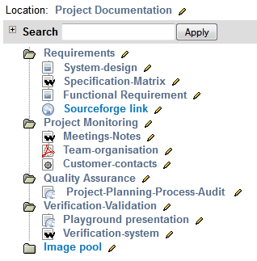
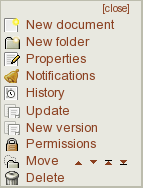
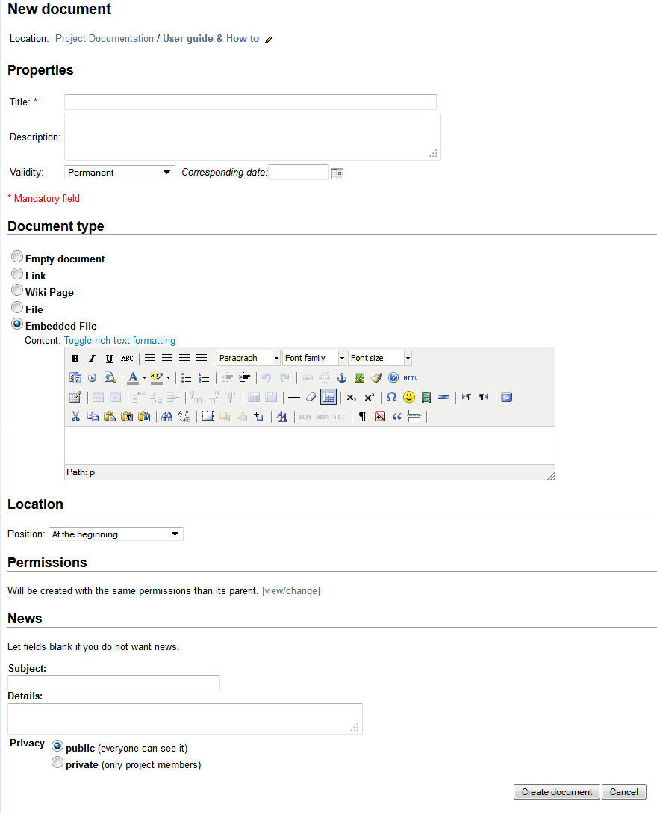
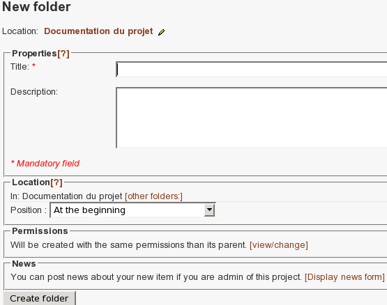
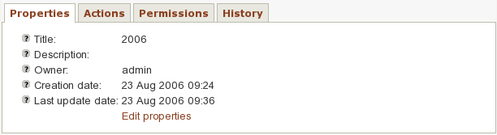
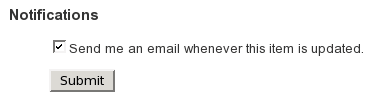
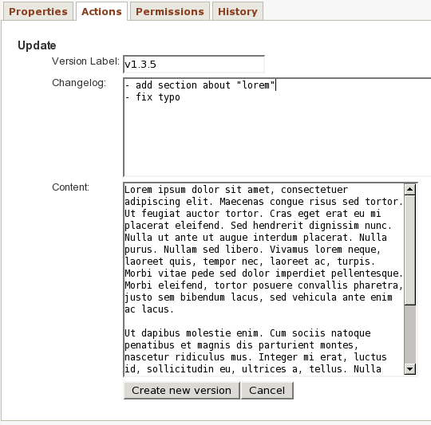
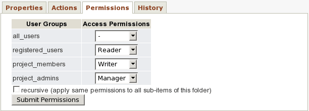
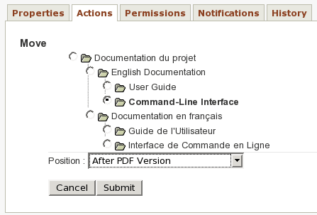
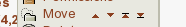

Document Manager
================

Documentation is probably the second most important deliverable in a
software project after the software work products themselves.
Tuleap provides a specific service to manage your project
documents.

Although the Tuleap Document Manager cannot be compared with
dedicated document management systems, it is however very handy to
publish documents that are critical to your community of users. Examples
are: Installation, Administration or User Guide, API documentation,
Frequently Asked Questions, etc...

The Document Manager features are as follows:

-  The Tuleap Document Manager can handle any type of
   document.

-  Documents are stored in folders. You can have subfolders in a folder.

-  Documents can be edited on line (if in text or HTML format).

-  Access control rules can be defined for each document or folder.

-  Documents have properties and searchable metadata.

Structure
----------

You can structure as you want your document manager by creating folders
and subfolders to classify your documents.



   	   Folders and subfolders

Actions
--------

The Document Manager allows some actions on folders or documents. Those
actions are available or not depending on permissions. In order to
display the action panel, you must click on the pencil icon next to the
document or folder name.



   	   Actions

We will now describe all the actions that can be performed on a folder
or document.

New Document
````````````

This action is only available for folders and allow the user to create a
new document in a folder. When you select this action, a "new document"
window is displayed, where you can enter information concerning the new
document.



   	   Create a new document

The new document inherits the permissions of the parent folder.

Metadata
~~~~~~~~

The title of the document is mandatory. The user can provide a
description which will be displayed on the browse view. Depending on the
project, there may be additional metadata required to classify the
document.

Document Type
~~~~~~~~~~~~~

5 types of documents are available :

-  *Empty:* the document will have no type. The user will be able to
   change the type after creation.

-  *Link:* allow the user to target a document with a URL. The document
   will not be stored locally in the docman.

-  *Wiki:* the document could be created with the wiki service. Just
   enter the name of the corresponding wiki page. You can also use an
   existing wiki page name.

-  *File:* any type of document could be uploaded. From a PowerPoint
   presentation, to a simple picture or a full office document. Files
   are versionned, so you can add new versions on existing document.

-  *Embedded file:* html or plain text can be edited online. Embedded
   files are versionned.

Location
~~~~~~~~

By default, the system creates a document in the folder that was
selected. The user can also choose another folder. He can also select
the position of the new document in the folder: at the beginning or at
the end.

New Folder
```````````

This action is only available for folders and allow the user to create a
sub folder in a folder.



   	   Create a new folder

The new folder inherits the permissions of the parent folder.

Properties
~~~~~~~~~~

Like for documents, the title of the folder is mandatory. The user can
provide a description which will be displayed on the browse view.
Depending on the project, there may be additional properties required to
classify the document.

Location
~~~~~~~~

Like for documents, by default, the system creates a folder in the
folder that was selected. The user can choose another folder. He can
also select the position of the new folder in the parent folder: at the
beginning or at the end.

Properties
````````````

This action allows the user to view the properties of a document or
folder. If he has enough permissions, he will be able to modify those
properties.



   	   Display and edit properties

From the property panel, it is possible to view/edit permissions,
history and actions. There are also shortcuts to these panels in the
initial "Actions" window.

Notifications
``````````````

This action allows the user to be notified when an item is modified.
Therefore, he will be alerted about the creation of a document in a
folder, about the update of a document, about its move, ... He just has
to check the dedicated checkbox.



   	   Notifications

History
````````

This action allows the user to see logs and old versions (if available).

.. figure:: ../images/screenshots/sc_docman2_history.png
   	   :align: center
  	   :alt: See a document history
  	   :name: See a document history

   	   See a document history

Update
```````

This action allows the user to update the name of a wiki page or the url
of a link.

.. figure:: ../images/screenshots/sc_docman2_update.png
   	   :align: center
  	   :alt: Update a link
  	   :name: Update a link 

   	   Update a link

New version
````````````

This action allows the user to update a new version of a file or an
embedded file.



   	   Create a new version for embedded file

Permissions
````````````

This action allows the user to manage the permissions of a document or
folder. Permissions for folders can be applied recursively to its
hierarchy.



   	   Define permissions

There is 3 types of permissions.

Readers
~~~~~~~

Those who can "read" a document or access the content of a folder.

"read" means access to the document, see it in the browse view, see its
properties or metadata, see its history.

Please note that if a user cannot read a folder, then he cannot access
to any of its subitems whatever their permissions, even deep in the
hierarchy.

Writers
~~~~~~~

Writers are readers who can also modify the document.

"Modify" means update a new version, modify the link or the wiki page
name, edit properties, move the item or delete it.

Managers
~~~~~~~~

Managers are writers who can also set permissions on a document or
folder and can access to logs.

Move
`````

Documents or folders can be moved elsewhere in the project
documentation.

They can only be moved in a folder where you have write permissions.

You can move an item in different ways.

The traditional way is to select move from the popup menu. You will be
able to choose the target folder (or let it in the same folder) and the
new position (at the beginning, at the end or at a specific position).
The permissions of the item will not be changed.



   	   Move a document

If you just want to reorder a folder and move some of its items
relatively to each other, you can click on shortcuts next to "move" item
in the popup menu : up, down, at the beginning or at the end.



   	   Shortcuts to move a document inside a folder

Delete
```````

Documents or folders can be deleted. If the user wants to delete a
folder, he will be warned that all subitems will be deleted (if the user
has enough permissions).

To be able to delete an item, the user must have write permissions on
the parent folder.

Administration
---------------

Permissions
````````````

This section defines who can administrate the document manager.

Document manager administrators have all access to all items of the
manager.

Display preferences
````````````````````

This section allows you to define the default view for the document
manager. The settings will be overridden by user preferences.

Properties
```````````

This section manage the properties of documents. Each property can be
edited during document submission and updated in the document properties
panel.

There is no specific permissions. If a user can read(modify) a document,
he can read(modify) all of its properties.

