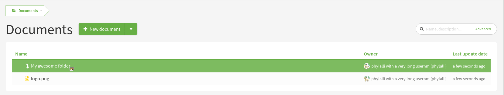

Document Manager modern interface
=================================

.. attention::

  This module is part of :ref:`Tuleap Enterprise <tuleap-enterprise>`. It might
  not be available on your installation of Tuleap.

The new interface of document manager provide a more modern way to interact with document manager.

Drag and drop
-------------
The major difference between both user interface, is that we now support drag and drop:

If you drop a document in current folder, it will add it under the folder

.. figure:: ../images/screenshots/document/current_folder.png
   :align: center
   :alt: create a new file under current folder
   :name: create a new file under current folder

If you drop a document in a specific folder, it will add it inside

If you drop a document on an existing on, it will create a new version of the document

.. figure:: ../images/screenshots/document/new_version.png
   :align: center
   :alt: create a new version of a file
   :name: create a new version of a file

Quick look
----------
In document manager items now have a quick look option, it will enable you to see document metadata and actions you can do.
If document is an image or an embedded file, it will display a preview of the document.

Switch
------

As all functionalities are not available for now only project who has no required metadata are automatically
switch on the new interface.

Please note that each user can switch between the legacy and the new UI at any moment.
