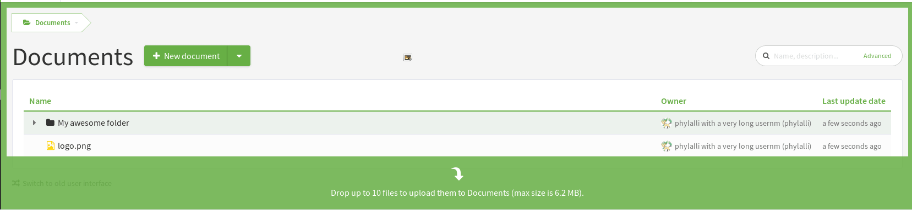

.. _document-manager:

Document Manager
================

Documentation is probably the second most important deliverable in a
software project after the software work products themselves.
Tuleap provides a specific service to manage your project
documents.

Although the Tuleap Document Manager cannot be compared with
dedicated document management systems, it is however very handy to
publish documents that are critical to your community of users. Examples
are: Installation, Administration or User Guide, API documentation,
Frequently Asked Questions, etc...

The Document Manager features are as follows:

-  The Tuleap Document Manager can handle any type of
   document.
-  Documents are stored in folders. You can have subfolders in a folder.
-  Documents can be edited online (See `Embedded files`_ and :ref:`ONLYOFFICE integration <onlyoffice-integration>`).
-  Access control rules can be defined for each document or folder.
-  Documents have properties and searchable properties.

.. _Embedded files: `Document type`_

Actions on documents and folders
--------------------------------

The Document Manager allows some actions on folders or documents. Those
actions are available or not depending on permissions.

All the actions are accessible through the quick look drop down.

.. figure:: ../../images/screenshots/document/actions_on_document.png
   :align: center
   :alt: actions on a document
   :name: actions on a document

The actions available are the following:
 - Create a new version for a document
 - Create a new folder or a new document for a folder
 - Update properties of the document
 - Access to the notifications, that means, do you want to be inform when a document or a folder is updated ?
 - History
 - Permissions
 - Approval tables
 - Cut/Paste a document or a folder
 - Delete document or folder
 - Lock/Unlock a document
 - Download a folder as a zip archive


Quick Look
``````````
Each item of the Document Manager has a quick look button,
that enables to see document properties and actions users can do.
If the document is an image or an embedded file, it will display a
preview of the document.

.. figure:: ../../images/screenshots/document/preview.png
   :align: center
   :alt: preview of an embedded file
   :name: preview of an embedded file

.. note::

    When accessing the quick look, use the friendly URL to share the
    link with your teammates.

New Document
````````````

This action is only available for folders and allow the user to create a
new document in a folder. When you select this action, a "new document"
window is displayed, where you can enter information concerning the new
document.

The new document inherits the permissions of the parent folder.

Document Type
~~~~~~~~~~~~~

Five types of documents are available:

============= ===============================================================
Type          Description
============= ===============================================================
File          Any type of document can be uploaded. From a PowerPoint
              presentation, to a simple picture or a full office document. Files
              are versionned, so you can add new versions on existing document.
              Office files such as Word or Excel documents can be viewed directly
              in your browser when the :ref:`ONLYOFFICE integration <onlyoffice-integration>`
              is active.

Link          Allows the user to target a document with a URL. The document
              will not be stored locally in the Document Manager.

Empty         The document will have no type. The user will be able to
              change the type after creation.

Wiki          The document can be created with the wiki service. Just
              enter the name of the corresponding wiki page. You can also use an
              existing wiki page name.

Embedded file HTML text that can be edited online. Embedded files are versioned.
============= ===============================================================

.. note::

   Wiki is only available for legacy wiki service based on PHPWiki.

Properties
~~~~~~~~~~

The title of the document is mandatory. Depending on the
project, there may be additional properties required to classify the
document.

Drag and drop and multi upload
~~~~~~~~~~~~~~~~~~~~~~~~~~~~~~

In current folder
'''''''''''''''''

If user drops a document in the current folder, it will add it into the folder content



In a given folder
''''''''''''''''''

If user drops a document in a specific folder, it will add it inside

.. figure:: ../../images/screenshots/document/specific_folder.png
   :align: center
   :alt: create a new file under a specific folder
   :name: create a new file under a specific folder

Create a new version of a file
''''''''''''''''''''''''''''''

If user drops a document on an existing file, it will create a new version of the file

.. figure:: ../../images/screenshots/document/new_version.png
   :align: center
   :alt: create a new version of a file
   :name: create a new version of a file

New Folder
``````````

This action is only available for folders and allow the user to create a
sub folder in a folder.

The new folder inherits the permissions of the parent folder.

Properties
~~~~~~~~~~

Like for documents, the title of the folder is mandatory.

Depending on the project, there may be additional properties required to
classify the folder. The values that are set for a folder will be proposed as
default values for the items that will be created within this folder.


Update properties
`````````````````

If users have enough permissions, they will be able to update the properties
of a document or folder.


Notifications
`````````````

This action allows the users to be notified when an item is modified.
Therefore, they will be alerted about the creation of a document in a
folder, about the update of a document, about its move, …
They just have to check the dedicated checkbox.

*Note: this view is still in the legacy interface.*

History
```````

Allows the user to see logs and old versions (if available).

*Note: this view is still in the legacy interface.*

New version
```````````

This action allows the user to update a new version of a file or an
embedded file, update the name of a wiki page, or the URL of a link.


.. _documents-permissions:

Permissions
```````````

This action allows the user to manage the permissions of a document or
folder. Permissions for folders can be applied recursively to its
hierarchy.

There are 3 types of permissions.

========== ===============================================================
Permission Description
========== ===============================================================
Readers    Those who can "read" a document or access the content of a folder.

           "read" means access to the document, see it in the tree view, see its
           properties, see its history.

Writers    Writers are readers who can also modify the document.

           "Modify" means update a new version, modify the link or the wiki page
           name, edit properties, move the item or delete it.

Managers   Managers are writers who can also set permissions on a document
           or folder and can access to logs.
========== ===============================================================

.. note::

   If users cannot read a folder, then they cannot access to any of
   its subitems whatever their permissions, even deep in the hierarchy.

Approval tables
```````````````

Set up an approval workflow.

For document with an approval table, a
coloured badge, depending on the status review, is displayed on documents
having an approval table.

.. figure:: ../../images/screenshots/document/approval_table_status.png
   :align: center
   :alt: approval table status
   :name: approval table status


*Note: the configuration of approval tables is still in the legacy interface.*

Cut/copy/paste
``````````````

Documents or folders can be copied or moved elsewhere in the project
documentation.

.. _document-download-folder-zip:

Download a folder as a zip archive
``````````````````````````````````


  Download as zip is available on all folders

You can download folders as a zip archive. Every sub-folder, file and embedded
file in this folder will be downloaded as a zip archive. Embedded files are
saved as HTML files. The zip archive is made of the last version of the files.

Please note that, even if the file is a ``.zip`` there is actually no
compression of the files. The ``.zip`` is used to create an archive that
can be downloaded but the server won't compress the files within because
it would be too heavy to manage for the Tuleap server.

Downloading a folder as a zip archive is subjected to :ref:`size limitations<site-admin-document>`
that can be enforced by your site administrator. By default, users may not
download folders with a size above 2 Gigabytes (GB).

.. attention::

  If Tuleap encounters a problem while processing one of the files (the file is
  corrupted, not found, not readable or Tuleap has not enough memory), it will
  add a file named ``TULEAP_ERRORS.txt`` at the root of the zip archive. This
  file will list all files with issues that could not be downloaded. If it
  happens, please let your site administrator know.

.. warning::

  For Mac OS X users, there is a special limitation: if the folder has a size
  above 4 Gigabytes (GB) or contains more than 64000 files, the native Mac OS
  archive extraction tool might not be able to open the archive. Tuleap will
  warn you if you encounter this case.

Delete
``````

Documents or folders can be deleted. If the user wants to delete a
folder, he will be warned that all subitems will be deleted (if the user
has enough permissions).

To be able to delete an item, the user must have write permissions on
the parent folder.

Administration
--------------

Search
``````

Configure the available criteria and columns displayed in the search page.
By default every properties are used as criteria and columns.

Permissions
```````````

This section defines who can administrate the Document Manager.

Document manager administrators have all access to all items of the
manager.

Properties
``````````

This section manage the properties of documents. Each property can be
edited during document submission and updated in the document properties
panel.

Obsolete documents
``````````````````

Every documents marked as obsolete (via Obsolescence date property) do
not appear anymore in the tree view and are listed here.

Locked documents
````````````````

Lists all documents that are locked by a user.

REST API
--------
Document manager comes with dedicated REST API routes. If you wish to use
them, note that the following are not available:

- monitor document
- approval tables configuration

