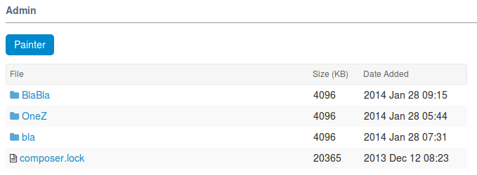
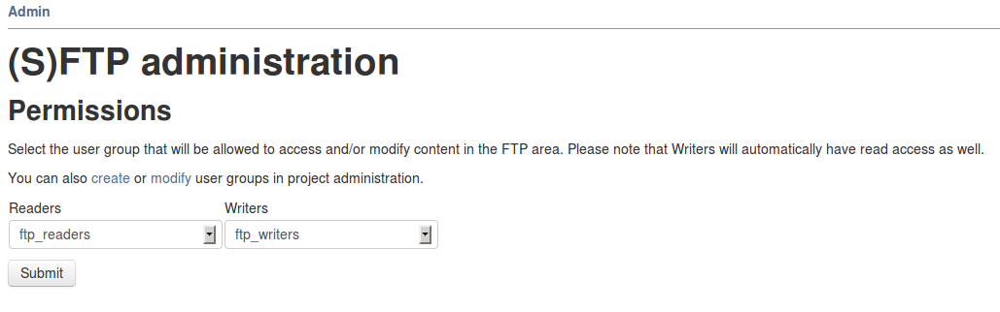
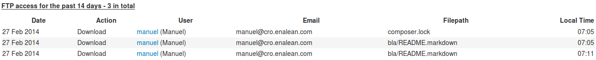

.. _sftp-browser:

SFTP Browser
============

Overview
--------

SFTP Browser is a dedicated service that aims to provide a secure area to exchange non structured data (free directory organization).

While the browsing features can be used with any kind of transporation protocol, it aims to be used with SFTP/HTTPS to secure storage and transport of data.

Features:

- Upload and download of files using SFTP
- Browsing and download of files using HTTPS
- Permissions management
- Comprehensive logging of actions for administrator

The setup and configuration of the plugin (ie. plugin is named 'proftpd') is available in plugin's readme.

Please note that this feature requires RHEL 6 as base OS.

Upload and download with SFTP
-----------------------------

As a user granted read or write permissions (see next section), you can upload/download files accordingly.

To connect using ftp, you shall run ``sftp <username>@<servername>``

Once connected, you cannot see anything (``ls`` returns no result) but you can move to directories corresponding to your project.

Given you are working in "Guinea Pig" project, with 'gpig' as shortname:

::

    $> sftp disciplus_simplex@tuleap.example.com
    $> ls
    $> cd /gpig
    $> ls
    some_directory
    $> cd /a_private_project_i_m_not_member_of
    *** ERROR: No such file or directory

Rule of thumb:

- You cannot see any SFTP area of any project on the plaform (even the one you are member of)
- But you can move to the projects you are explicitly granted Read permissions on.

Permissions
-----------

SFTP areas are defined per project basis. Each project administrator should define:

- A group of users who can read (Readers)
- A group of users who can write (Writers)

*Warning: you have to select two different groups, one for writers and one for readers.* If you choose one group for both, nobody will be able to write.

Those permissions apply on the project SFTP area globally. This means that a Reader will be able to read the whole project SFTP area recursively. It's not possible to define private subdirectories.

In addition to write permissions, Writers are also granted Read and delete permissions.

Please note that project administrators must define the two groups (Readers and Writers) prior to any usage of this feature. By default, nobody, even the project administrator can upload/download in SFTP area until the two groups are defined.

Technical notes:

- permissions updates are applied on the file system with a delay of ~2/3 minutes
- permissions are enforced on filesystem using posix ACL.

Logging
-------

All upload/download/delete actions made by SFTP or HTTPS are logged and can be available for project administrators in project ``Admin > Access log`` section.

While HTTPS download are visible as soon as someone download something, please note that SFTP direct downloads are only visible the day after (SFTP logs are extracted on daily bases during log rotation).
