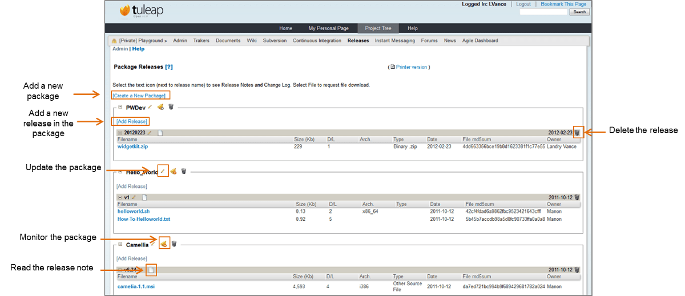

.. _delivery-manager:

Delivery Manager
================

Guidelines
-----------

There are 2 ways by which project administrators can provide access to
their project source code on Tuleap: the software
configuration management repository (CVS or Subversion) and the Delivery
Manager. At first glance, having two distinct Tuleap
services seems redundant. However both have been developed with
different objectives and target audience in mind and they are very much
complementary. Providing both is definitely a plus for your visitors.

-  **The SCM repository** provides a full access to your source code
   including its entire version history. However accessing the source
   code via SCM tools requires that the Tuleap user installs
   specific software on his machine. Not everybody is capable or willing
   to do so. SCM access is well suited for Tuleap users who
   want to get deeper in the project code, add some new extensions, fix
   bugs and contribute changes back to the project team. Please be aware
   that certain projects decide to restrict the access to the SCM to
   project members only. Hence the importance of the file release
   mechanism.

-  **The Delivery Manager** allows you to publish pre-packaged version
   of the source code and/or binaries in one or several archive file
   (zip, tar, jar,...) that an authorized user can easily download from
   the Tuleap Web site. No specific tools or knowledge is
   required. Besides possibly providing pre-packaged source code it is
   also considered a very good practice to provide ready-to-use binary
   version of your software to make developers life even easier. The
   File Release service is well suited for people who want to start
   using your software without any further delay.

As you can see both services are fundamentally different in nature and
we strongly encourage project teams to use both of them. In order to
help project teams understand why these two services are highly
complementary a typical project life cycle is documented on :ref:`a-typical-software-development-life-cycle-on-Tuleap`.

Delivery Manager Jargon
------------------------

Before we get further into the description of the Delivery Manager let's
review the terms used throughout this section. These terms are key for
the understanding of the tool mechanism both for users and
administrators (see `Delivery Manager Structure`_).


   Delivery Manager Structure

-  **Packages** : these are the topmost entities visible in the Delivery
   Manager. A package is a container for one or several releases. In
   general a package do correspond with high-level deliverables of your
   software products. Let's assume that your team is working on a
   database engine. Possible packages could be DB-engine for the
   database engine itself and DB-drivers for the database drivers like
   ODBC or JDBC drivers. A third package DB-Docs could also be created
   to deliver the documentation in a separate container.

-  **Releases**: a release is a collection of individual files that were
   all frozen and time stamped at a given moment in time. In that sense
   it is also a container like a package but one level below. The files
   contained in a release generally correspond to a given version (also
   called release) of your software. Building on the database example
   above we could imagine than the DB-engine package has release 1.0,
   release 1.1 and release 2.0beta available. DB-drivers could have
   release 1.0 as well but no release 1.2 because the 1.0 drivers also
   work with the release 1.2 of DB-engine. In other words release naming
   can be completely independent from one package to another.

-  **Files**: files are the basic entities that one can find in a
   release. Again building on the database engine example, we can
   imagine that the release 1.0 of package DB-engine contains the file
   db-engine-src-1.0.zip for the source file and db-engine-win32-1.0.zip
   for the pre-compiled Windows version. When release 1.2 of the
   DB-engine package pops up, we could have files db-engine-src- 1.2.zip
   for the source file and db-engine-win32-1.2.zip for the pre-compiled
   Windows version and a new file called db-engine-linux-intel-1.2.zip
   for the pre-compiled Linux version running on Intel hardware. We
   haven't said a word about the DB-docs package. May be it is still
   empty for the moment ;-)

    **Note**

    This is really the kind of structure a project team should aim at to
    make their deliverables easy to understand and easy to access for
    the community. Thinking about the structure of your software and
    documentation deliverables ahead of time can help you structure your
    team, your working processes (e.g. build and test process) in the
    right way. Do not overlook this part of your project.

File Release Browsing and Download
-----------------------------------

The latest version of each project package (if any) is always visible on
the Project Dashboard (see :ref:`an-example-of-project-dashboard`). The latest version can immediately be
downloaded by clicking on the "Download" link or visit the complete list
of packages and release by clicking on the "[View ALL project files]"
link.


   Example of a Delivery Manager screen

The first example given on `Example of a Delivery Manager screen`_ shows the Delivery Manager screen of the
Playground project.

Browsing packages
``````````````````

As explained in the `Delivery Manager Jargon`_, projects can contain several packages. In the
example, the Playground project has four packages.

The content of each package can be hidden by clicking the *minus* icon
located just before the package name. This can help for visibility
reasons if your project has lots of packages and releases. To expand a
collapsed package, simply click the *plus* icon before the package name.
By default, all the packages are expanded.

Tuleap gives you the opportunity to monitor the packages.
Like this, you will be notified when a new release is available, or if a
release is updated, etc. In order to monitor a package, click the *bell*
icon located after the package name. If you're already monitoring the
package, there is a red sign on the bell. If you don't monitor the
package, the bell has a green *plus* on it.

Browsing releases
``````````````````

A package can contain several releases. In the example, the package
"Camellia" has 2 releases called v6.34 and v.620, listed in
chronological order. Each release contains a certain number of files.

Like packages, the content of the releases can be hidden to enhance
visibility. The mechanism is the same: click the *plus* and *minus*
icons to expand/collapse the release content. By default, only the first
release of each package (which is the latest one) is expanded.

After each release name, the icon representing a text file let you read
the notes and the changelog of the current release.

Downloading files
``````````````````

Each release contains a certain number of files to be downloaded. In the
case of the release 3.0.1, two ISO image archives can be downloaded.
Files that belong to the other releases are hidden in this example. To
make them visible, just click the small *plus* that stands just before
the name of the release. Some file information is given, like the size,
the type of file, the architecture (if it is relevant) the date and the
number of downloads. To download a file, you just have to click the name
of the file and follow the instructions.

.. _delivery-manager-administration:

Delivery manager Administration
--------------------------------

This section is for project admins and file admins. It goes through a
detailed explanation of the Delivery Manager process. This is a 2-step
process:

**Package Creation**: Create one or several packages. This must only be
done once. When packages are in place you can add a new release or
update an existing one in them at any time.

**Release Creation**: Once a package has been created, you can add (and
update) releases to it

When you are project admin or file admin, you are able to perform the
admin actions on the Delivery Manager home page. (See `The Delivery Manager screen of the Playground project, when you are an admin`_ )



   The Delivery Manager screen of the Playground project, when you are an admin

Package Administration
```````````````````````

To administrate packages, you must be project admin or file admin.
Package creation and modification are nearly the same.

Package Creation
~~~~~~~~~~~~~~~~

To create a package, you just have to click the [add a package] link
located on the top of the Delivery Manager screen. Then, fill the form,
giving the package name, its relative rank on the Delivery Manager
screen, and its status:

-  **Package Name**: this is the name of the package. The name of the
   package must be unique in a project.

-  **Rank on screen**: the rank indicates the position the packages will
   be displayed in the screen. You can choose the value: 'at the
   beginning', 'at the end', or after every other package.

-  **Status**: an active package will be displayed, whereas a package
   with a hidden status won't appear on the Delivery Manager screen. For
   project admins or file admins, the hidden packages are displayed in
   italic, in order to update them.

.. _package-modification:

Package Modification
~~~~~~~~~~~~~~~~~~~~

To update a package, just click the [edit] icon located after each
package name. Then, the modification form is the same than the creation
one, except that you can set read permissions on the package (see `Package editing of the Camellia package`_).


          Package editing of the Camellia package

A project member with the 'File Manager Admin' right (see :ref:`user-permissions`) can attach
access permissions to any existing package.

By default, permissions attached to a package apply to all releases and
files that belong to this package. But you may also set different
permissions to specific releases (see below).

Release Administration
```````````````````````

To administrate releases, you must be project admin or file admin.
Release creation and modification are the same.

Release Creation and modification
~~~~~~~~~~~~~~~~~~~~~~~~~~~~~~~~~

Once a package has been created you can immediately start adding
releases to it. Click on the [Add a Release] link of the appropriate
package (see `The Delivery Manager screen of the Playground project, when you are an admin`_).

The release creation and modification process is really easy to perform.
It can be divided into 6 steps, but some are optional. (see `The release update screen`_). In every
case, you can update the release at any time


   The release update screen

-  **Step 1 - Give Release properties**

   The first step is the only one mandatory to create a release. It
   gives you a chance to modify the package of the release, the release
   date, and the status of the release. You also have to provide the
   release name.

-  **Step 2 - Upload and attach files to the release (optional)**

   This step is optional in the way that you can add the files after
   having create the release, but of course, a release should contain at
   least one file to be relevant. As explained above multiple files can
   be attached to the same release. To attach a file, click the [add
   file] link. Then, a select box appear, in order to select the file to
   attach. There is two solution to attach a file:

   -  *Direct Upload*: you can upload the file via the Web interface by
      using the "Local file - Browse" option in the pull down menu and
      pointing to the appropriate file on your local disk.

   -  *FTP / SCP*: upload your file via ftp or scp and then select the
      appropriate file name from the "FTP/SCP Files list " in the pull
      down menu.

      **Tip**

      Tuleap server offers an upload mechanism via FTP (ou SCP). To 
      upload your files, follow the instructions given
      when you click the *?* next to the [add file] link. Then click
      the [Refresh File list] link to see your files.

   Before you upload the files make sure you gave them names that
   will speak to Tuleap users. Ideally the file names
   should include the release label in it and any other extension
   telling whether it is a source file or a binary file.

-  **Step 3 - Add Release Notes and/or Changelog (optional)**

   With the release, you can also provide notes or changelog, and even
   both! You can either cut and paste or upload Release Notes and
   ChangeLog. To upload a release note or a changelog, click the
   *Upload* link.

   The Release Notes is typically a short (10 to 20 lines) and
   high-level document that summarizes the new features delivered in
   this release with a focus on the user visible changes (new UI, new
   functions, new APIs...). This is an important document and all new
   releases should definitely have one. Release Notes are immensely
   helpful to the community to determine whether they need to upgrade to
   the next release.

   The ChangeLog is a much more technical document. It contains all bugs
   fixed in this new release as well as any change in the design or the
   architecture. This document is not as critical as the previous one to
   the normal end-user but it is absolutely pivotal for those who use
   your software in other development or integration activities.

       **Tip**

       If you use CVS as you version control system you can very easily
       generate a well formatted and informative Changelog file. The
       cvs2cl utility available at `http://www.red-
       bean.com/cvs2cl <http://www.red-     bean.com/cvs2cl>`__
       automatically extract all the CVS commit messages, aggregate them
       with modification dates and author name and format them in a nice
       way. This is a very good basis for a Changelog document.

-  **Step 4 - Set permissions to the Release (optional)**

   By default, releases have no specific access permissions: access to
   all files is granted to any Tuleap registered user
   (anonymous users are not allowed to download release files). However,
   in some cases, you might want to limit the users allowed to download
   your software. In these specific cases, you can restrict access
   permissions to your packages and releases to specific user groups.
   See :ref:`usre-groups` for more information on user groups. To define or to change the
   permissions on a release, click the [view/change] link in the
   permissions frame.

   Package and release permissions are enforced at two different levels:

   -  **File List:** When a user is not granted access to a package or
      release, then the package or release is not listed in the 'File'
      main page, so s/he does not know that the file exists.

   -  **Download:** If a user finds or forges a download link for an
      unauthorized file, the download will still fail. The system
      systematically re-checks for permissions when files are requested
      for download.

   If you do not specify any access permissions for a release (or reset
   them to default), it inherits the access permissions from the package
   it belongs to. However, when you define a permission for a release,
   then it overrides the permissions defined for the package.

   The permissions set for the release can be only stricter than the
   package permissions.

-  **Step 5 - Submit a News (optional)**

   This step is optional in the sense that you can skip it if you want.
   This step gives the opportunity to project admin to submit a news
   about the release they've just created (if you're not project admin
   or news admin, you won't see this step). A default subject and
   message are pre-filled. You are of course free to modify it. The news
   will be displayed on your project dashboard. It is a good way to
   advertise the users that a new release have been done. The news will
   also appear in the news administration page, like others.

-  **Step 6 - Send e-mail notification (optional)**

   This step is optional in the sense that it may not show up on your
   screen. If some Tuleap users monitor your package, this
   step will tell you how many of them are doing so. Tuleap
   gives you the freedom to send an e-mail notification or not to the
   users who expressed interest in your packages. Do not bypass this
   step, always inform your community of users and developers.

       **Tip**

       When you prepare your files for release make sure that you
       include a README file in the top directory of each file that a
       user can download. And pack this README with useful information
       like the address of your Tuleap site, the Mailing
       list you have put in place for your project, how to submit a bug
       or a support to the project team (via Tuleap of
       course)

Processor List Administration
------------------------------

Project admins and file admins can manage the processor list per
project. The processor is an (optional) attribute of a released file.
Depending the project or working domain, you could be interested in
adding processors to the existing list. To do it, follow the admin link
"Manage processors" of the Delivery Manager. Then, you have the list of
the available processors. System processors are not editable. The other
processors are specifics to the current project. You can edit them,
delete them, as well as create new ones. A processor has a name and a
rank in the processor list.
