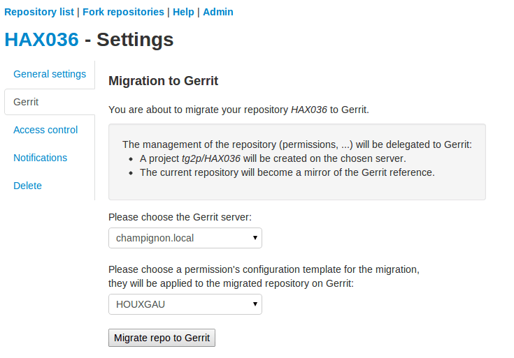
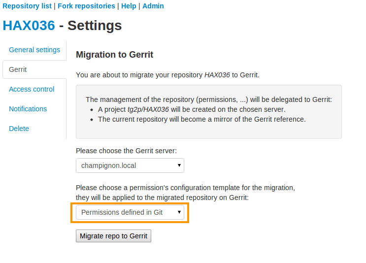
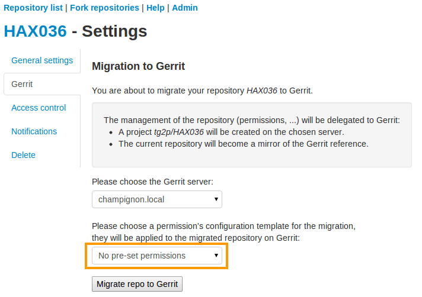
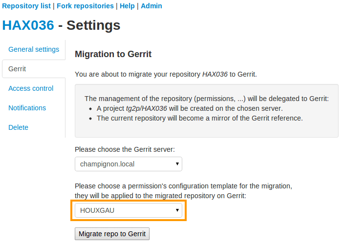
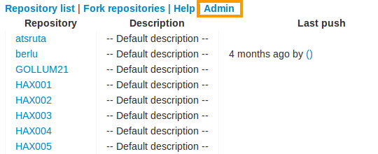
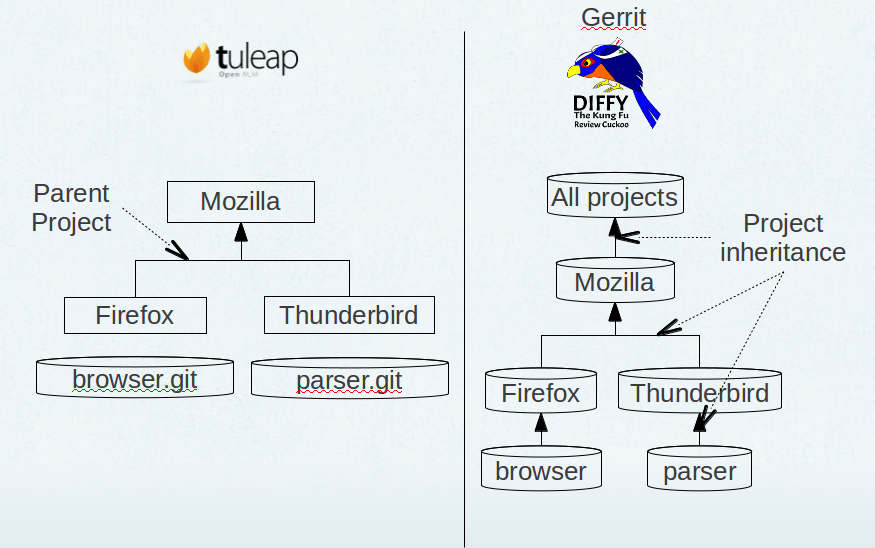
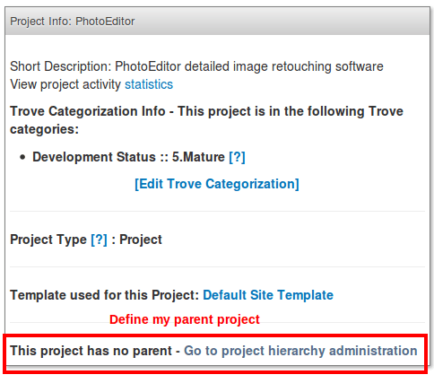
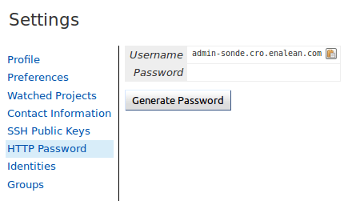
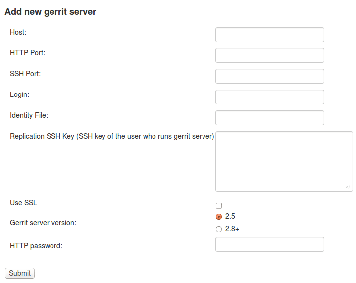

Gerrit
======

Gerrit integration is still pretty new so a good knowledge of both Gerrit and Tuleap is required.

Gerrit is a code review tool built on top of git. It also manage permissions for repository access.

More informations about gerrit on http://code.google.com/p/gerrit/

Please note that this feature depends on LDAP authentication.


   Gerrit logo

Feature overview
----------------

The integration is meant to be as lightweight as possible so end users can use all power of Gerrit.
Tuleap simplifies creation and management of the repositories, users and user groups.
It doesn't restrain gerrit features at all.

You can connect several Gerrit instances to one Tuleap server. One Gerrit instance can be connect to several 
Tuleap servers. A Gerrit server connected to Tuleap can also be used without Tuleap in full autonomy for projects,
groups and user management.


Migrate a git repository to Gerrit
----------------------------------

The gerrit migration panel can be found in git repository settings. You need to be a project administrator to have
access to it.



   Example of a migration panel to gerrit

As a project administrator, you can migrate a git repository from Tuleap to Gerrit.

After replication, the sources will be replicated on the Gerrit server with a set of default permissions based on
access rights at the time of migration.

On Tuleap side, as soon as the git repository is migrated, the repository is turned read-only (the reference is now on Gerrit).
User can still browse the repository through the web UI, clone it or fork it but all write operations are blocked (even for admins).

However, all permanent changes (branches & tags) made on the corresponding Gerrit project are replicated to Tuleap. 
When developers make commits on Gerrit, there is a delay of a few seconds to see this commit replicated.

Please note however that review related things (patchsets, review & co) are *not* replicated. Technically speaking, 
only refs/heads/* and refs/tags/* are.

As a side effect of a project migration, all user groups are replicated to Gerrit too. See corresponding section below.

Project creation
````````````````

In Gerrit terminology, a git repository is called "project". To reduce confusion, we will talk about Gerrit project.

In following sections, we will take the example of an imaginary Tuleap project "mozilla" with two git repositories "thunderbird" and "firefox".

Project admins migrate to Gerrit "firefox" git repository. After a couple of minutes, on Gerrit side there is:

* One top level Gerrit project "mozilla"
* One sub project "mozilla/firefox" created

The Gerrit project "mozilla/firefox" contains sources and is where developer will push for review.

The Gerrit project "mozilla" is a permission only project (no sources can be pushed into) and is meant to group all git repositories that come
from the same Tuleap project. It's convenient to define common permissions for several repositories.


Permissions
```````````

Tuleap comes with a default set of permissions for each Gerrit project. Those permissions are set at project migration only.
No subsequent modifications of permissions are done by Tuleap.

Default permissions
"""""""""""""""""""



   Issue migration with default permissions

Default Gerrit access rights are based permissions set on corresponding Tuleap git repository at migration.
For details on on gerrit access rights please have a look to http://gerrit-documentation.googlecode.com/svn/Documentation/2.5.2/access-control.html

* Read:

  * On 'heads'

    * Read
    * label code-review -1..+1

  * On 'for/refs/heads'

    * Push

  * On 'tags'

    * Read
* Write:

  * On 'heads'

    * Read
    * Create
    * forgeAuthor
    * label code-Review -2..+2
    * label verified -1..+1
    * submit
    * push
    * pushMerge

  * On 'for/refs/heads'

    * Push
    * PushMerge

  * On tags

    * Read
    * pushTags

* Rewind:

  * On 'heads'

    * Push +force

As project administrator, you can redefine the whole Gerrit permission scheme as you wish. If you need to create new user groups to tailor
your workflow, see "User groups management" section below.

No permissions
""""""""""""""

If you already are a gerrit power user and don't want default permission, you can also start with an empty permission scheme.
Just untick "Migrate to gerrit the access rights defined in the Git plugin"



   Migrate to Gerrit without default permission scheme

Use templates
""""""""""""""



   Migrate to Gerrit using a permission's template

You can also define templates to be applied to refs/meta/config on Gerrit and which defines the access rights.
To apply a template on migration, you simply have to select it within the proposed selectbox as you can see on
the figure above.

These templates can be defined using the admin panel of Git. They must be valid ones in order to be correctly
applied during the migration process. You can use the variable *%projectname%* which will be replaced by the
project's name during migration. For further informations regarding these templates, please refer to the Gerrit's
documentation.



   Git's admin section

Setup parent projects (Umbrella)
""""""""""""""""""""""""""""""""

This section assume you already know what basics of `Gerrit project inheritance <https://gerrit-documentation.storage.googleapis.com/Documentation/2.5/access-control.html#_all_projects>`_

This feature aims to address complex setups where a lot of Tuleap projects and git repositories are involved.
The main objective is to simplify the definition of common rules and leverage on gerrit permission inheritance to apply them.

Let's take again our mozilla based example:



   Tuleap/gerrit umbrella projects mapping

On Gerrit side, at mozilla level, I can define common permissions rules that will apply on all repositories (hence browser and mbox in our
example). Those common rules might state that:

* any member of mozilla organization is allowed to propose a contribution on any mozilla repository
* any QA mozilla team member is allowed to -2 contribution on any repository
* ...

This inheritance is set automatically during repository migration as long as there is a parent project defined.
This definition is done as project admin, in admin welcome panel, see screenshot below:



   Define a parent project

User groups management
----------------------

User group management helps to keep consistent your teams between Tuleap and Gerrit.
When someone join or leave your team, just add or remove it in Tuleap project and it's automatically propagated to Gerrit.

*Warning*: It's not safe to update those user groups directly *in gerrit*. If you add or remove someone manually Tuleap might
undo this change without prior notice.
If you ever need to have a user group with custom membership you should create a dedicated group in gerrit.

The user group management follow the same naming pattern than projects.
Given I have a "mozilla" Tuleap project with one special user group "Developers", I will get on Gerrit server:

* mozilla/project_members
* mozilla/project_admins
* mozilla/Developers

The two first user groups are created by default out of "Members" and "Admins" list.

As soon as one git repository was migrated to Gerrit. All modifications done to Tuleap project membership is replicated:

* When I create a new Tuleap user group, a new Gerrit user group is created
* When I add users as members of a user group on Tuleap, they became members of the corresponding user group on Gerrit
* When I remove members on Tuleap, they are removed from corresponding Gerrit group
* When I create a binding between two user groups in Tuleap, the two groups are linked in gerrit (even if the user group, source of the binding doesn't exist on Gerrit yet).
* When I remove a binding between two user groups in Tuleap, the source group is no longer included in the target group and all members of the source group are added into the target group.

Manage user SSH keys
--------------------

To help people to start working with Gerrit, user ssh keys stored in Tuleap can be imported on Gerrit server.

As soon as a user belongs to a Tuleap project with at least one git repository migrated to Gerrit, all modifications
done to user ssh keyring are propagated to the corresponding user account on the server.
In other words, when user add an ssh key on Tuleap, the ssh key is added on Gerrit server and vice et versa.

This key management doesn't override Gerrit ssh keys, it will not delete keys Tuleap doesn't manage.

Note: the first connexion between Tuleap user account and Gerrit user account is not done automatically. Each user have to
go on Tuleap "Account Maintenance" page and click "Push SSH keys" button. All future operations are automated.

Delete or disconnect from Gerrit
--------------------------------

Once a repository is migrated, you can decide to revert this action and "disconnect" gerrit and tuleap.


   Disconnect & delete Gerrit project

There are three options:

* Delete
* Disconnect
* Disconnect and keep read-only

In all cases, it means that Tuleap repository will be writable directly again (you can change permissions,
you can push, etc).

Those actions are available on the "Gerrit" pane in git repository settings, there is a small delay between
disconnect request and application.

Delete
``````

Delete option is only possible if site admin configured "deleteproject" plugin on gerrit side (see `Setup`_).

If delete is possible, it will be proposed as a checkbox next to disconnect button.

Deletion will delete the corresponding Gerrit project (and only this project). All data (git commits, reviews, changeset, etc)
will be permanently erased.

After a deletion, if you ever want to re-migrate a repository, it's possible (it's not the case with Disconnect).

Disconnect
``````````
If you choose not to delete, the Gerrit project *AND* the Tuleap repository will be *writable* in the same time.

However, the gerrit project *will not be replicated*. It's likely that you will end-up with a fork: two different, incompatible versions
of the same project. This is risky but it can be useful in scenario like:

* you migrate to gerrit
* your team fail to find the right workflow
* you choose to disconnect for a time, but keeping Gerrit project for tests until the workflow and the team are ready
* then you delete the gerrit project and start again.

With a simple disconnect, you cannot re-migrate the git repository. You will be asked to delete it beforehand.


   Before being able to re-migration, I should delete the Gerrit project.

Disconnect and keep read-only
`````````````````````````````
A variation of disconnect is to "Disconnect and keep read-only".

As expected, the corresponding Gerrit project will be turned in read only mode.

It's useful for archiving purpose.

Setup
-----

This section is for Tuleap site admin and explain how to setup Tuleap/Gerrit 
integration.
If you are developer, you don't have to read this section.

Integration works with:
 * 2.5.x version of gerrit.
 * 2.8+ version of gerrit.

Prerequisites:

* You need to have your Tuleap instance running with PHP 5.3.x in order to link Tuleap with gerrit 2.8+
* LDAP plugin must be installed, configured and active. Both Tuleap and Gerrit rely on LDAP for common user management.

From now on, you will need:

================================ ======================================================
  What                              Value
================================ ======================================================
a tuleap instance                my.tuleap.server.net
a gerrit instance                gerrit.instance.com
your local workstation           workstation
the gerrit general administrator admin-my.tuleap.server.net (must be a valid LDAP user)
the gerrit super administrator   gerrit-adm (must be a valid LDAP user)
================================ ======================================================

Install and configure Gerrit server
```````````````````````````````````

Follow the steps here up until and including the section:
  * `Gerrit 2.5: Initialize the Site <http://gerrit-documentation.googlecode.com/svn/Documentation/2.5.2/install-quick.html>`_
  * `Gerrit 2.8: Initialize the Site <https://gerrit-documentation.storage.googleapis.com/Documentation/2.8/install.html>`_

Configure LDAP integration
""""""""""""""""""""""""""

To connect as ``gerrit-adm``, you first need to configure gerrit to authenticate with LDAP.

* Edit ``etc/gerrit.config`` to use `LDAP auth <http://gerrit.googlecode.com/svn/documentation/2.5.2/config-gerrit.html#ldap>`_. Example:

  .. code-block:: ini

    [auth]
        type = LDAP
    [ldap]
        server = ldap://myldap.server.com
        accountBase = ou=People,dc=cro,dc=enalean,dc=com
        groupBase = ou=Group,dc=cro,dc=enalean,dc=com
        accountFullName = cn

* Restart or stop/start your gerrit as explained in the gerrit quick_install documentation.

Create the gerrit administrator account
"""""""""""""""""""""""""""""""""""""""

* Start the gerrit instance, go to the web ui and create the administrator account (the first account registered is the administrator) for ``gerrit-adm``.

* Through the gerrit web ui, go to the settings and upload your very own local ssh key.

  .. code-block:: bash

    # copy the output of this and paste it in gerrit
    you@workstation$ cat $HOME/.ssh/id_rsa.pub

* This gives you ultimate rights over ``gerrit.instance.com`` as a super administrator. It's bad practice to use this account for anything but major changes so we will add a general administrator account for taking care of the day to day administration of ``gerrit.instance.com``.


Configure gerrit replication
""""""""""""""""""""""""""""

To configure gerrit replication we need to use the gerrit replication plugin. This plugin comes as part of the gerrit package (gerrit-full-2.5.1.war or gerrit2.8.war) that you have downloaded. There are two steps to using this package. Let's assume you have already followed the steps in the link above and have a folder called _gerrit_testsite_ where all the gerrit files are located.

* First login as ``admin-my.tuleap.server.net`` on ``gerrit.instance.com`` and create the group ``my.tuleap.server.net-replication``. Do not add any users to it. Make group visible to all registered users:

  * Go to ``Groups > Create New Group``
  * Create ``my.tuleap.server.net-replication``
  * Then go to ``Groups > List > my.tuleap.server.net-replication > General``
  * Tick the Group option ``Make group visible to all registered users``
  * and save

* Now go back to the gerrit package you downloaded. You inflate the jar of the replication plugin into ``gerrit_testsite/plugins/``.

  .. code-block:: bash

    gerrit@gerrit.instance.com$ unzip -j gerrit.war WEB-INF/plugins/replication.jar -d gerrit_testsite/plugins/

* Finally, you need to configure the plugin. Go to ``gerrit_testsite/etc/`` and create a file called ``replication.config``:

  .. code-block:: bash
  
    gerrit@gerrit.instance.com$ cd gerrit_testsite/etc
    gerrit@gerrit.instance.com$ touch replication.config
  

* In this file put the following contents

  .. code-block:: ini

    [remote "my.tuleap.server.net"]
      url = gitolite@my.tuleap.server.net:${name}.git
      push = +refs/heads/*:refs/heads/*
      push = +refs/tags/*:refs/tags/*
      authGroup = my.tuleap.server.net-replication

Generating http password (Gerrit 2.8+ only)
"""""""""""""""""""""""""""""""""""""""""""

Since gerrit 2.8. we need new information in order to have a fully working integration.
This information is an http password for your Gerrit admin user ``admin-my.tuleap.server.net``.

You have to generate this http password through the Gerrit web interface.

To do this, log-in into your Gerrit instance as ``admin-my.tuleap.server.net``, go to settings menu, and choose http password.
Then click on generate.



   You have to generate an http password in order to use a gerrit 2.8+ server.

Connect Gerrit and Tuleap servers
`````````````````````````````````

Setup administrator account for Tuleap
""""""""""""""""""""""""""""""""""""""

* As codendiadm on Tuleap server generate a new SSH key for gerrit:

  .. code-block:: bash

    codendiadm@my.tuleap.server.net$ ssh-keygen -P "" -f /home/codendiadm/.ssh/id_rsa-gerrit

* On Gerrit server log-in with the LDAP credentials for ``admin-my.tuleap.server.net`` and give it the SSH public key you just created (``/home/codendiadm/.ssh/id_rsa-gerrit.pub``)

* On Gerrit server, log back in as ``gerrit-adm`` and give ``admin-my.tuleap.server.net`` Administrator rights: In the interface, go to ``Groups > List > Administrators`` then add ``admin-my.tuleap.server.net`` in the input box and click on ``Add``.

Grant write accesses to administrators
""""""""""""""""""""""""""""""""""""""

On Gerrit server, as Administrator, go to Projects > List > All-projects > Access.

* Look for the reference refs/meta/config

  * Add ``Read`` permission to Groups ``Administrators``

* Add a new reference refs/meta/*

  * Grant ``Read`` and ``Push`` permission to ``Administrators``
    `This is necessary <https://groups.google.com/d/topic/repo-discuss/yJDNZJmmAUI/discussion>`_ to allow Tuleap to update the ``project.config`` of any project

* Look for the reference /refs/*

  * Add ``Forge Committer Identity`` permission for the group ``Administrators`` (this will allow Tuleap to push commits it's not the direct author of).

Configure the email of the administrator
""""""""""""""""""""""""""""""""""""""""

This step cannot be done through the web ui since the email is hard coded to ``codendiadm@my.tuleap.server.net`` which by default has no mbox and a confirmation email is sent to this address.

Gerrit 2.5
''''''''''

First, shell into the box on which Tuleap is running as either ``codendiadm``. From there, you will need to run this:

  .. code-block:: bash

    codendiadm@my.tuleap.server.net$ ssh -i /home/codendiadm/.ssh/id_rsa-gerrit admin-my.tuleap.server.net@gerrit.instance.com -p 29418 gerrit gsql
    UPDATE account_external_ids SET email_address = 'codendiadm@my.tuleap.server.net' WHERE external_id LIKE '%:admin-my.tuleap.server.net';
    UPDATE accounts SET preferred_email = 'codendiadm@my.tuleap.server.net' WHERE full_name = 'admin-my.tuleap.server.net';
    exit;
    codendiadm@my.tuleap.server.net$ ssh -i /home/codendiadm/.ssh/id_rsa-gerrit admin-my.tuleap.server.net@gerrit.instance.com -p 29418 gerrit flush-caches

Gerrit 2.8
''''''''''

We can directly use the gerrit REST API to configure the ``admin-my.tuleap.server.net`` email:

  .. code-block:: bash

    curl --digest --user ``admin-my.tuleap.server.net``:``http_password`` 
         -X PUT tuleap.server.net/a/accounts/self/emails/codendiadm@my.tuleap.server.net
         -H "Content-Type: application/json;charset=UTF-8"
         -d'{"email": "codendiadm@my.tuleap.server.net", "no_confirmation": true}'

Integrating Tuleap and Gerrit
`````````````````````````````

* Shell into the box on which your Gerrit instance is running and grab the output of the default public key that will be used for the replication:

  .. code-block:: bash

    gerrit@gerrit.instance.com$ cat ~/.ssh/id_rsa.pub

If it doesn't exist then you need to create it via ``ssh-keygen`` as above.

* As site admin on Tuleap, go to ``Admin > plugins > git plugin`` and add a gerrit server:

=======================  ==============================================
 Key                      Value
=======================  ==============================================
  Host                   ``gerrit.instance.com``
  Port                   ``29418``
  Login                  ``admin-my.tuleap.server.net``
  Identity File          ``/home/codendiadm/.ssh/id_rsa-gerrit``
  Replication SSH Key    copy and paste the output of the public key
  Gerrit server version  check the right value regarding your gerrit server
  Http password          copy the gerrit http password
=======================  ==============================================

Here is a view of the Tuleap git plugin administration where you are able to add new gerrit servers:



   The form in Git plugin administration to add gerrit server.

* Finally, it is important for the codendiadm user on ``my.tuleap.server.net`` to have ``gerrit.instance.com`` as part of its known hosts and vice versa. To ensure this:

  .. code-block:: bash

    # root on Tuleap
    root@my.tuleap.server.net$ ssh -p 29418 -i /home/codendiadm/.ssh/id_rsa-gerrit admin-my.tuleap.server.net@gerrit.instance.com gerrit -h

    # codendiadm on Tuleap
    codendiadm@my.tuleap.server.net$ ssh -p 29418 -i /home/codendiadm/.ssh/id_rsa-gerrit admin-my.tuleap.server.net@gerrit.instance.com gerrit -h

    # Gerrit user on Gerrt server (replication)
    gerrit@gerrit.instance.com$ ssh gitolite@my.tuleap.server.net

Enabling Gerrit project deletion via Tuleap
"""""""""""""""""""""""""""""""""""""""""""

[This plugin comes from https://gerrit.googlesource.com/plugins/delete-project]

From Tuleap 6.5 onwards, it will be possible to delete a Gerrit project after it has been disconnected from Tuleap.
For this option to be present in Tuleap, the Gerrit server needs to have an additional plugin.

* First, download the plugin:

  * Gerrit 2.5: https://tuleap.net/file/download.php/101/65/p22_r76/deleteproject.jar
  * Gerrit 2.8: https://tuleap.net/file/download.php/101/92/p22_r77/delete-project.jar

Gerrit 2.5
''''''''''

* To install the plugin there are two options.

  * option 1 - Put the plugin in the 'plugins' folder of your Gerrit instance then run
  .. code-block:: bash

    ssh -p29418 admin-my.tuleap.server.net@gerrit.instance.com gerrit plugin enable deleteproject

  * option 2 - Put the plugin file somewhere accessible then run
  .. code-block:: bash

    ssh -p29418 admin-my.tuleap.server.net@gerrit.instance.com gerrit plugin install <url of the plugin>

Gerrit 2.8
''''''''''

To install the plugin, put delete-project.jar in the 'plugins' folder of your Gerrit instance then run

  .. code-block:: bash

    curl --digest --user ``admin-my.tuleap.server.net``:``http_password``
         -X POST tuleap.server.net/a/plugins/deleteproject/gerrit~enable
