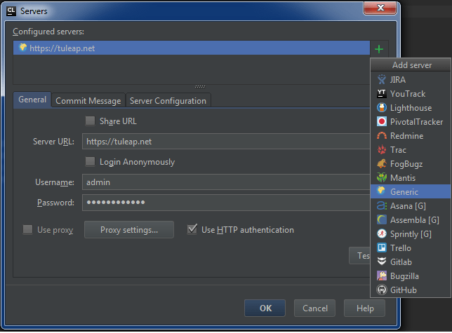
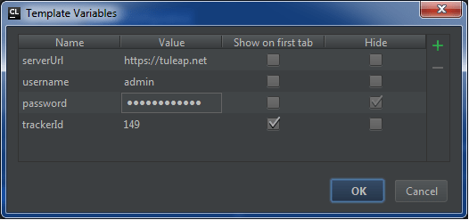
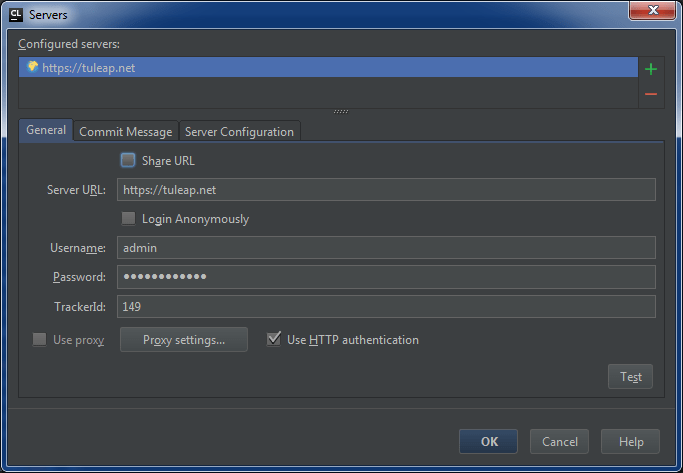
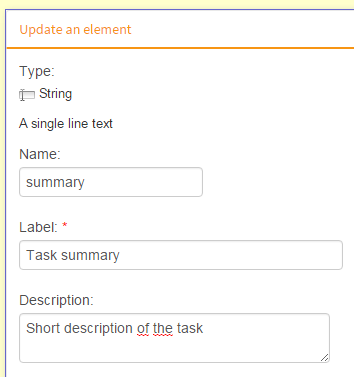
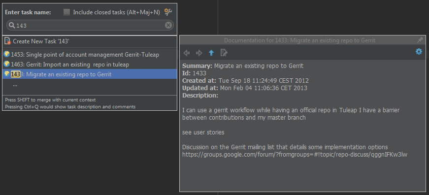

JetBrains IDE integration
=========================

Currently available data for an artifact are :

* ID
* Summary
* Description
* Creation date
* Last update date

First, add a generic tracker server	: Tools > Tasks & Contexts > Configure Servers ... Then add a **Generic** tracker server. Set :

* **Server URL** : Tuleap server (HTTPS Only)
* **Username** : Your Tuleap username
* **Password** : Your Tuleap password
* Check **Use HTTP authentication**

At this point, you cannot test your connection as JetBrains IDEs need a configured task list to test the connection.

On the **Server Configuration** page, indicates the following parameters :

.. image:: ../../images/screenshots/jetbrains/jetbrains_serverconfiguration.png
   :alt: Server Configuration
   :align: center

As displayed, there is a variable ``{trackerId}``. You can set directly the selected tracker id on the URL or create a variable. Choose **Manage Template Variables...**

If you check ``Show on first tab``, the selected field is displayed on **General**. Set the selected tracker id on the field.

On the **Server Configuration** page, you can choose the field id on the selectors :

	* The line ``singleTask-id`` refers to the id of the **id** field
	* The line ``singleTask-summary`` refers to the id of the **summary** field
	* The line ``singleTask-description`` refers to the id of the **description** field
	* The line ``singleTask-updated`` refers to the id of the **last modification date** field
	* The line ``singleTask-created`` refers to the id of the **submission date** field

On the selected tracker, the field id needed are on the administration part :

On the **Server Configuration** page, the right part of the table is a JSONPath expression. It uses selector and can be changed following your tracker structure. To find the field, use the REST API Explorer plugin. For instance, the query ``https://tuleap.net:443/api/artifacts/1433?values_format=by_field``
produces :

::

    {
      "id": 1433,
      "uri": "artifacts/1433",
      "tracker": {
        "id": 149,
        "uri": "trackers/149"
      },
      "project": {
        "id": 101,
        "uri": "projects/101"
      },
      "submitted_by": 344,
      "submitted_on": "2012-09-18T11:24:49+02:00",
      "html_url": "/plugins/tracker/?aid=1433",
      "changesets_uri": "artifacts/1433/changesets",
      "values": null,
      "values_by_field": {
        "summary": {
          "field_id": 1280,
          "type": "string",
          "label": "Summary",
          "value": "Migrate an existing repo to Gerrit"
        },
        "artifact_id": {
          "field_id": 1275,
          "type": "aid",
          "label": "Artifact ID",
          "value": 1433
        },
        "description": {
          "field_id": 1281,
          "type": "text",
          "label": "Description",
          "value": "I can use a gerrit workflow while having an official […]",
          "format": "text"
        }
      },
      "last_modified_date": "2013-02-04T11:06:36+01:00"
    }

With the previous parameters, the task is displayed :

An issue may occur for using SNIExtension on the JVM. To fix it, add the flag ``-Djsse.enableSNIExtension=false`` on the .vmoptions files of your IDE.
