Mylyn Connector for Tuleap - User Documentation
===============================================

Install the connector
---------------------

In order to install the connector, you can use the Eclipse Marketplace
available from the "Help -> Eclipse Marketplace" menu. In the
marketplace, you just have to search for Tuleap in order to find the
latest version of the connector available.

.. note::

    If the installation of the connector fails, be sure to include the
    following update site:
    ``http://download.eclipse.org/mylyn/releases/latest``

Connect to a Tuleap server
--------------------------

To establish a connection with a Tuleap server, you need to go in the
Task Repositories or Team Repositories view in order to create a new
Mylyn repository. Select the Task connector "Tuleap Repository
Connector" and click next.

|image0|

In the next page of the wizard, you have access to the page used to
connect to the Tuleap server. Use the URL of the trackers of your Tuleap
project along with your Tuleap username and password to connect to the
Tuleap server as shown in the following screenshot.

|image1|

Your login and password will be valited prior to the connection but you
can force the verification to ensure that your credentials are valid. Do
not forget to make sure that the connector will remember your password
by checking the associated checkbox.

Create a query
--------------

Once you have created your repository, Mylyn Task will ask you to create
a query in order to retrieve your tasks from the Tuleap server. You can
use the new Query wizard in order to create your query.

|image2|

In this wizard, you can create two kinds of queries: locally created
ones or queries saved on the server. In your Tuleap project, you may
have created reports in order to vizualize a specific set of tasks
matching a set of critera, you can execute those reports directly from
the Mylyn Connector for Tuleap. you can also define new queries directly
in Eclipse.

|image3|

When your query has been executed by Mylyn Task, its result will be
available in the Task List view. In this view, you can see the list of
the tasks matching your query along with the completion of the query.

Display and edit tasks
----------------------

If you want to display a specific task, you just have to double click on
it from the Task List view.

|image4|

Update a task
-------------

Once modified, you can update the task on the Tuleap server by using the
"Submit" button on top of the editor.

Add attachments
---------------

If the configuration of your Tuleap tracker allows it, you can add
attachments to your task directly from the Tuleap task editor.

|image5|

You can also use the screenshot tooling to directly attach a screenshot
with various annotations.

|image6|

Link with the context
---------------------

Mylyn Task will let you activate a specific task thanks to the round
button in the Task List view and at the top of the task editor. Once a
task has been activated, all manipulated elements will be linked with
the active task. You can see those linked element in the context tab of
the task editor. When you are done working on a specific task, you just
need to uncheck the activate task button. The task and its context will
then be closed.

|image7|

You can easily retrieve the context of a task by re-activating it. All
the elements of the context that you had used will be reopened.

You can easily attach the context of a task as an attachment and submit
it on the Tuleap server. You can retrieve the context from an attachment
too.

Use Tuleap artifact fields in commit template
---------------------------------------------

When a task is active, you can use Mylyn to pre-format commit messages, including values from the Tuleap artifact's fields.
Open the "Window -> Preferences" menu, then the "Mylyn -> Team" Page. Check the option to let Mylyn manage the commit message, then enter your commit message template.

|image8|

You have access to Tuleap artifact's field values with ${tuleap.fieldXXX("key")} placeholders, available on auto-completion.
The field's label is easy to find as it is the one you see on the artifact page.
The field's name is available from the tracker's administration page

|image9|

The field's integer id can be retrieved from the same administration page, by hovering the field's edition button. You then see the field's id at the end of the pointed URL after "formElement=".

|image10|

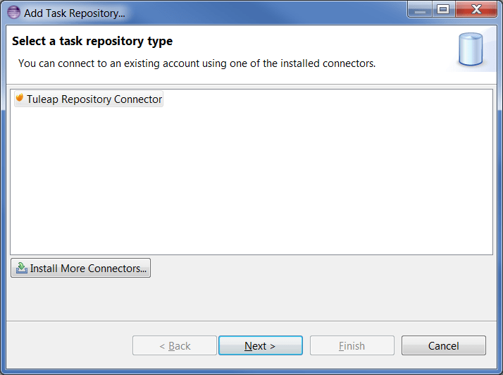
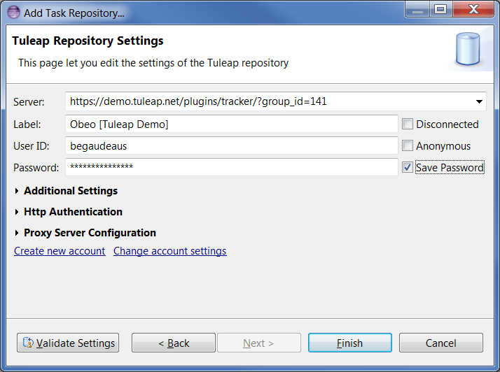
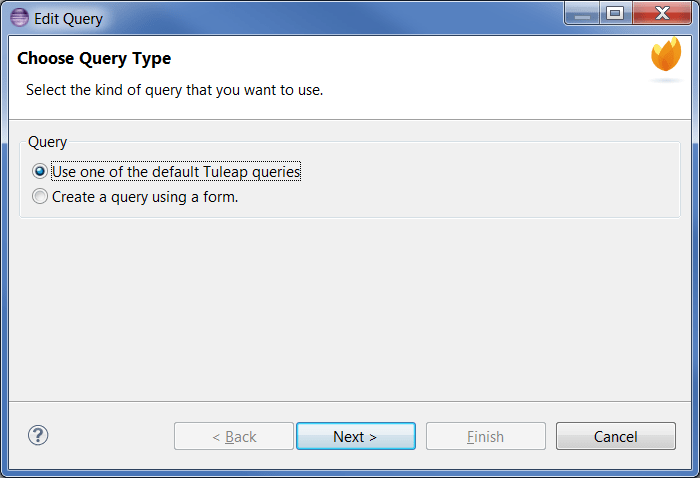
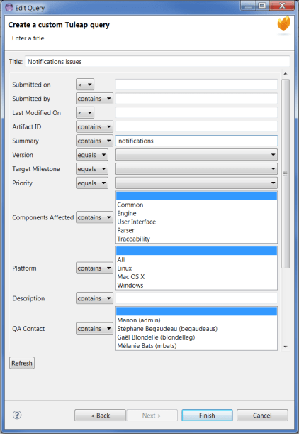
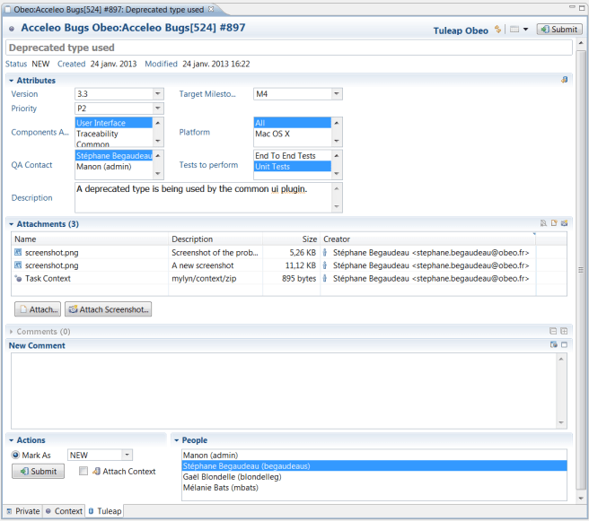
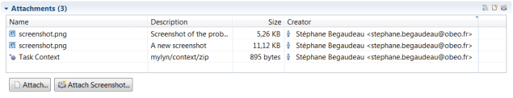
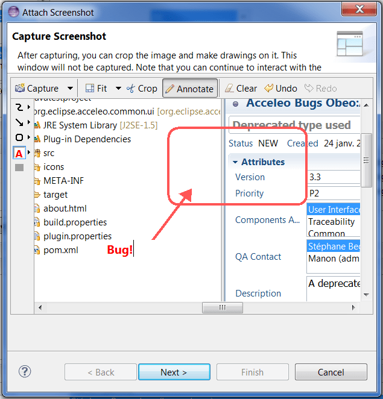
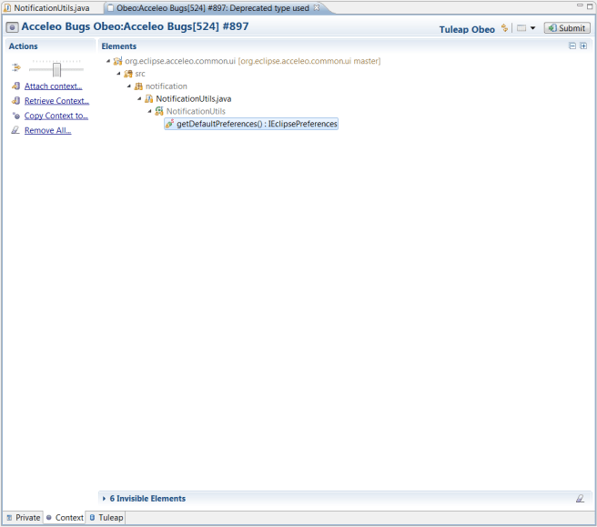
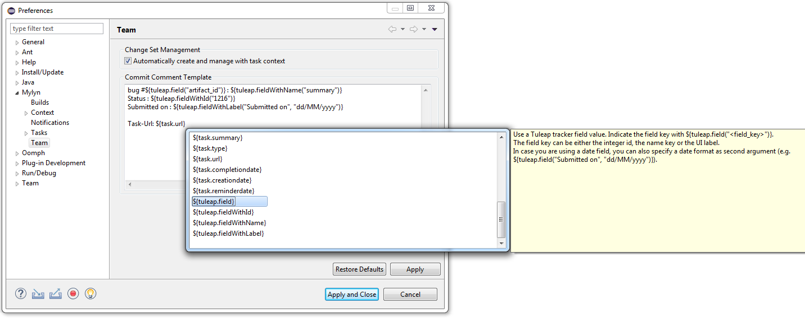
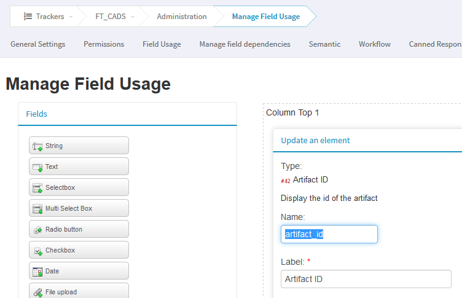
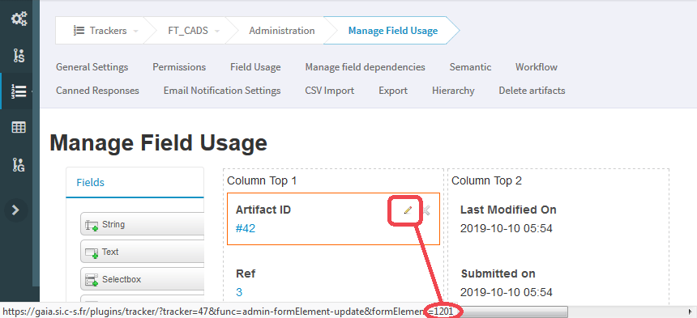
