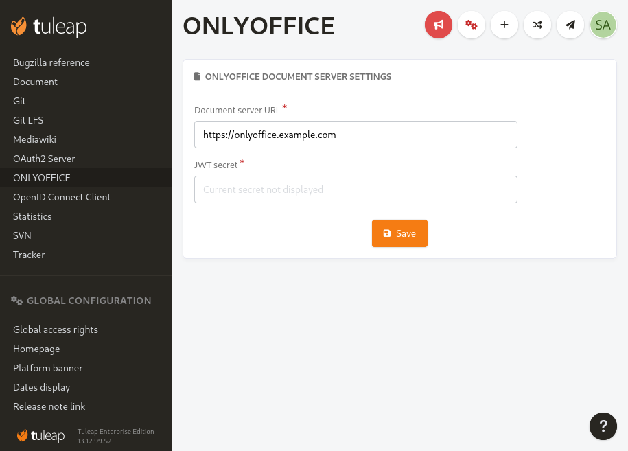

.. _onlyoffice-integration:

ONLYOFFICE
==========

`ONLYOFFICE <https://www.onlyoffice.com/>`_ is an office suite you can use in your browser.

Integration with :ref:`document-manager`
----------------------------------------

Office documents (Word, Excel, spreadsheets, PDF…) stored in the Document Manager can be directly viewed in ONLYOFFICE.
The integration is seamless when the ONLYOFFICE integration plugin is active: clicking on an office document in the Document
Manager will open ONLYOFFICE and load your document.

.. note:: As of today, the integration cannot be used to edit documents, only to view them.

Initial setup
-------------

To deploy the integration you will need to have access to an `ONLYOFFICE document server <https://api.onlyoffice.com/editors/basic>`_ or deploy one.

In order to activate the integration, as a site administrator once :ref:`you have installed and actived the plugin <install-plugins>`, you will
need to specify the URL of your `document server <https://api.onlyoffice.com/editors/basic>`_ and the `token associated with it <https://api.onlyoffice.com/editors/signature/>`_.

