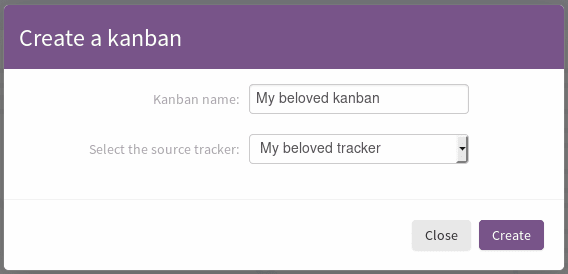

.. _kanban:

Kanban
======

Tuleap supports Kanban methodology with a dedicated cardwall.

Using a Kanban
--------------

To enter a Kanban, go to the Kanban service of your project. All your Kanban boards are displayed.

If you do not have any Kanban yet, you can create a Kanban on your own.

Creating your Kanban from scratch
`````````````````````````````````

To create your own Kanban, you will need to create a tracker.
Once your tracker has been created, go to the Kanban service of your project.
Click on the ``Add a Kanban`` button.
In the modal, enter a name for your Kanban, select your newly created tracker and validate.



   Kanban creation

A new Kanban appears in the Kanban section.

Configure the card fields
`````````````````````````

Card fields are tracker fields to be displayed in the Kanban cards (only in expanded view).
For instance you can easily display who is the creator of the card, who are the assignees, what is the priority etc.
You can also define the card's background color.


   Card fields in Kanban

To do so, you have to configure the :ref:`semantic_color` in the tracker administration (``my_tracker > Administration > Manage Semantic > Card Semantic``).

Filtered Kanban
```````````````

Your Kanban can be filtered using the public reports of its tracker.
For instance, let's imagine you want to setup a filter showing the tasks assigned to the current user accessing the Kanban. To do so, you have to:

1. Define a public report (ex: ``assigned_to = MYSELF()``)
2. Go back to your Kanban
3. Click on ``Edit this Kanban``
4. Choose your report in the ``Tracker report filters`` section
5. Save

Once it is done, a filter selectbox appears in the header of the Kanban.

.. figure:: ../images/screenshots/agiledashboard/kanban/filtered-kanban.png
   :align: center
   :alt: Filtered kanban
   :name: Filtered kanban

   Filtered Kanban

Your Kanban will be reloaded with cards matching the query defined in the report, each time you change the filter.

.. NOTE:: Filtered Kanbans are not working with the realtime feature of Tuleap.

Add a Kanban to a dashboard
```````````````````````````

You can add your Kanban to one of your dashboards as a widget.
To do it, click on the ``Add to dashboard`` button and select the target dashboard in the dropdown.

.. figure:: ../images/screenshots/agiledashboard/kanban/filtered-kanban-widget.png
   :align: center
   :alt: Filtered kanban widget
   :name: Filtered kanban widget

   Kanban widget

If a filter is selected when adding the widget to the dashboard, then the Kanban widget will be filtered too.
It is particularly interesting when you want to have several views for a same Kanban.
To edit the current filter, all you have to do is to click on the cog icon in the widget header and choose another filter.

.. NOTE:: You can't add more than one Kanban widget per dashboard.
