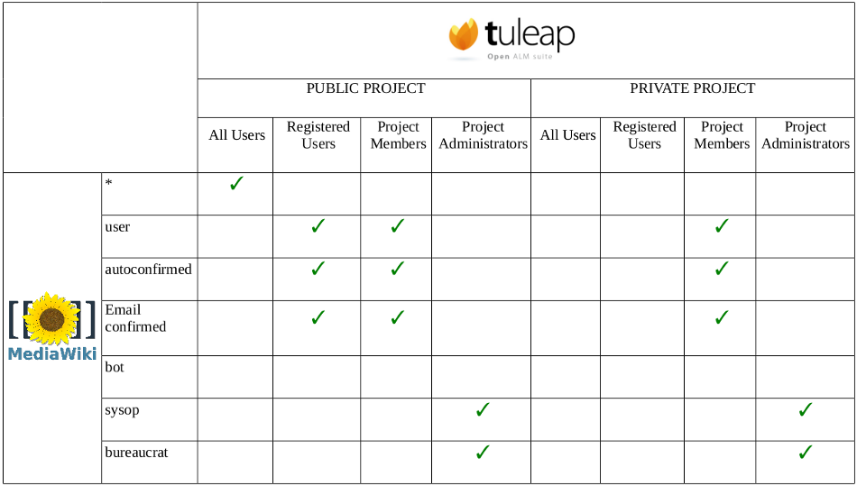
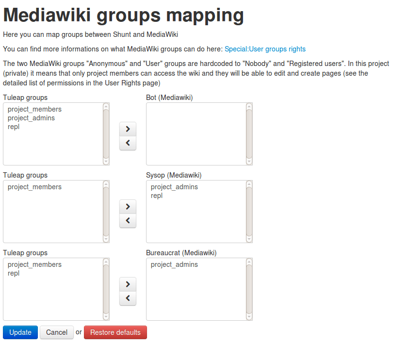

.. _mediawiki:

Mediawiki
=========

Overview
--------

This chapter is not a Mediawiki Tutorial. It focuses on the integration of Mediawiki
with Tuleap. If you are not familiar with Mediawiki we warmly advise you to first
read some of the documents listed in the references section (see `Mediawiki References`_).

The Mediawiki version provided by Tuleap is 1.20.3. As of today, this Mediawiki has no plugin
deployed.

There is one instance of Mediawiki per project. Tuleap manages the connection to Mediawiki.
Tuleap users have access to the Mediawiki service in any project they are allowed to access
(and which has activated the service), so you don't need to register on Mediawiki.

Restricted users will have access to Mediawiki from projects they are members of.
If they aren't, they won't be able to access Mediawiki neither from public nor from
private projects.

Permissions
-----------

Note intended for long time Mediawiki users. Contrary to default Mediawiki, in Tuleap 'anonymous' users can only Read pages (they cannot create or edit).

As of today, when you have a public Tuleap project, you cannot prevent anonymous users from browsing the pages.

If you need to have a private Mediawiki, then you should switch your project to Private.

Mapping between Tuleap and Mediawiki user groups
`````````````````````````````````````````````````

There is a default mapping between Tuleap and Mediawiki default user groups.

Users added in Tuleap groups will be automatically added in corresponding Mediawiki groups. It is no longer possible
to add users in Mediawiki groups directly from Mediawiki.

For instance, when a new user is added to a project, he/she will be added in the *user*, *autoconfirmed*
and *email confirmed* Mediawiki groups. This is fully transparent for both users and project adminstrators,
and there currently is no way to create a custom mapping from the Mediawiki service.

This default mapping is defined as follows:



As a project admin you can also define your own mapping between Tuleap and Mediawiki groups.



Please note that it's not possible to assign Tuleap special **all_users** and **registered_users** to Mediawiki groups.

.. seealso::
   For more details on Mediawiki groups and permissions, see:
   http://www.mediawiki.org/wiki/Manual:User_rights

Synchronisation for Mediawiki users and groups
```````````````````````````````````````````````

In order to have fully relevant users and groups in Mediawiki, the synchronisation
is launched when the following actions occured:

-  A Tuleap user is removed from project members

-  A Tuleap user is no more an administrator of the project

-  A Tuleap user is renamed


Mediawiki extensions
--------------------

Tuleap currently integrates the following Mediawiki extensions:

* `CategoryTree <https://www.mediawiki.org/wiki/Extension:CategoryTree>`_ : dynamically browses the
  structure of categories. For more information about this, please visit the project's mediawiki,
  click on **Special Pages**, then on **Version** to access the list of installed extensions.
 
* `Cite <https://www.mediawiki.org/wiki/Extension:Cite/Cite.php>`_ : adds ``<ref[name="id"]>`` and ``<references/>`` tags for references and footnotes.

* `ImageMap <https://www.mediawiki.org/wiki/Extension:ImageMap>`_ : allows for client-side clickable images, thanks to the ``<imagemap>`` tag.

* `InputBox <https://www.mediawiki.org/wiki/Extension:InputBox>`_ : allows for the inclusion of predefined HTML forms.

* `LabeledSectionTransclusion <https://www.mediawiki.org/wiki/Extension:Labeled_Section_Transclusion>`_ : adds the ``#lst`` and ``#lstx`` functions and the ``<section>`` tag,
  and activates the marked sections in the text that must be transcluded.

* `ParserFunctions <https://www.mediawiki.org/wiki/Extension:ParserFunctions>`_ : enhances the wikitext parser throught the addition of logical and strings manipulation
  functions.

* `PdfBook <http://www.mediawiki.org/wiki/Extension:PdfBook>`_ : lets you compose a book from articles in a category and export it as PDF.

* `SyntaxHighlight_GeSHi <https://www.mediawiki.org/wiki/Extension:SyntaxHighlight_GeSHi>`_ : allows for source code syntax highlighting throught the ``<syntaxhighlight>`` tag
  and the `GeSHi syntax highlighting <http://qbnz.com/highlighter/>`_.


* `WikiEditor <http://www.mediawiki.org/wiki/Extension:WikiEditor>`_ : provides a text editor. Only available when display is 'Compatibility view' mode (see below).

Tuleap Specific extension
`````````````````````````

* **TuleapArtLinks**: provides artifact links integration with Tuleap. Since Tuleap 7.10, MediaWiki recognizes Tuleap cross-references such as **art #12345** and turns them automatically into hypertext links pointing to the corresponding Tuleap artifact. 

Compatibility view
------------------
In order to accommodate for mediawiki plugins that are not compatible with Tuleap's window rendering there is an option to enable
a compatibility view. If checked and if the site administrators have set it up then the mediawiki in that project will take a standalone
appearance. There will be links on the sidebar that will bring you back to your project area.

Displaying your project's logo in Mediawiki
-------------------------------------------
The following conditions have to be met for your logo to be displayed in Mediawiki:

- The logo must be named ``.wgLogo.png`` exactly (notice the dot prefix).
- It must be located in ``/var/lib/tuleap/mediawiki/projects/<project-id>/images/``. Ask your site administrators to upload it there for you.
- Its height and width *should* be 155px x 155px but can be smaller or larger, as it will always be adapted to these dimensions.


Mediawiki References
--------------------

-  The official Mediawiki documentation: See http://www.mediawiki.org/wiki/Documentation

Contributions
-------------

- **CategoryTree** contributed by Daniel Kinzler.
- **Cite** contributed by Ævar Arnfjörð Bjarmason.
- **ImageMap** contributed by Tim Starling.
- **InputBox** contributed by Erik Moeller, Leonardo Pimenta, Rob Church, Trevor Parscal and DaSch.
- **LabeledSectionTransclusion** contributed by Steve Sanbeg.
- **ParserFunctions** contributed by Tim Starling, Robert Rohde, Ross McClure and Juraj Simlovic.
- **PdfBook** contributed by `Aran Dunkley <http://www.organicdesign.co.nz/nad>`_.
- **SyntaxHighlight_GeSHi** contributed by Brion Vibber, Tim Starling, Rob Church and Niklas Laxström.
- **TuleapArtLinks** contributed by `Enalean SAS <https://www.enalean.com/>`_.
