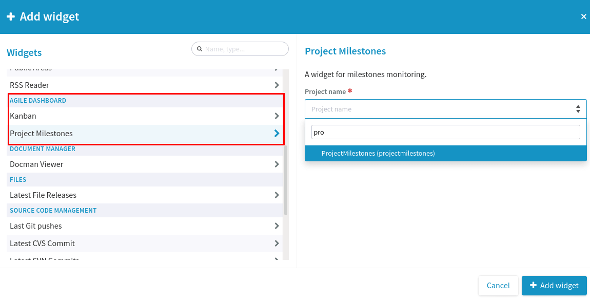
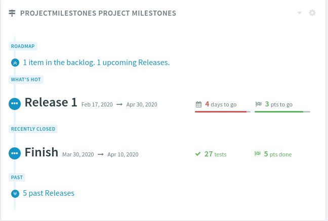
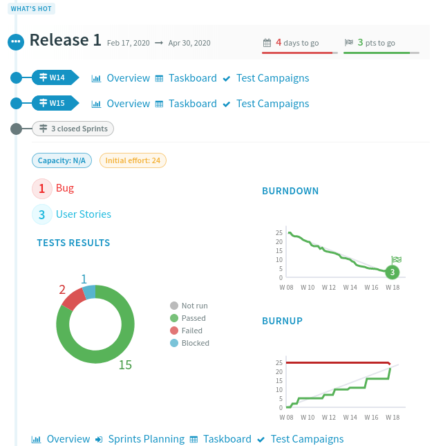

.. _project-milestones:

Project Milestones
------------------

.. attention::

  This module is part of :ref:`Tuleap Enterprise <tuleap-enterprise>`. It might
  not be available on your installation of Tuleap.

The widget Project Milestones aims at displaying the main information of a Scrum Backlog on a personal or project dashboard.

Project Milestones features:

* Multiple widgets to synthesize several Backlog of projects on same dashboard
* Integration with TestManagement

Configuration
~~~~~~~~~~~~~

The displayed project in Project Milestones must have the Backlog service activated and configured (see :ref:`backlog`).

Project Milestones can be displayed on any personal dashboard or project dashboard.

Add the widget
^^^^^^^^^^^^^^



To add Project Milestones in a dashboard, you need to select Project Milestones in section ``Backlog``.

Then, enter the label of the project to display, select the project from the dropdown, and click on ``Add widget``.

Integration with TestManagement
^^^^^^^^^^^^^^^^^^^^^^^^^^^^^^^
To configure and use TestManagement, see :ref:`TestManagement <testmgmt>`.

You don't need to do anything else.

Presentation
~~~~~~~~~~~~



The widget is composed of 4 main parts: ``Roadmap``, ``What's hot``, ``Recently closed`` and ``Past``.

Roadmap
^^^^^^^

In Roadmap section, there is a link to go to top backlog of the displayed project.

This link displays the number of artifacts in the backlog and the upcoming releases' number.

What's hot
^^^^^^^^^^



This section displays all releases that are in progress. You can open or close a release by clicking on its label.

At the top, you can find:

* Release's label.
* Dates.
* Number days to go (with a percent on the hover).
* Remaining effort (with a percent on the hover).

All opened sprints are displayed with links to Overview, Taskboard/Cardwall.
Furthermore, there is the number of closed releases.

If Burndown and Burnup are configured, there are displayed.

Finally, at the bottom there are links to go to Overview, Sprint Planning, Taskboard/Cardwall of the release.

Integration with TestManagement
```````````````````````````````

If TestManagement is configured, there are more additional information:

* A pie chart to display the number of each tests classified by status.
* A link to go to test campaigns of each sprints.
* At the bottom of the release, a link to go to test campaigns of the release.

Recently closed
^^^^^^^^^^^^^^^

The last closed release is displayed. When you open this release, you have access of same information like in ``What's hot``.
But, the header is different and you have the initial effort (instead of remaining effort).

Integration with TestManagement
```````````````````````````````

In the header, you have the number of tests in the test campaigns of the closed release.

Past
^^^^

There is a link to go to past releases. This link displays the number of past releases.

Multiples Widgets
~~~~~~~~~~~~~~~~~

You can add as many widgets as you want on the same dashboard. Thus you can display different projects.
