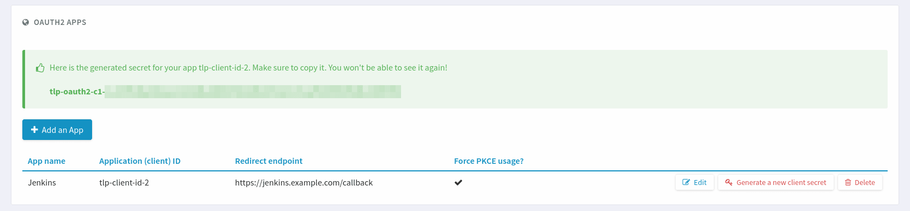

.. _openidconnect_provider:

OAuth2 and OpenIDConnect
========================

.. attention::

  This module is part of :ref:`Tuleap Enterprise <tuleap-enterprise>`. It might
  not be available on your installation of Tuleap.

Tuleap `oauth2_server` plugin provides both  `OAuth2 <oauth2_>`_ and
`OpenIDConnect <openidconnect_>`_ servers. This plugin allows for other websites
to interconnect with Tuleap easily. Users can grant authorizations to external
websites or applications to let them access Tuleap resources (through the
:ref:`REST API <rest_api>`) or sign in with a Tuleap account.

It is a recommended and secure way to let other applications interact with
Tuleap's REST API with :ref:`Access Tokens <rest_oauth2_access_token>`.
Applications can also authenticate users with their Tuleap account by leveraging
OpenIDConnect, providing Single sign-on capabilities.

Setup
-----

The plugin ``tuleap-plugin-oauth2-server`` must be installed and enabled on your
Tuleap instance, see :ref:`install-plugins` to learn how to do that.

Definitions
-----------

Throughout this document, the terms "End-User", "Client Application" and
"Provider" will be used. Here is what they mean:

- "Project Administrator": a Tuleap user. They belong to their Project's
  "Project Administrators" user group.
- "End-User": a Tuleap user. They are NOT Project Administrator. In OAuth2
  terminology this corresponds to a "resource owner".
- "Client Application": a software application that is able to request
  authorization from End-Users to access your Tuleap instance on their behalf
  through `OAuth2 <oauth2_>`_ and `OpenIDConnect <openidconnect_>`_. In OAuth2
  terminology this corresponds to a "client". In OpenIDConnect terminology this
  is a "Relying Party".

Client registration
-------------------

In order to use OAuth2 and OpenIDConnect, the Project Administrator must
manually register ([1]_) the Client Application in a project.

.. figure:: ../images/screenshots/openidconnect/oidc-register-app.png

  In Project Administration, click on the "OAuth2 Apps" tab.

.. figure:: ../images/screenshots/openidconnect/oidc-register-app-modal.png

  When you click on "Add an App", a modal opens. You may choose the
  application's name (text). The "Redirect endpoint" (URL) is required. If
  the Client Application supports `Proof Key for Code Exchange <oauth2_pkce_>`_, you should check the
  "Force usage of PKCE to authenticate" checkbox.

When the Project Administrator creates an OAuth2 App, they must choose a name
for it. The name will be shown to End-Users when the Client Application asks
their authorization. The redirect endpoint is specific to the application and
should be found in its documentation. It is where Tuleap will redirect End-Users
after they give (or do not give) authorization to the Client Application.

  Tuleap will show the Client Secret only once after creating the application.

.. attention::

  Tuleap will show **only once** a feedback with the Client Secret the
  Client Application will need to use OAuth2. **Save it somewhere safe.** It is used
  by Tuleap to authenticate the application and is like a password.

Provider registration
---------------------

Next, register Tuleap as an OAuth2 server or OpenIDConnect provider in the
Client Application. You will need to provide:

* The Client ID. It starts by ``tlp-client-id-``.
* The Client Secret that appeared only once at Client registration. It starts by
  ``tlp-oauth2-c1-``.
* The Authorization endpoint: ``https://<your-tuleap-domain>/oauth2/authorize``.
  It is where the Client Application will redirect End-Users to ask Tuleap for
  authorization.
* The Token endpoint: ``https://<your-tuleap-domain>/oauth2/token``. It is where
  the Client Application will request its OAuth2 Access token to be able to access
  the Tuleap REST API.
* The User Information endpoint:
  ``https://<your-tuleap-domain>/oauth2/userinfo``. It is where the Client
  Application will request information about End-Users that have authorized it,
  for example their user ID or user name.

Granting authorization
----------------------

Once the Client Application is registered in your project and Tuleap is
registered on the Client Application, the Client Application can ask End-Users
to grant it authorization to access Tuleap.

The process starts in the Client Application, which will redirect End-Users to
Tuleap's Authorization endpoint page:

.. figure:: ../images/screenshots/openidconnect/oidc-authorize.png

  Tuleap will ask End-Users to authorize whatever permissions are requested by
  the Client Application.

When End-Users click on "Authorize", they will be redirected back to the Client
Application. It will now have an Access Token that it can use to access Tuleap's
REST API on the End-Users' behalf, with their permissions.

Revoking authorization
----------------------

After having authorized a client application, End-Users can revoke it whenever
they want. Access your user preferences:

  Click on the "Cog" icon on the right-hand side of your name and profile
  picture to access your user preferences.

Then, go to the "OAuth2 Apps" tab in user preferences.

.. figure:: ../images/screenshots/openidconnect/oidc-preferences-app-list.png

  Go to the "OAuth2 Apps" tab in your user preferences. All authorized OAuth2
  Client applications will be listed with the permissions (Scopes) you have
  granted them.

When you click on "Revoke authorization", the application will no longer have
access to Tuleap's REST API. If you use the application again, it will request
your authorization once more.

Discovery endpoint
------------------

Tuleap implements the `OpenIDConnect Discovery endpoint <oidc_discovery_spec_>`_.
The endpoint can be found at:
``https://<your-tuleap-domain>/.well-known/openid-configuration``

It responds with a JSON object detailing the location of the various endpoints
and supported parameters for OAuth2 and OpenIDConnect. You can find there the
list of supported `OAuth2 scopes <oauth2_scopes_>`_ that can be requested by a
Client application.

Client Application development
------------------------------

If you wish to develop your own Client Application compatible with Tuleap,
please refer to `RFC6749 <oauth2_spec_>`_, `RFC7636 <oauth2_pkce_>`_ and
`OpenIDConnect Core <oidc_spec_>`_. Those documents contain all the details
needed to implement an OpenIDConnect compatible Application Client.

Please note that only the OAuth2 `Authorization Code Grant
<oauth2_authorization_code_grant_>`_ is supported by Tuleap. The OAuth2
`Implicit Grant <oauth2_implicit_grant_>`_ is not supported.

JSON Web Key Set (JWKS) endpoint
^^^^^^^^^^^^^^^^^^^^^^^^^^^^^^^^

Tuleap `signs <oidc_signing_>`_ its OpenIDConnect ID Tokens. To verify this
signature, your client application will need to access the JSON Web Key Set
endpoint to retrieve the signing keys. It can be found at
``https://<your-tuleap-domain>/oauth2/jwks``.

The signing key is regularly rotated so we advise against storing it in your
application.

Token Revocation endpoint
^^^^^^^^^^^^^^^^^^^^^^^^^

Tuleap implements the `OAuth2 Token revocation endpoint <oauth2_revocation_spec_>`_
It can be found at ``https://<your-tuleap-domain>/oauth2/token/revoke``

Client Applications that suspect their `OAuth2 Refresh Token <refresh_token_>`_
or `OAuth2 Access Token <access_token_>`_ has been compromised can use this
endpoint to revoke it and ensure it can no longer be used.
To use that endpoint, the Client Application must authenticate itself with its
Client ID and Client secret. Please consult `RFC7009 <oauth2_revocation_spec_>`_
for implementation details.

Resources
---------

- `OAuth2 Specification <oauth2_spec_>`_
- `OpenIDConnect Specification <oidc_spec_>`_

.. rubric:: Footnotes

.. [1] Tuleap does not support `OpenIDConnect Dynamic Registration
  <oidc_dynamic_registration_spec_>`_. All Client applications must be
  registered manually.

.. _oauth2: https://auth0.com/docs/protocols/oauth2
.. _openidconnect: https://auth0.com/docs/protocols/oidc
.. _oauth2_spec: https://tools.ietf.org/html/rfc6749
.. _oauth2_scopes: https://tools.ietf.org/html/rfc6749#section-3.3
.. _oauth2_authorization_code_grant: https://tools.ietf.org/html/rfc6749#section-4.1
.. _oauth2_implicit_grant: https://tools.ietf.org/html/rfc6749#section-4.2
.. _oauth2_pkce: https://tools.ietf.org/html/rfc7636
.. _oauth2_revocation_spec: https://tools.ietf.org/html/rfc7009
.. _oidc_spec: https://openid.net/specs/openid-connect-core-1_0.html
.. _oidc_dynamic_registration_spec: https://openid.net/specs/openid-connect-registration-1_0.html
.. _oidc_discovery_spec: https://openid.net/specs/openid-connect-discovery-1_0.html
.. _oidc_signing: https://openid.net/specs/openid-connect-core-1_0.html#Signing
.. _access_token: https://tools.ietf.org/html/rfc6749#section-1.4
.. _refresh_token: https://tools.ietf.org/html/rfc6749#section-1.5
