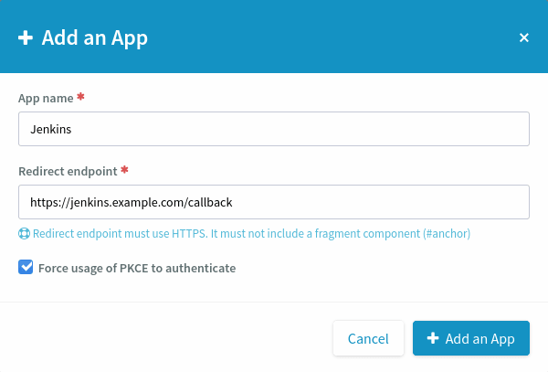
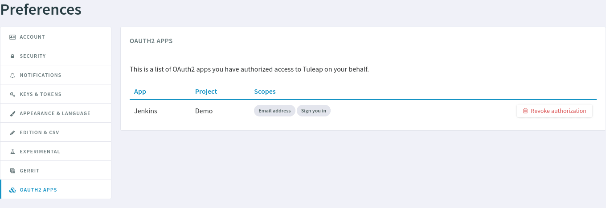

.. _openidconnect_provider:

OAuth2 and OpenIDConnect
========================

.. attention::

  This module is part of :ref:`Tuleap Enterprise <tuleap-enterprise>`. It might
  not be available on your installation of Tuleap.

The `OAuth2 <oauth2_>`_ and `OpenIDConnect <openidconnect_>`_ server plugin
allows for other websites to interconnect with Tuleap easily. Users can grant
authorizations to external websites or applications to let them access Tuleap
resources (through the :ref:`REST API <rest_api>`) or sign in with a Tuleap
account.

Setup
-----

The plugin ``tuleap-plugin-oauth2-server`` must be installed and enabled on your
Tuleap instance, see :ref:`install-plugins` to learn how to do that.

Client registration
-------------------

In order to use OAuth2 and OpenIDConnect, your Project Administrator must
manually register ([1]_) the application in your project.

  In Project Administration, click on the "OAuth2 Apps" tab.

  When you click on "Add an App", a modal opens. Three fields must be filled:
  "App name" (text), "Redirect endpoint" (URL) and "Force usage
  of PKCE to authenticate"  (checkbox)

When you create an OAuth2 App, you must choose a name for it. The name will be
shown to users when the application asks their authorization. The redirect
endpoint is specific to the application and should be found in its
documentation. It is where Tuleap will redirect users after they give (or do not
give) authorization to the application.

.. figure:: ../images/screenshots/openidconnect/oidc-register-client-secret.png

  Tuleap will show the Client secret only once after creating the application.

.. attention::

	Tuleap will show **only once** a feedback with the Client Secret the
	application will need to use OAuth2. **Save it somewhere safe.** It is used
	by Tuleap to authenticate the application and is like a password.

Provider registration
---------------------

Next, register Tuleap as an OAuth2 server or OpenIDConnect provider in the
application. You will need to provide:

* The Application ID or Client ID. It starts by ``tlp-client-id-``.
* The Client Secret that appeared only once at Client registration. It starts by
  ``tlp-oauth2-c1-``.
* The Authorization endpoint: ``https://<your-tuleap-domain>/oauth2/authorize``.
  It is where the Client application will redirect users to ask Tuleap for
  authorization.
* The Token endpoint: ``https://<your-tuleap-domain>/oauth2/token``. It is where
  the Client application will request its OAuth2 token to be able to access
  the Tuleap REST API.
* The User Info endpoint: ``https://<your-tuleap-domain>/oauth2/userinfo``. It
  is where the Client application will get information about users that have
  authorized it, for example their user ID or user name.

Granting authorization
----------------------

Once the Client application is registered in your project and Tuleap is
registered on the Client application, users can grant authorization to the
Client application to access Tuleap.

The process starts in the Client application, which will redirect users to the
Authorization endpoint page:

  Tuleap will ask you to authorize whatever permissions are requested by the
  Client application.

When you click on "Authorize", you will be redirected back to the Client
application. It will now have an Access Token that it can use to access Tuleap's
REST API on your behalf, with your permissions.

Revoking authorization
----------------------

After having authorized a client application, you can revoke it whenever you
want. Access your user preferences:

.. figure:: ../images/screenshots/openidconnect/user-preferences.png

  Click on the "Cog" icon on the right of your name and profile picture to
  access your user preferences.

Then, go to the "OAuth2 Apps" tab in user preferences.

  Go to the "OAuth2 Apps" tab in your user preferences. All authorized OAuth2
  Client applications will be listed with the permissions (Scopes) you have
  granted them.

When you click on "Revoke authorization", the application will no longer have
access to Tuleap's REST API. If you use the application again, it will request
your authorization once more.

Discovery endpoint
------------------

Tuleap implements the `OpenIDConnect Discovery endpoint <oidc_discovery_spec_>`_.
The endpoint can be found at:
``https://<your-tuleap-domain>/.well-known/openid-configuration``

It responds with a JSON object detailing the location of the various endpoints
and supported parameters for OAuth2 and OpenIDConnect. You can find there the
list of supported `OAuth2 scopes <oauth2_scopes_>`_ that can be requested by a
Client application.

Resources
---------

- `OAuth2 Specification <oauth2_spec_>`_
- `OpenIDConnect Specification <oidc_spec_>`_

.. rubric:: Footnotes

.. [1] Tuleap does not support `OpenIDConnect Dynamic Registration
  <oidc_dynamic_registration_spec_>`_. All Client applications must be
  registered manually.

.. _oauth2: https://auth0.com/docs/protocols/oauth2
.. _openidconnect: https://auth0.com/docs/protocols/oidc
.. _oauth2_spec: https://tools.ietf.org/html/rfc6749
.. _oauth2_scopes: https://tools.ietf.org/html/rfc6749#section-3.3
.. _oidc_spec: https://openid.net/specs/openid-connect-core-1_0.html
.. _oidc_dynamic_registration_spec: https://openid.net/specs/openid-connect-registration-1_0.html
.. _oidc_discovery_spec: https://openid.net/specs/openid-connect-discovery-1_0.html